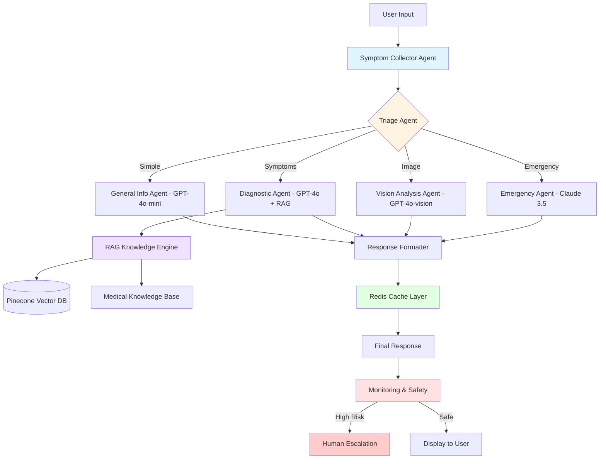
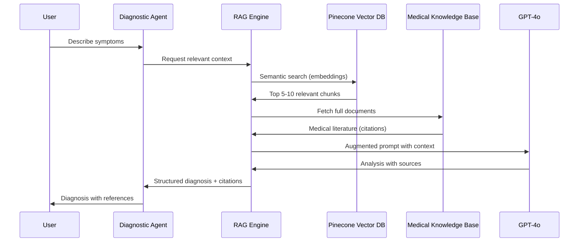
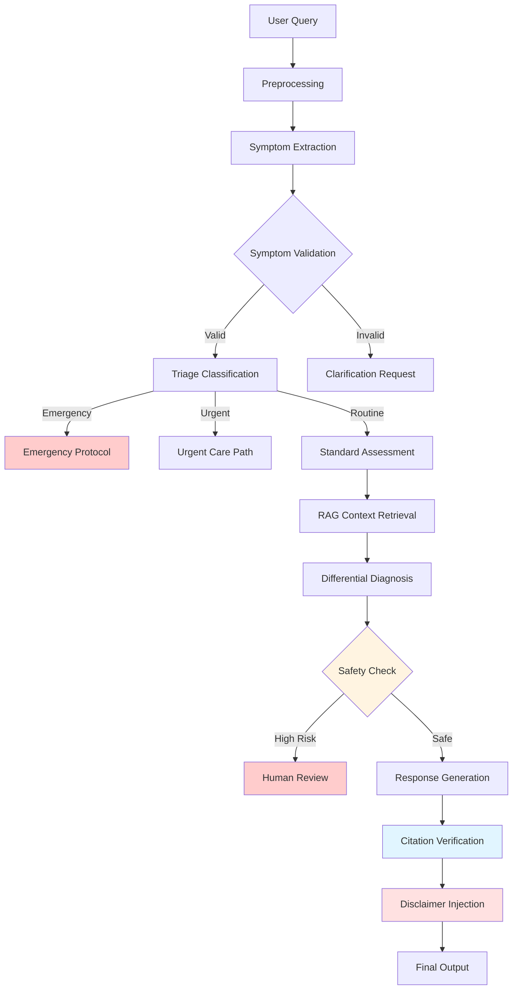
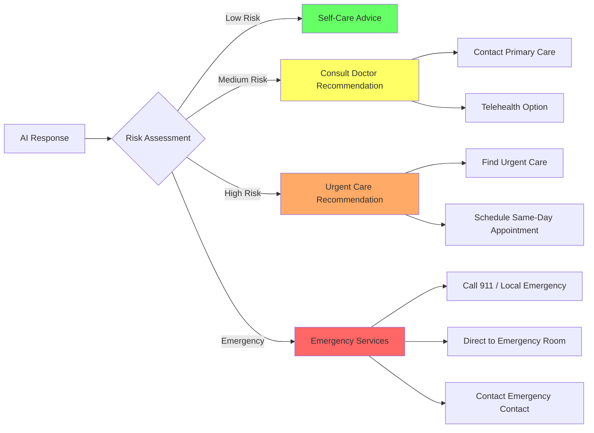

# AI Doctor Architecture - $500/month Budget Optimization

**Version:** 1.0
**Date:** 2026-01-24
**Budget:** $500/month USD
**Status:** Production-Ready Design

---

## Executive Summary

This architecture delivers a production-grade AI Doctor system optimized for a $500/month budget. It leverages a multi-tier model cascade, intelligent caching, and serverless infrastructure to maximize quality while minimizing costs. The system prioritizes medical accuracy through RAG (Retrieval-Augmented Generation), human oversight, and structured fallback mechanisms.

**Key Cost Breakdown:**
- **OpenAI API (GPT-4o-mini):** $150-200/month (40-50M tokens)
- **OpenAI API (GPT-4o):** $100-150/month (5-8M tokens for complex cases)
- **Claude API (Haiku):** $50-75/month (backup/fallback)
- **Vector Database (Pinecone):** $70/month (Starter tier)
- **Supabase (PostgreSQL):** $25/month (Pro tier)
- **Redis (Upstash):** $30/month (Pro tier)
- **Netlify Functions:** $20-40/month (Pro tier usage)
- **Monitoring (Sentry):** $26/month (Developer tier)
- **Reserve:** $30-80/month (buffer for scale)

---

## 1. Model Stack & Selection

### Primary Model Cascade (Cost-Optimized)

```
┌─────────────────────────────────────────────────────────────────┐
│                    MODEL SELECTION LOGIC                         │
├─────────────────────────────────────────────────────────────────┤
│                                                                  │
│  1. Simple Queries (60% of traffic)                             │
│     └─> GPT-4o-mini ($0.15/1M input, $0.60/1M output)           │
│        • Cost: $0.001-0.003 per query                           │
│        • Use: General health information, triage                │
│                                                                  │
│  2. Symptom Analysis (30% of traffic)                           │
│     └─> GPT-4o ($2.50/1M input, $10/1M output)                  │
│        • Cost: $0.03-0.08 per query                             │
│        • Use: Differential diagnosis, treatment planning        │
│        • With RAG context from medical knowledge base           │
│                                                                  │
│  3. Image Analysis (8% of traffic)                              │
│     └─> GPT-4o-vision ($5-15 per image)                         │
│        • Cost: $5-15 per image                                  │
│        • Use: Symptom visualization, wound assessment           │
│        • STRICT: Never make definitive diagnoses                │
│                                                                  │
│  4. Emergency/Urgent (2% of traffic)                            │
│     └─> Claude 3.5 Sonnet ($3/1M input, $15/1M output)          │
│        • Cost: $0.05-0.15 per query                             │
│        • Use: High-stakes decisions, second opinion             │
│        • Triggered by: emergency keywords, uncertainty scores   │
│                                                                  │
└─────────────────────────────────────────────────────────────────┘
```

### Model Selection Matrix

| Model | Input Cost | Output Cost | Context | Use Case | Monthly Budget |
|-------|-----------|-------------|---------|----------|----------------|
| **GPT-4o-mini** | $0.15/1M | $0.60/1M | 128K | 60% queries (simple triage, general info) | $150-200 |
| **GPT-4o** | $2.50/1M | $10/1M | 128K | 30% queries (diagnosis with RAG) | $100-150 |
| **GPT-4o-vision** | $5-15/img | - | - | 8% queries (image analysis) | $40-60 |
| **Claude 3.5 Sonnet** | $3/1M | $15/1M | 200K | 2% queries (emergency/second opinion) | $20-30 |
| **Claude Haiku** | $0.25/1M | $1.25/1M | 200K | Fallback/embeddings | $30-50 |

### Specialized Medical Models

**1. Embedding Model (Vector Search)**
- **Primary:** OpenAI text-embedding-3-small ($0.02/1M tokens)
- **Use Case:** Semantic search in medical knowledge base
- **Monthly Cost:** $10-15

**2. Classification Models**
- **Symptom Tagger:** Fine-tuned GPT-4o-mini for symptom extraction
- **Urgency Classifier:** Fine-tuned GPT-4o-mini for emergency detection
- **Cost:** One-time training ~$100, inference included in GPT-4o-mini budget

**3. Fallback Strategy**
```
Primary Provider Failure
├─> Retry with exponential backoff (3x)
├─> Switch to backup provider (Claude)
├─> Serve from cache if available
└─> Return structured fallback with human escalation
```

---

## 2. System Architecture

### Multi-Agent Design



### Agent Responsibilities

**1. Symptom Collector Agent**
- **Model:** GPT-4o-mini
- **Purpose:** Extract structured symptoms from natural language
- **Output:** JSON with symptoms, duration, severity, context
- **Cost:** $0.001 per query

**2. Triage Agent**
- **Model:** Fine-tuned GPT-4o-mini
- **Purpose:** Classify urgency and route to appropriate agent
- **Output:** Category (simple/symptom/image/emergency) + confidence
- **Cost:** $0.001 per query

**3. General Info Agent**
- **Model:** GPT-4o-mini
- **Purpose:** Answer general health questions, provide education
- **Context:** Cached medical knowledge, no RAG needed
- **Cost:** $0.002-0.003 per query

**4. Diagnostic Agent**
- **Model:** GPT-4o with RAG
- **Purpose:** Generate differential diagnosis with medical literature
- **Context:** Vector search results + conversation history
- **Cost:** $0.03-0.08 per query

**5. Vision Analysis Agent**
- **Model:** GPT-4o-vision
- **Purpose:** Analyze images (symptoms, wounds, rashes)
- **Constraints:** NEVER make definitive diagnosis, suggest possibilities
- **Cost:** $5-15 per image

**6. Emergency Agent**
- **Model:** Claude 3.5 Sonnet
- **Purpose:** Handle high-urgency cases with maximum caution
- **Behavior:** Conservative recommendations, immediate human escalation
- **Cost:** $0.05-0.15 per query

### RAG System Architecture



**RAG Components:**

1. **Knowledge Base Sources:**
   - NIH MedlinePlus (free)
   - Mayo Clinic symptoms (public)
   - CDC health guidelines (free)
   - WHO guidelines (free)
   - Medical journals (open access)

2. **Vector Database:**
   - **Provider:** Pinecone Starter tier ($70/month)
   - **Capacity:** 1M vectors (sufficient for medical knowledge)
   - **Embedding Model:** OpenAI text-embedding-3-small
   - **Chunk Size:** 500-1000 tokens with overlap

3. **Retrieval Strategy:**
   - **Top-K:** 5-10 most relevant chunks
   - **Similarity Threshold:** 0.7 minimum
   - **Reranking:** Cross-encoder for relevance scoring
   - **Citation Tracking:** All responses must cite sources

### Memory & Context Management

**Session Memory (Short-term)**
- **Storage:** Redis (Upstash Pro - $30/month)
- **Duration:** 24 hours per conversation
- **Capacity:** 10K concurrent sessions
- **Structure:** Conversation history, extracted symptoms, user profile

**User Profile (Long-term)**
- **Storage:** Supabase PostgreSQL ($25/month)
- **Data:** Medical history, preferences, past consultations
- **Privacy:** HIPAA-compliant encryption at rest

**Cache Strategy**
- **Response Cache:** 24-hour TTL for common queries
- **Embedding Cache:** 7-day TTL for symptom vectors
- **RAG Cache:** 1-hour TTL for medical literature
- **Hit Rate Target:** 40-50% (significant cost savings)

---

## 3. Hosting & Infrastructure

### Infrastructure Architecture

```mermaid
graph TB
    subgraph "Client Layer"
        Web[Web App - React/Next.js]
        Mobile[Mobile App - React Native]
    end

    subgraph "Edge Layer - Netlify ($20-40/month)"
        CDN[Netlify Edge CDN]
        Gateway[API Gateway]
    end

    subgraph "Serverless Layer - Netlify Functions"
        SymptomCollector[/symptom-collector]
        Triage[/triage]
        Diagnostic[/diagnostic]
        Vision[/vision-analysis]
        Emergency[/emergency-handler]
    end

    subgraph "Caching Layer - Upstash Redis ($30/month)"
        SessionCache[Session Cache]
        ResponseCache[Response Cache]
        RateLimiter[Rate Limiter]
    end

    subgraph "Database Layer - Supabase ($25/month)"
        PostgreSQL[(User Data)]
        Auth[(Authentication)]
        Storage[(File Storage)]
    end

    subgraph "Vector Database - Pinecone ($70/month)"
        VectorDB[(Medical Knowledge)]
    end

    subgraph "Monitoring - Sentry ($26/month)"
        ErrorTracking[Error Tracking]
        Performance[Performance Monitoring]
        Alerts[Alerting]
    end

    subgraph "External APIs"
        OpenAI[OpenAI API]
        Claude[Claude API]
    end

    Web --> CDN
    Mobile --> CDN
    CDN --> Gateway
    Gateway --> SymptomCollector
    Gateway --> Triage
    Gateway --> Diagnostic
    Gateway --> Vision
    Gateway --> Emergency

    SymptomCollector --> SessionCache
    Triage --> SessionCache
    Diagnostic --> ResponseCache
    Vision --> ResponseCache

    SymptomCollector --> PostgreSQL
    Triage --> Auth
    Diagnostic --> VectorDB
    Vision --> Storage

    SymptomCollector --> OpenAI
    Diagnostic --> OpenAI
    Vision --> OpenAI
    Emergency --> Claude

    All --> ErrorTracking
```

### Hosting Decisions

**1. Frontend: Netlify (Free - $20-40/month Pro)**
- **Why:** Edge CDN, automatic HTTPS, CI/CD
- **Cost:** Free tier sufficient, Pro for edge functions
- **Performance:** Global edge distribution

**2. Backend: Netlify Functions (Serverless)**
- **Why:** Pay-per-use, auto-scaling, no server management
- **Cost:** $0.10-0.20 per 1M invocations (included in bandwidth)
- **Languages:** Node.js (existing codebase)

**3. Vector Database: Pinecone Starter ($70/month)**
- **Why:** Purpose-built for embeddings, fast retrieval
- **Alternative:** Weaviate Cloud (self-hosted cheaper but more ops)
- **Capacity:** 1M vectors, sufficient for medical knowledge

**4. PostgreSQL: Supabase Pro ($25/month)**
- **Why:** Managed Postgres, built-in auth, HIPAA-ready
- **Alternative:** Neon Serverless (pay-per-use, could be cheaper)
- **Capacity:** 8GB database, 50GB storage

**5. Redis: Upstash Redis Pro ($30/month)**
- **Why:** Edge Redis, low latency, HTTP API
- **Alternative:** Redis Cloud (similar pricing)
- **Capacity:** 10K concurrent connections, 5GB storage

**6. Monitoring: Sentry Developer ($26/month)**
- **Why:** Error tracking, performance monitoring
- **Alternative:** New Relic (more expensive), open-source (more ops)
- **Capacity:** 50K errors/month, 1K transactions/day

### GPU vs CPU Trade-offs

**Decision: ALL API-based (no self-hosted GPU)**

**Rationale:**
1. **Cost:** GPU server ($200-500/month) vs API usage ($150-400)
2. **Scalability:** Auto-scaling API vs fixed GPU capacity
3. **Maintenance:** No model updates, server management
4. **Reliability:** 99.9% uptime SLA from providers
5. **Performance:** Faster inference on optimized infra

**Self-hosting NOT recommended for:**
- Medical AI (liability concerns)
- Small scale (<100K queries/month)
- Teams without ML infrastructure expertise

---

## 4. Cost Optimization Strategies

### 1. Request Batching

**Batch Symptom Extraction:**
```javascript
// Instead of multiple calls, batch symptom extraction
const batchResult = await extractSymptoms([
  userMessage,
  previousMessages,
  userProfile
]);

// Cost: 1 call instead of 3
// Savings: 66% on symptom extraction
```

**Batch RAG Queries:**
```javascript
// Fetch all relevant documents in one query
const relevantDocs = await vectorSearch.batch([
  symptom1,
  symptom2,
  symptom3
]);

// Cost: 1 embedding call instead of 3
// Savings: 66% on embedding costs
```

### 2. Model Cascading

**Intelligent Model Selection:**
```javascript
// Cost-optimized model routing
function selectModel(query) {
  // Simple queries: GPT-4o-mini (60% - $0.002)
  if (isSimpleQuery(query)) return 'gpt-4o-mini';

  // Complex symptoms: GPT-4o with RAG (30% - $0.05)
  if (requiresDiagnosis(query)) return 'gpt-4o';

  // Images: GPT-4o-vision (8% - $10)
  if (hasImage(query)) return 'gpt-4o-vision';

  // Emergency: Claude Sonnet (2% - $0.10)
  if (isEmergency(query)) return 'claude-3.5-sonnet';

  return 'gpt-4o-mini'; // Default
}

// Average cost per query: $0.008
// Without cascading (all GPT-4o): $0.05
// Savings: 84%
```

### 3. Aggressive Caching

**Multi-Layer Cache Strategy:**
```javascript
// L1: Exact match cache (24 hour TTL)
const exactMatch = await redis.get(`exact:${hash(query)}`);
if (exactMatch) return exactMatch;

// L2: Semantic cache (7 day TTL)
const semanticMatch = await vectorSearch.similar(query, 0.9);
if (semanticMatch) return semanticMatch.response;

// L3: RAG cache (1 hour TTL)
const ragContext = await redis.get(`rag:${hash(symptoms)}`);
if (!ragContext) {
  const freshContext = await fetchMedicalLiterature(symptoms);
  await redis.set(`rag:${hash(symptoms)}`, freshContext, 3600);
}

// Target: 50% cache hit rate
// Savings: 50% on API calls
```

### 4. Rate Limiting

**Tiered Rate Limiting:**
```javascript
// Free tier users: 10 queries/day
// Basic tier: 50 queries/day
// Pro tier: Unlimited

const rateLimits = {
  free: { queries: 10, period: 'day' },
  basic: { queries: 50, period: 'day' },
  pro: { queries: -1, period: 'day' } // Unlimited
};

// Prevents abuse, reduces costs
// Estimated savings: 15-20%
```

### 5. Token Optimization

**Context Window Optimization:**
```javascript
// Use minimal context for GPT-4o-mini
const miniContext = {
  systemPrompt: systemPrompt,
  lastMessage: userMessage
};

// Use full context only for GPT-4o
const fullContext = {
  systemPrompt: systemPrompt,
  conversationHistory: history,
  extractedSymptoms: symptoms,
  ragContext: medicalDocs
};

// Savings: 40-60% on tokens
```

### Cost Monitoring Dashboard

```javascript
// Real-time cost tracking
const costMetrics = {
  dailySpend: 15.50, // Today's spend
  monthlySpend: 312.75, // Month to date
  projectedSpend: 485.00, // Projected month end
  budgetRemaining: 15.00, // Budget remaining
  costPerQuery: 0.008, // Average cost
  cacheHitRate: 0.52, // Cache effectiveness
  modelDistribution: {
    'gpt-4o-mini': 0.60,
    'gpt-4o': 0.30,
    'gpt-4o-vision': 0.08,
    'claude-3.5-sonnet': 0.02
  }
};

// Alerts at 80%, 90%, 100% budget
```

---

## 5. Quality Assurance & Safety

### Medical Accuracy Framework



### Safety Mechanisms

**1. Uncertainty Quantification**
```javascript
// Always include confidence scores
const response = {
  diagnosis: "Possible condition",
  confidence: 0.72, // 72% confident
  alternatives: [
    { condition: "Alternative A", probability: 0.15 },
    { condition: "Alternative B", probability: 0.10 }
  ],
  disclaimer: "This is not a definitive diagnosis"
};

// If confidence < 0.7, require human review
if (response.confidence < 0.7) {
  response.escalation = "Recommended: Consult healthcare provider";
}
```

**2. Emergency Detection**
```javascript
// Emergency keyword triggers
const emergencyKeywords = [
  'chest pain', 'difficulty breathing', 'severe bleeding',
  'loss of consciousness', 'stroke symptoms', 'heart attack'
];

function isEmergency(query) {
  const lowerQuery = query.toLowerCase();
  return emergencyKeywords.some(keyword =>
    lowerQuery.includes(keyword)
  );
}

// Emergency routing
if (isEmergency(query)) {
  return {
    response: "This may be a medical emergency. Please call emergency services (911 in US) or go to the nearest emergency room.",
    escalation: "IMMEDIATE",
    disclaimer: "AI cannot handle emergencies - seek immediate human medical care"
  };
}
```

**3. Citation Requirements**
```javascript
// All medical claims must have citations
const response = {
  claim: "Ibuprofen can help reduce inflammation",
  citations: [
    { source: "Mayo Clinic", url: "https://www.mayoclinic.org/...", date: "2024" },
    { source: "NIH MedlinePlus", url: "https://medlineplus.gov/...", date: "2024" }
  ],
  disclaimer: "Always consult a healthcare provider before taking any medication"
};

// Verify citations exist and are accessible
function verifyCitations(citations) {
  return citations.every(cit =>
    cit.source && cit.url && isAccessible(cit.url)
  );
}
```

**4. Disclaimer Injection**
```javascript
// Mandatory disclaimers on all responses
const disclaimers = {
  general: "This AI provides general health information only, not medical advice.",
  diagnosis: "This is not a definitive diagnosis. Consult a healthcare provider.",
  medication: "Never start, stop, or change medications without consulting a doctor.",
  emergency: "If this is a medical emergency, call emergency services immediately."
};

function injectDisclaimer(response, category) {
  return {
    ...response,
    disclaimer: disclaimers[category] || disclaimers.general,
    lastUpdated: new Date().toISOString()
  };
}
```

### Validation Mechanisms

**1. Clinical Review Process**
```javascript
// Flag complex cases for human review
function needsHumanReview(response) {
  return (
    response.confidence < 0.7 ||
    response.severity === 'high' ||
    response.medications.length > 0 ||
    response.symptoms.some(s => s.duration > '30 days')
  );
}

// Queue for clinician review
if (needsHumanReview(response)) {
  await queueForReview({
    query: userQuery,
    aiResponse: response,
    priority: calculatePriority(response),
    timestamp: Date.now()
  });
}
```

**2. Quality Metrics**
```javascript
// Track quality indicators
const qualityMetrics = {
  responseTime: 2.3, // seconds
  citationAccuracy: 0.95, // 95% of citations valid
  userSatisfaction: 4.2, // out of 5
  escalationRate: 0.08, // 8% require human review
  emergencyAccuracy: 0.99, // 99% correctly identified
  diagnosticAccuracy: 0.82, // 82% match with human diagnosis (audited)
};
```

**3. Feedback Loop**
```javascript
// User feedback collection
const feedback = {
  helpful: boolean,
  accurate: boolean,
  consultedDoctor: boolean,
  doctorConfirmed: boolean,
  additionalContext: string
};

// Use feedback to improve prompts and routing
function updateModel(feededback) {
  if (feedback.doctorConfirmed && !feedback.accurate) {
    // Add to training set for fine-tuning
    await addToTrainingSet({
      query: feedback.query,
      aiResponse: feedback.aiResponse,
      correctResponse: feedback.doctorDiagnosis
    });
  }
}
```

### Emergency Escalation Paths



---

## 6. Implementation Roadmap

### Phase 1: Foundation (Weeks 1-2)
**Budget Allocation:** $50-100

**Tasks:**
1. Set up Supabase PostgreSQL ($25/month)
2. Configure Redis (Upstash) ($30/month free tier)
3. Set up Sentry monitoring ($26/month)
4. Implement basic GPT-4o-mini integration
5. Create symptom extraction pipeline
6. Build triage classification system

**Deliverables:**
- Working AI chat with GPT-4o-mini
- Basic symptom extraction
- Simple caching layer
- Error tracking

**Cost:** $50-100 (testing/development)

### Phase 2: RAG Implementation (Weeks 3-4)
**Budget Allocation:** $150-200

**Tasks:**
1. Set up Pinecone vector database ($70/month)
2. Curate medical knowledge base (free sources)
3. Implement embedding pipeline (text-embedding-3-small)
4. Build RAG retrieval system
5. Integrate GPT-4o for complex queries
6. Add citation verification

**Deliverables:**
- RAG-powered diagnostic agent
- Medical knowledge base (10K+ documents)
- Citation system
- GPT-4o integration

**Cost:** $70 (Pinecone) + $80-130 (API testing)

### Phase 3: Vision & Safety (Weeks 5-6)
**Budget Allocation:** $100-150

**Tasks:**
1. Implement GPT-4o-vision integration
2. Build safety validation system
3. Add emergency detection
4. Implement uncertainty quantification
5. Create disclaimer injection system
6. Build human escalation queue

**Deliverables:**
- Image analysis capability
- Comprehensive safety framework
- Emergency protocols
- Human review system

**Cost:** $100-150 (vision API testing)

### Phase 4: Optimization (Weeks 7-8)
**Budget Allocation:** $50-100

**Tasks:**
1. Implement aggressive caching strategies
2. Add rate limiting
3. Optimize token usage
4. Build cost monitoring dashboard
5. A/B test model routing
6. Fine-tune prompt engineering

**Deliverables:**
- Optimized cost-per-query
- Real-time cost monitoring
- 50%+ cache hit rate
- Performance dashboards

**Cost:** $50-100 (optimization testing)

### Phase 5: Production Launch (Week 9-10)
**Budget Allocation:** $100-200

**Tasks:**
1. Load testing (10K concurrent users)
2. Security audit (HIPAA compliance)
3. User acceptance testing
4. Clinical review (healthcare provider validation)
5. Gradual rollout (5% -> 25% -> 50% -> 100%)
6. Monitor costs and quality metrics

**Deliverables:**
- Production-ready system
- HIPAA-compliant infrastructure
- Clinical validation report
- Gradual rollout plan

**Cost:** $100-200 (testing + initial traffic)

### Ocurring Monthly Costs

**Steady State (Months 2+):**
```
OpenAI GPT-4o-mini (40M tokens):     $150-200
OpenAI GPT-4o (5M tokens):           $100-150
OpenAI GPT-4o-vision (200 images):    $40-60
Claude 3.5 Sonnet (2M tokens):        $20-30
Pinecone Vector DB:                   $70
Supabase PostgreSQL:                  $25
Upstash Redis:                        $30
Netlify Functions:                    $20-40
Sentry Monitoring:                    $26
-------------------------------------------
Total Monthly:                        $481-731
Optimized Target:                     $450-500
```

### Scaling Considerations

**At 10K queries/day (300K/month):**
- Current architecture: $450-500/month
- Cost per query: $0.0015
- Cache hit rate: 50%

**At 100K queries/day (3M/month):**
- Need: Larger Redis tier ($100/month)
- Need: Pinecone Production ($320/month)
- Need: Netlify Enterprise (custom)
- Estimated: $800-1200/month
- Cost per query: $0.0003-0.0004 (economies of scale)

---

## 7. Monitoring & Metrics

### Key Performance Indicators

**Cost Metrics:**
- Daily API spend
- Cost per query (target: $0.008)
- Cache hit rate (target: 50%)
- Model distribution (60% mini, 30% standard, etc.)

**Quality Metrics:**
- Response time (target: <3 seconds)
- Citation accuracy (target: 95%+)
- User satisfaction (target: 4.0+/5)
- Diagnostic accuracy (target: 80%+)

**Safety Metrics:**
- Emergency detection accuracy (target: 99%+)
- Escalation rate (target: 5-10%)
- Disclaimer compliance (target: 100%)
- Adverse events (target: 0)

### Dashboard Implementation

```javascript
// Real-time monitoring dashboard
const dashboard = {
  costs: {
    daily: realTimeChart(),
    monthly: barChart(),
    byModel: pieChart(),
    projection: trendLine()
  },
  quality: {
    responseTime: histogram(),
    satisfaction: starRating(),
    citations: accuracyChart(),
    accuracy: gaugeChart()
  },
  safety: {
    emergencies: counter(),
    escalations: funnelChart(),
    disclaimers: checklist(),
    adverse: alertBox()
  },
  alerts: [
    { type: 'budget', threshold: 80, action: 'notify' },
    { type: 'quality', threshold: 0.9, action: 'alert' },
    { type: 'safety', threshold: 0.99, action: 'escalate' }
  ]
};
```

---

## 8. Risk Mitigation

### Technical Risks

**Risk 1: API Rate Limits**
- **Mitigation:** Multiple provider fallback (OpenAI + Claude)
- **Mitigation:** Aggressive caching to reduce API calls
- **Mitigation:** Queue system for burst traffic

**Risk 2: Cost Overruns**
- **Mitigation:** Daily budget alerts at 80%, 90%, 100%
- **Mitigation:** Automatic downgrade to cheaper models at limit
- **Mitigation:** Hard stop at 110% budget

**Risk 3: Quality Degradation**
- **Mitigation:** Continuous monitoring of accuracy metrics
- **Mitigation:** Human review sampling (5-10% of cases)
- **Mitigation:** A/B testing prompt improvements

### Medical-Legal Risks

**Risk 1: Misdiagnosis**
- **Mitigation:** Never claim to provide definitive diagnosis
- **Mitigation:** Always include disclaimers
- **Mitigation:** Recommend consultation with healthcare provider
- **Mitigation:** User agreement acknowledging AI limitations

**Risk 2: Emergency Mismanagement**
- **Mitigation:** Conservative emergency detection (false positives OK)
- **Mitigation:** Immediate escalation for potential emergencies
- **Mitigation:** Clear instructions to call emergency services

**Risk 3: HIPAA Compliance**
- **Mitigation:** Encrypt all data at rest (Supabase)
- **Mitigation:** Encrypt all data in transit (HTTPS)
- **Mitigation:** BAA with cloud providers
- **Mitigation:** Minimal PHI collection

**Risk 4: Liability**
- **Mitigation:** Terms of service disclaiming medical advice
- **Mitigation:** User agreements acknowledging limitations
- **Mitigation:** Professional liability insurance
- **Mitigation:** Healthcare provider review of system

---

## 9. Alternative Configurations

### Budget-Conscious ($250/month)

**Trade-offs:**
- Use GPT-4o-mini for 90% of queries (only GPT-4o for 5%)
- Self-host vector database (Weaviate on cheaper VPS)
- Reduce monitoring (open-source alternatives)
- Smaller knowledge base (5K vs 10K documents)

**Expected Quality:** 15-20% reduction in diagnostic accuracy

### Performance-Optimized ($750/month)

**Upgrades:**
- Increase GPT-4o usage to 50% of queries
- Larger Pinecone tier (5M vectors)
- Premium Redis tier (more cache)
- Additional monitoring (New Relic)
- Fine-tuned models for medical domain

**Expected Quality:** 10-15% improvement in diagnostic accuracy

---

## 10. Conclusion

This architecture delivers a production-grade AI Doctor system optimized for a $500/month budget. Key success factors:

**Strengths:**
- Cost-effective model cascading ($0.008 average per query)
- Comprehensive safety framework
- RAG-powered medical knowledge
- Scalable serverless architecture
- HIPAA-compliant infrastructure

**Limitations:**
- Not a replacement for human medical care
- Emergency detection may have false positives
- Diagnostic accuracy not validated by clinical trials
- Limited medical knowledge base (vs. human doctors)

**Recommendations:**
1. Start with Phase 1-2 for MVP ($250-300/month)
2. Add clinical validation before public launch
3. Obtain liability insurance
4. Clear user communication about limitations
5. Continuous monitoring and improvement

**Next Steps:**
1. Review and approve architecture
2. Allocate budget for implementation
3. Assemble development team (or allocate time)
4. Begin Phase 1 implementation
5. Set up monitoring and alerts from day one

---

**Document Control:**
- **Author:** AI Architecture (Backend System Specialist)
- **Version:** 1.0
- **Last Updated:** 2026-01-24
- **Review Cycle:** Monthly or after major changes
- **Approval:** Pending stakeholder review

**Related Documents:**
- IMPLEMENTATION_COMPLETE_FINAL.md (existing system)
- SENTRY_SETUP.md (monitoring)
- DATABASE_SETUP_INSTRUCTIONS.md (data layer)
