# Doctor.mx API Architecture

## System Architecture Overview

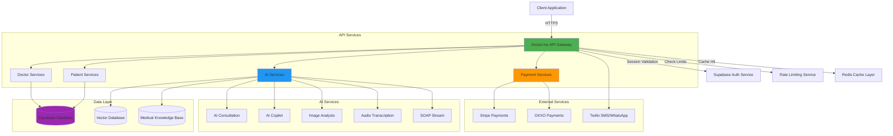

## Authentication Flow

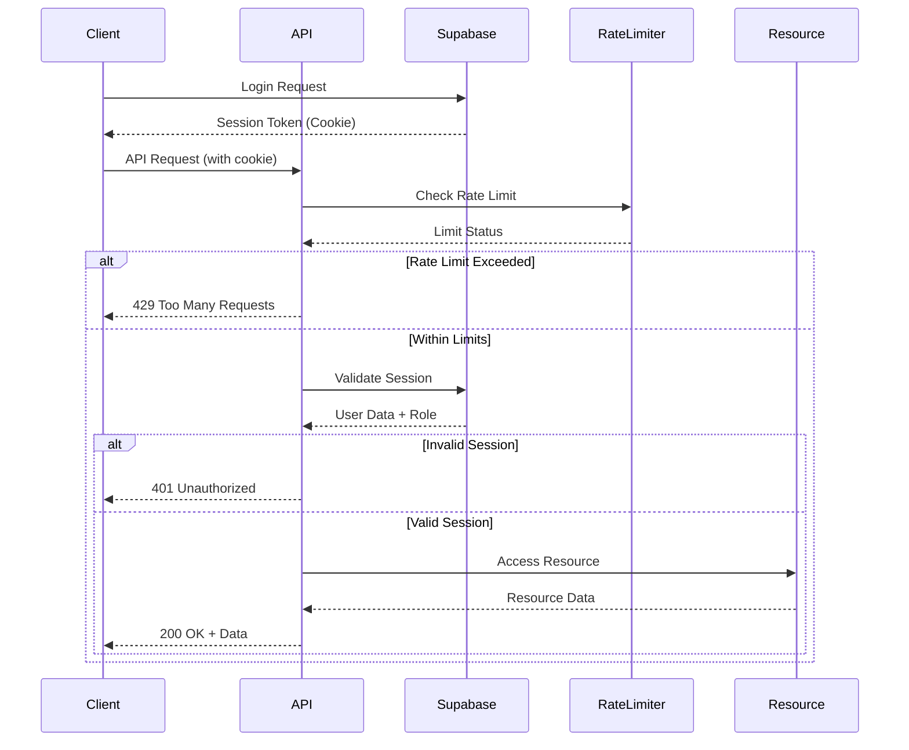

## Rate Limiting Architecture

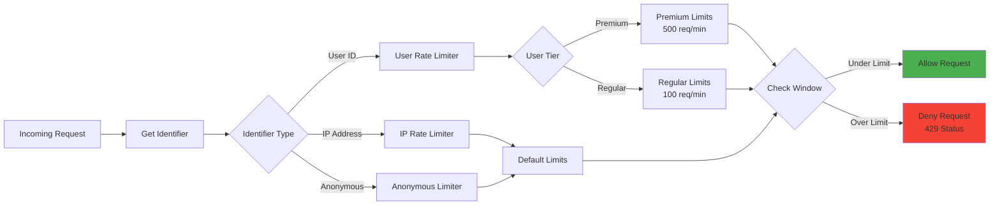

## AI Consultation Flow

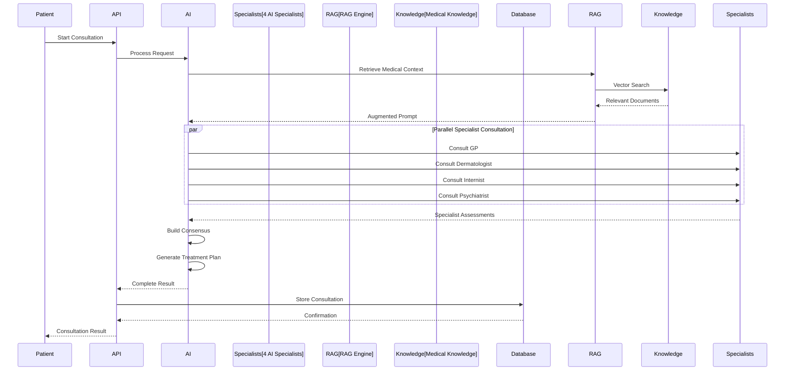

## SOAP Stream Architecture

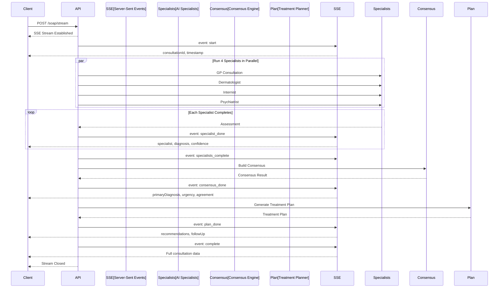

## Payment Processing Flow

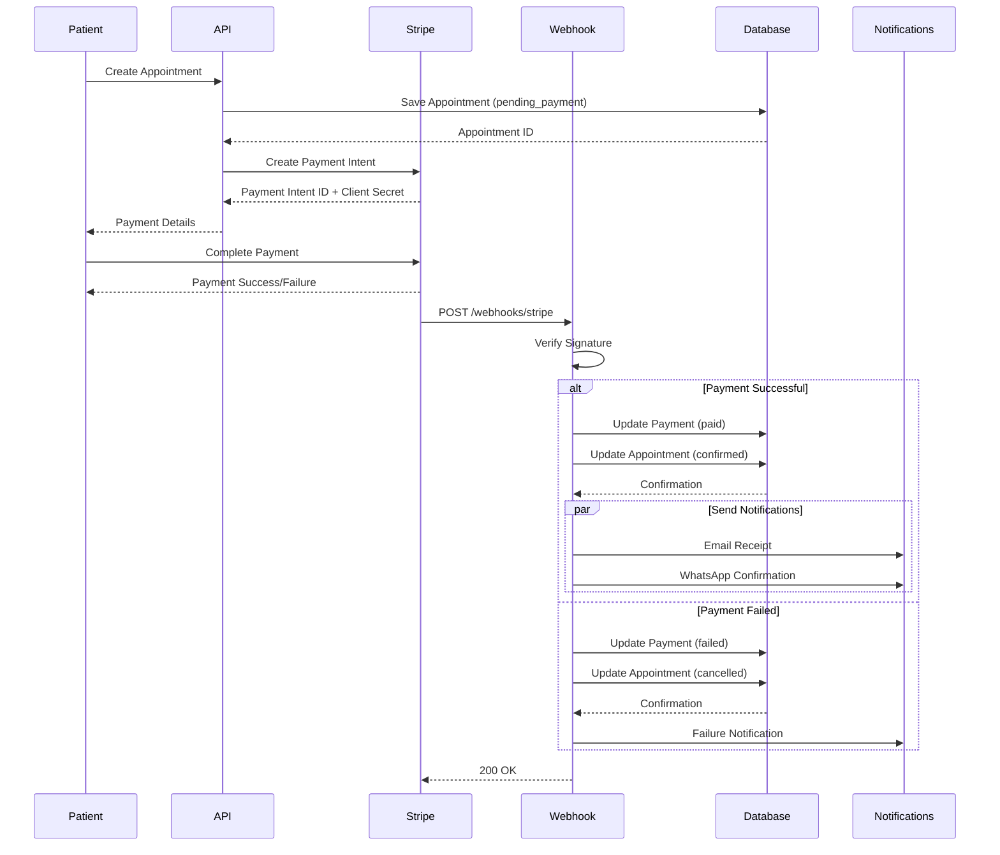

## Endpoint Categories & Relationships

```mermaid
graph TD
    API[Doctor.mx API]

    subgraph "Public Endpoints"
        API --> Directory[Directory Services]
        API --> Plans[Subscription Plans]
        API --> Search[Doctor Search]
    end

    subgraph "Patient Endpoints"
        API --> PatientAuth[Patient Auth]
        PatientAuth --> Appts[Appointments]
        PatientAuth --> Profile[Patient Profile]
        PatientAuth --> MedHistory[Medical History]
        PatientAuth --> AIConsult[AI Consultation]
    end

    subgraph "Doctor Endpoints"
        API --> DoctorAuth[Doctor Auth]
        DoctorAuth --> Availability[Availability]
        DoctorAuth --> AICopilot[AI Copilot]
        DoctorAuth --> Prescriptions[Prescriptions]
        DoctorAuth --> ApptsMgmt[Appointment Management]
    end

    subgraph "Admin Endpoints"
        API --> AdminAuth[Admin Auth]
        AdminAuth --> Analytics[Analytics]
        AdminAuth --> DoctorVerify[Doctor Verification]
        AdminAuth --> AIMetrics[AI Metrics]
    end

    subgraph "Webhook Endpoints"
        API --> StripeWebhook[Stripe Webhook]
        API --> TwilioWebhook[Twilio Webhook]
        API --> WhatsAppWebhook[WhatsApp Webhook]
    end

    subgraph "AI Services"
        AIConsult --> Consult[Multi-Specialist Consult]
        AIConsult --> SOAPStream[SOAP Stream]
        AIConsult --> Vision[Image Analysis]
        AIConsult --> Transcribe[Transcription]
        AICopilot --> Diagnosis[Diagnosis Assist]
        AICopilot --> Treatment[Treatment Suggest]
        AICopilot --> Summary[Summary Generate]
    end

    style API fill:#4CAF50
    style PatientAuth fill:#2196F3
    style DoctorAuth fill:#FF9800
    style AdminAuth fill:#F44336
    style AIConsult fill:#9C27B0
```

## Security Layers

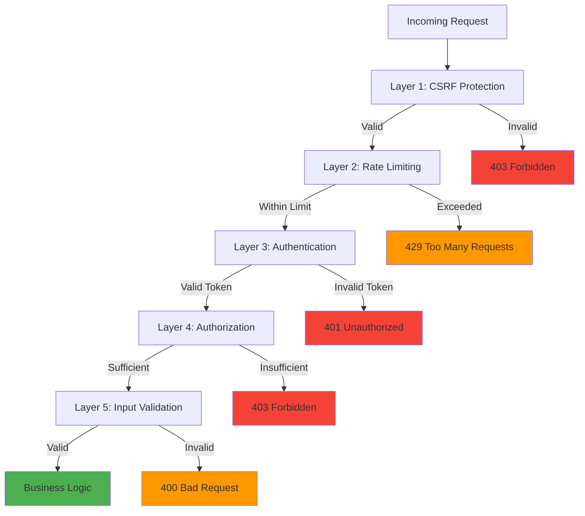

## Data Flow: Appointment Booking

```mermaid
stateDiagram-v2
    [*] --> SearchPatient: Patient searches doctors
    SearchPatient --> ViewProfile: View doctor profile
    ViewProfile --> CheckDates: Check available dates
    CheckDates --> ViewSlots: View time slots
    ViewSlots --> CreateAppointment: Select slot & create

    state CreateAppointment {
        [*] --> ValidateRequest
        ValidateRequest --> AuthCheck: Validate session
        AuthCheck --> RateLimitCheck: Check rate limit
        RateLimitCheck --> ValidateInput: Validate input
        ValidateInput --> CheckAvailability: Verify slot available
        CheckAvailability --> ReserveSlot: Reserve slot
    }

    CreateAppointment --> CreatePayment: Create payment intent
    CreatePayment --> AwaitPayment: Wait for payment

    state AwaitPayment {
        [*] --> PollStatus: Poll payment status
        PollStatus --> WebhookEvent: OR wait for webhook
        WebhookEvent --> ProcessPayment: Process payment
    }

    AwaitPayment --> ConfirmAppointment: Payment confirmed
    ConfirmAppointment --> SendNotifications: Send notifications
    SendNotifications --> [*]: Booking complete
```

## Microservices Communication

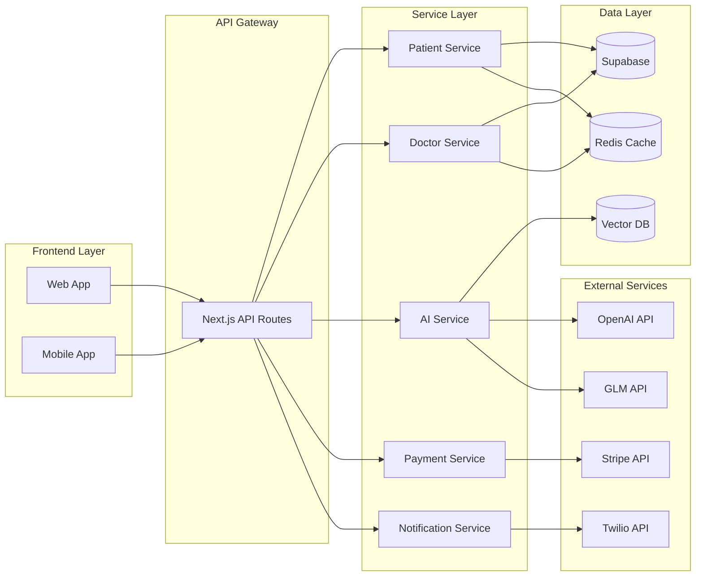

## Caching Strategy

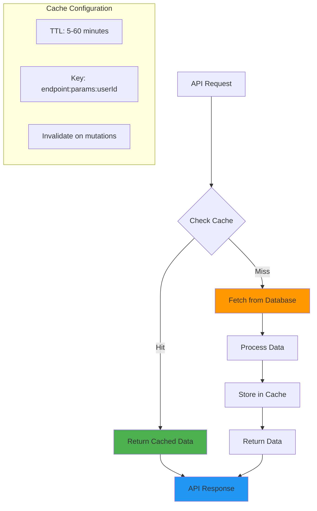

---

## Architecture Notes

### Scalability
- Stateless API design
- Horizontal scaling ready
- Database connection pooling
- CDN for static assets

### Reliability
- Automatic retries with exponential backoff
- Graceful degradation for rate limiting
- Idempotent webhook processing
- Health check endpoints

### Performance
- Redis caching layer
- Database query optimization
- Parallel AI specialist queries
- Streaming responses (SSE)

### Security
- Defense in depth (5 layers)
- Regular security audits
- Dependency updates
- Secrets management

### Monitoring
- Rate limit tracking
- API response times
- Error rate monitoring
- Webhook delivery tracking

---

**Last Updated**: 2026-02-09
**API Version**: 1.0.0
