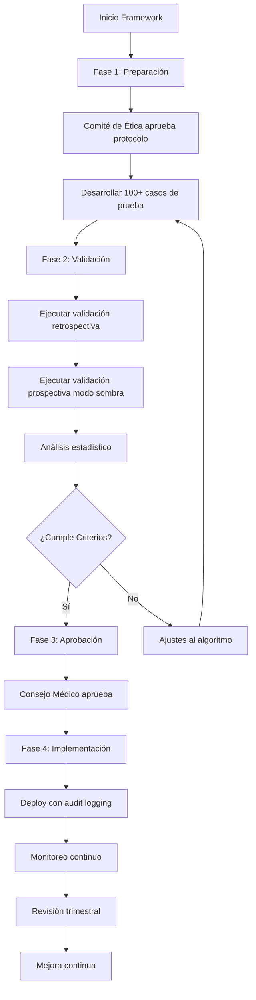

# Marco de Validación Clínica - Doctor.mx Emergency Detection
# Clinical Validation Framework - Doctor.mx Emergency Detection

**Versión:** 1.0.0
**Fecha:** 2026-02-09
**Estado:** Framework Completo para Implementación
**Sistema:** Doctor.mx Emergency Detection System

---

## Resumen Ejecutivo / Executive Summary

Este framework de validación clínica establece los procesos, protocolos y requisitos para asegurar que el sistema de detección de emergencias médicas de Doctor.mx cumpla con los más altos estándares de seguridad clínica, evidencia científica, y cumplimiento regulatorio.

This clinical validation framework establishes the processes, protocols, and requirements to ensure that Doctor.mx's medical emergency detection system meets the highest standards of clinical safety, scientific evidence, and regulatory compliance.

---

## Estructura del Framework / Framework Structure

```
docs/clinical-validation/
├── README.md                                    # Este archivo / This file
├── validation-study-protocol.md                 # Protocolo de estudio clínico
├── medical-review-board.md                      # Proceso de aprobación médica
├── doctor-override-workflow.md                  # Flujo de override de doctores
└── audit-log-requirements.md                    # Requisitos de audit log inmutable
```

---

## Documentos del Framework / Framework Documents

### 1. Protocolo de Estudio de Validación Clínica
**Archivo:** `validation-study-protocol.md`

**Contenido:**
- Objetivos del estudio (Sensibilidad ≥95%, Especificidad ≥90%)
- Diseño del estudio (100+ casos de validación)
- Población y criterios de inclusión/exclusión
- Métodos de validación con casos golden standard
- Análisis estadístico (IC 95%, Kappa de Cohen)
- Consideraciones éticas y consentimiento informado
- Cronograma de implementación (4 meses)

**Propósito:** Establecer la metodología rigurosa para validar que el sistema detecta emergencias con precisión clínica.

**Purpose:** Establish rigorous methodology to validate that the system detects emergencies with clinical accuracy.

---

### 2. Proceso de Aprobación del Consejo Médico
**Archivo:** `medical-review-board.md`

**Contenido:**
- Estructura y composición del Consejo Médico
- Niveles de clasificación de características (Crítico, Alto, Medio, Bajo)
- Flujo de aprobación detallado
- Criterios de evaluación (evidencia científica, seguridad, usabilidad)
- Toma de decisiones y tipos de aprobación
- Documentación requerida
- Matriz de trazabilidad

**Propósito:** Asegurar que toda característica clínica sea revisada y aprobada por especialistas médicos calificados.

**Purpose:** Ensure all clinical features are reviewed and approved by qualified medical specialists.

---

### 3. Flujo de Override de Doctor
**Archivo:** `doctor-override-workflow.md`

**Contenido:**
- Filosofía del override (autonomía profesional del médico)
- Tipos de override (escalation, de-escalation, categorization)
- Flujo de trabajo paso a paso
- Interfaz de usuario y justificación requerida
- Documentación inmutable de overrides
- Análisis y aprendizaje de overrides
- Controles y salvaguardas

**Propósito:** Permitir que los médicos ejerzan su juicio clínico profesional mientras se recolecta datos para mejorar el sistema.

**Purpose:** Allow physicians to exercise their professional clinical judgment while collecting data to improve the system.

---

### 4. Requisitos de Audit Log Inmutable
**Archivo:** `audit-log-requirements.md`

**Contenido:**
- Arquitectura del audit log inmutable
- Requisitos de inmutabilidad (hash criptográfico, firma digital)
- Eventos a registrar (detecciones, overrides, resultados)
- Formato de registro universal
- Almacenamiento y retención (10 años)
- Consultas y reportes
- Seguridad y compliance regulatorio

**Propósito:** Crear un registro inmutable de todos los eventos clínicos para responsabilidad, trazabilidad, y mejora continua.

**Purpose:** Create an immutable record of all clinical events for accountability, traceability, and continuous improvement.

---

## Criterios de Éxito del Framework / Framework Success Criteria

### Métricas Clave / Key Metrics

| Métrica | Objetivo | Fase de Medición |
|---------|----------|------------------|
| **Sensibilidad del Sistema** | ≥95% | Validación Clínica |
| **Especificidad del Sistema** | ≥90% | Validación Clínica |
| **Tasa de Falsos Negativos** | 0% (críticos) | Validación Clínica |
| **Tiempo de Detección** | <2 segundos | Validación Técnica |
| **Concordancia con Gold Standard** | κ ≥0.80 | Validación Clínica |
| **Tasa de Overrides Justificados** | >80% | Producción |
| **Tasa de Documentación de Overrides** | 100% | Producción |
| **Integridad de Audit Log** | 100% | Producción |
| **Cumplimiento de Plazos de Aprobación** | <30 días | Proceso de Aprobación |

---

## Flujo de Implementación / Implementation Flow



---

## Roles y Responsabilidades / Roles and Responsibilities

### Equipo Clínico / Clinical Team

| Rol | Responsabilidades |
|-----|-------------------|
| **Director Médico** | - Aprobar protocolo de validación<br>- Presidir Consejo Médico<br>- Responsabilidad final de decisiones clínicas |
| **Líder de Seguridad Clínica** | - Evaluar riesgos de seguridad<br>- Monitorear post-implementación<br>- Investigar incidentes clínicos |
| **Especialistas Advisors** | - Revisar características en su especialidad<br>- Proveer evidencia científica<br>- Validar casos de prueba |
| **Médicos Tratantes** | - Ejecutar overrides cuando sea necesario<br>- Documentar justificación clínica<br>- Contribuir al aprendizaje del sistema |

### Equipo Técnico / Technical Team

| Rol | Responsabilidades |
|-----|-------------------|
| **Lead de Ingeniería** | - Implementar sistema de detección<br>- Asegurar performance (<2s)<br>- Implementar audit logging inmutable |
| **Ingeniero de ML/AI** | - Desarrollar y validar algoritmos<br>- Analizar overrides para mejora<br>- Mantener modelos actualizados |
| **Ingeniero de Datos** | - Diseñar schema de audit log<br>- Implementar pipelines de datos<br>- Crear reportes y dashboards |
| **QA Engineer** | - Diseñar casos de prueba automatizados<br>- Ejecutar pruebas de regresión<br>- Validar inmutabilidad |

### Equipo de Compliance / Compliance Team

| Rol | Responsabilidades |
|-----|-------------------|
| **Oficial de Privacidad** | - Asegurar cumplimiento LFPDPPP<br>- Validar anonimización de datos<br>- Gestión de consentimientos |
| **Legal Counsel** | - Revisión de términos y condiciones<br>- Minimización de liability<br>- Cumplimiento regulatorio |
| **Oficial de Seguridad** | - Seguridad de audit logs<br>- Control de acceso basado en roles<br>- Respuesta a incidentes |

---

## Cronograma de Implementación / Implementation Timeline

### Fase 1: Preparación (4 semanas)

- Semana 1: Aprobación del protocolo por Comité de Ética
- Semana 2: Desarrollo de casos de prueba iniciales (30 casos)
- Semana 3: Configuración de infraestructura de validación
- Semana 4: Prueba piloto y ajustes

### Fase 2: Validación (8 semanas)

- Semana 5-6: Casos retrospectivos (50 casos)
- Semana 7-8: Casos prospectivos modo sombra (30 casos)
- Semana 9-10: Casos límite adicionales (20 casos)
- Semana 11-12: Revisión por especialistas y análisis

### Fase 3: Aprobación (2 semanas)

- Semana 13: Aprobación del Consejo Médico
- Semana 14: Preparación para implementación

### Fase 4: Implementación (2 semanas)

- Semana 15: Deploy con monitoreo intensivo
- Semana 16: Estabilización y ajustes

**Total:** 16 semanas (~4 meses)

---

## Métricas de Monitoreo Continuo / Continuous Monitoring Metrics

### Métricas de Producción (Reporte Diario)

```typescript
interface DailyMonitoringMetrics {
  // Detecciones
  totalDetections: number;
  detectionRate: number; // Detecciones por 1000 consultas

  // Overrides
  overrideRate: number; // Overrides por 1000 detecciones
  escalationRate: number;
  deEscalationRate: number;
  justifiedOverrideRate: number;

  // Precisión (cuando se conoce resultado)
  systemAccuracy: number;
  falsePositiveRate: number;
  falseNegativeRate: number;

  // Performance
  averageDetectionTime: number; // ms
  p95DetectionTime: number;
  p99DetectionTime: number;

  // Audit Log
  auditLogIntegrity: number; // % de registros verificados
  auditLogRetention: number; // Días de retención
}
```

### Alertas Automáticas

| Condición | Severidad | Acción |
|-----------|-----------|--------|
| Falso negativo crítico | 🔴 Crítica | Suspensión inmediata, análisis root cause |
| Tasa de override >20% | 🟠 Advertencia | Revisión de calidad del sistema |
| Tiempo de detección >2s | 🟡 Info | Optimización de performance |
| Audit log integrity <100% | 🔴 Crítica | Investigación de seguridad |
| Override sin justificación | 🟠 Advertencia | Requerir capacitación |

---

## Compatibilidad Regulatoria / Regulatory Compliance

### Regulaciones Mexicanas

- ✅ **LFPDPPP:** Consentimiento informado, anonimización de datos
- ✅ **NOM-024-SSA3-2012:** Expediente clínico electrónico, firma digital
- ✅ **COFEPRIS:** Validación de algoritmos médicos

### Estándares Internacionales

- ✅ **HIPAA:** Protección de PHI (si aplica)
- ✅ **GDPR:** Protección de datos de ciudadanos EU (si aplica)
- ✅ **ISO 27001:** Seguridad de la información (planeado)
- ✅ **FDA Guidelines:** Software as a Medical Device (referencia)

---

## Recursos Adicionales / Additional Resources

### Documentos Relacionados

- [Emergency Detection System Documentation](../emergency-detection.md)
- [Clinical Workflows](../workflows/clinical.md)
- [Enhanced Red Flags Implementation](../../src/lib/ai/red-flags-enhanced.ts)

### Plantillas y Formularios

- [Consentimiento Informado](./templates/informed-consent.md)
- [Caso de Validación](./templates/validation-case.md)
- [Reporte de Override](./templates/override-report.md)
- [Cuestionario de Especialista](./templates/specialist-questionnaire.md)

### Herramientas

- [Dashboard de Monitoreo Clínico](https://clinical-monitoring.doctormx.com)
- [Sistema de Audit Log](https://audit-log.doctormx.com)
- [Portal del Consejo Médico](https://medical-board.doctormx.com)

---

## Próximos Pasos / Next Steps

### Inmediatos (Esta semana)

1. [ ] Presentar framework a Director Médico
2. [ ] Presentar framework a Comité de Ética
3. [ ] Aprobar recursos para implementación

### Corto Plazo (Este mes)

1. [ ] Configurar infraestructura de audit logging
2. [ ] Desarrollar primeros 30 casos de prueba
3. [ ] Capacitar especialistas en proceso de revisión

### Mediano Plazo (Este trimestre)

1. [ ] Completar validación clínica con 100+ casos
2. [ ] Obtener aprobación del Consejo Médico
3. [ ] Implementar en producción con monitoreo

---

## Contacto / Contact

Para preguntas sobre este framework:

- **Director Médico:** clinical@doctormx.com
- **Líder de Seguridad Clínica:** clinical-safety@doctormx.com
- **Ingeniería:** engineering@doctormx.com
- **Compliance:** compliance@doctormx.com

---

**Versión del Framework:** 1.0.0
**Fecha de Creación:** 2026-02-09
**Próxima Revisión:** 2026-05-09
**Propietario:** Director Médico, Doctor.mx

---

## Aprobaciones del Framework / Framework Approvals

- [ ] Director Médico: _______________________ Fecha: ________
- [ ] Comité de Ética: _______________________ Fecha: ________
- [ ] Oficial de Seguridad: _______________________ Fecha: ________
- [ ] Oficial de Privacidad: _______________________ Fecha: ________
- [ ] Director Técnico: _______________________ Fecha: ________

---

**© 2026 Doctor.mx - Todos los derechos reservados**
