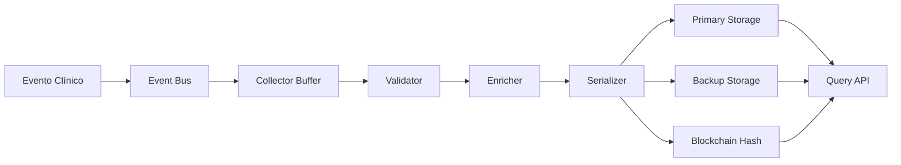

# Requisitos de Audit Log Inmutable
# Immutable Audit Log Requirements

**Versión:** 1.0.0
**Fecha:** 2026-02-09
**Estado:** Borrador para Implementación
**Sistema:** Doctor.mx Clinical Audit Trail

---

## Índice / Table of Contents

1. [Resumen Ejecutivo](#resumen-ejecutivo)
2. [Arquitectura del Audit Log](#arquitectura-del-audit-log)
3. [Requisitos de Inmutabilidad](#requisitos-de-inmutabilidad)
4. [Eventos a Registrar](#eventos-a-registrar)
5. [Formato de Registro](#formato-de-registro)
6. [Almacenamiento y Retención](#almacenamiento-y-retención)
7. [Consultas y Reportes](#consultas-y-reportes)
8. [Seguridad y Compliance](#seguridad-y-compliance)

---

## Resumen Ejecutivo

### Español
Este documento define los requisitos para el sistema de audit log inmutable que registra todos los eventos relacionados con la detección de emergencias médicas. El audit trail es crítico para la responsabilidad clínica, mejora continua del sistema, y cumplimiento regulatorio. Todos los eventos de detección, overrides de médicos, y resultados clínicos deben registrarse de manera inmutable y trazable.

### English
This document defines requirements for the immutable audit log system that records all events related to medical emergency detection. The audit trail is critical for clinical accountability, continuous system improvement, and regulatory compliance. All detection events, physician overrides, and clinical outcomes must be recorded immutably and traceably.

---

## Arquitectura del Audit Log

### Diseño del Sistema

```typescript
interface AuditLogArchitecture {
  // Capa de colección
  collection: {
    eventBus: {
      type: 'pub-sub';
      topics: ['emergency_detection', 'override', 'outcome', 'system_change'];
    };

    eventCollector: {
      buffering: 'in-memory';
      batchSize: 100;
      flushInterval: 5000; // ms
    };
  };

  // Capa de procesamiento
  processing: {
    validator: {
      schemaValidation: true;
      requiredFields: string[];
    };

    enricher: {
      addTimestamp: true;
      addHash: true;
      addSignature: true;
    };

    serializer: {
      format: 'JSON';
      compression: 'gzip';
      encryption: 'AES-256-GCM';
    };
  };

  // Capa de almacenamiento
  storage: {
    primary: {
      type: 'database';
      system: 'Supabase PostgreSQL';
      table: 'audit_logs';
      indexing: ['event_type', 'timestamp', 'user_id', 'case_id'];
    };

    backup: {
      type: 'object-storage';
      system: 'AWS S3 / Google Cloud Storage';
      format: 'immutable-logs/YYYY/MM/DD/*.json.gz';
      lifecycle: 'transition-to-glacier-after-90d';
    };

    blockchain: {
      enabled: boolean; // Opcional para máxima trazabilidad
      network: 'ethereum | hyperledger';
      frequency: 'batch-every-100-records';
    };
  };

  // Capa de consulta
  query: {
    api: {
      endpoint: '/api/audit-logs';
      authentication: 'JWT + role-based';
      rateLimit: '100 req/min';
    };

    search: {
      fullText: true;
      filters: ['event_type', 'date_range', 'user', 'severity'];
      aggregation: true;
    };
  };
}
```

### Diagrama de Flujo de Datos



---

## Requisitos de Inmutabilidad

### 1. Registro Inmutable

**Definición:** Un registro es inmutable si, una vez escrito, no puede ser modificado, eliminado o alterado de ninguna manera.

```typescript
interface ImmutableRecord {
  // Identificación única
  id: string; // UUID v4

  // Hash criptográfico del contenido
  contentHash: string; // SHA-256

  // Firma digital
  digitalSignature: {
    algorithm: 'RSA-4096' | 'ECDSA';
    signature: string;
    signedBy: string; // Key identifier
    signedAt: Date;
  };

  // Cadena de hashes (blockchain-like)
  previousHash?: string; // Link to previous record
  sequenceNumber: number;

  // Timestamp confiable
  timestamp: {
    created: Date;
    timezone: 'UTC';
    source: 'ntp-synchronized';
  };

  // Contenido (el hash es de este objeto)
  content: AuditEvent;

  // Marca de inmutabilidad
  immutable: true;
}
```

### 2. Verificación de Inmutabilidad

```typescript
class ImmutabilityVerifier {
  // Verificar que un registro no ha sido modificado
  verifyRecord(record: ImmutableRecord): boolean {
    // 1. Recalcular hash del contenido
    const calculatedHash = crypto
      .createHash('sha256')
      .update(JSON.stringify(record.content))
      .digest('hex');

    // 2. Comparar con hash almacenado
    if (calculatedHash !== record.contentHash) {
      return false;
    }

    // 3. Verificar firma digital
    const signatureValid = crypto.verify(
      record.digitalSignature.signature,
      record.contentHash,
      record.digitalSignature.signedBy
    );

    if (!signatureValid) {
      return false;
    }

    // 4. Verificar cadena de hashes
    if (record.previousHash) {
      const previousRecord = this.getRecord(record.sequenceNumber - 1);
      if (previousRecord.contentHash !== record.previousHash) {
        return false;
      }
    }

    return true;
  }

  // Verificar integridad de toda la cadena
  verifyChain(): ChainIntegrityReport {
    const records = this.getAllRecords();
    const issues = [];

    for (let i = 1; i < records.length; i++) {
      const current = records[i];
      const previous = records[i - 1];

      if (!this.verifyRecord(current)) {
        issues.push({
          type: 'invalid_signature',
          recordId: current.id,
          sequence: i
        });
      }

      if (current.previousHash !== previous.contentHash) {
        issues.push({
          type: 'broken_chain',
          recordId: current.id,
          sequence: i,
          expectedHash: previous.contentHash,
          actualHash: current.previousHash
        });
      }
    }

    return {
      totalRecords: records.length,
      validRecords: records.length - issues.length,
      issues,
      integrity: issues.length === 0 ? 'valid' : 'compromised'
    };
  }
}
```

### 3. Prevención de Modificaciones

**A nivel de Base de Datos:**

```sql
-- Tabla de audit logs con restricciones de inmutabilidad
CREATE TABLE audit_logs (
  id UUID PRIMARY KEY DEFAULT gen_random_uuid(),
  content_hash TEXT NOT NULL UNIQUE,
  digital_signature TEXT NOT NULL,
  sequence_number BIGINT NOT NULL UNIQUE,
  previous_hash TEXT,
  timestamp TIMESTAMPTZ NOT NULL DEFAULT NOW(),
  content JSONB NOT NULL,

  -- Marca de inmutabilidad
  created_at TIMESTAMPTZ NOT NULL DEFAULT NOW(),
  immutable BOOLEAN NOT NULL DEFAULT TRUE,

  -- Restricción CHECK que impide actualizaciones
  CONSTRAINT no_updates CHECK (
    created_at <= NOW() AND
    immutable = TRUE
  )
);

-- Trigger para impedir actualizaciones y eliminaciones
CREATE OR REPLACE FUNCTION prevent_audit_modifications()
RETURNS TRIGGER AS $$
BEGIN
  RAISE EXCEPTION 'Cannot modify immutable audit log record';
END;
$$ LANGUAGE plpgsql;

CREATE TRIGGER audit_log_no_update
  BEFORE UPDATE ON audit_logs
  FOR EACH ROW
  EXECUTE FUNCTION prevent_audit_modifications();

CREATE TRIGGER audit_log_no_delete
  BEFORE DELETE ON audit_logs
  FOR EACH ROW
  EXECUTE FUNCTION prevent_audit_modifications();

-- Índices para consultas eficientes
CREATE INDEX idx_audit_logs_timestamp
  ON audit_logs(timestamp DESC);

CREATE INDEX idx_audit_logs_event_type
  ON audit_logs((content->>'event_type'));

CREATE INDEX idx_audit_logs_case_id
  ON audit_logs((content->>'case_id'));
```

**A nivel de Aplicación:**

```typescript
class AuditLogger {
  private immutableMode = true;

  async logEvent(event: AuditEvent): Promise<string> {
    // Solo permite crear registros, nunca actualizar o eliminar
    const record = await this.createImmutableRecord(event);
    return record.id;
  }

  // Estos métodos lanzan error
  async updateRecord(id: string, changes: any): Promise<never> {
    throw new Error('Cannot update immutable audit log');
  }

  async deleteRecord(id: string): Promise<never> {
    throw new Error('Cannot delete immutable audit log');
  }
}
```

---

## Eventos a Registrar

### 1. Clasificación de Eventos

```typescript
enum AuditEventType {
  // Detección de emergencias
  EMERGENCY_DETECTED = 'emergency.detected',
  EMERGENCY_FALSE_POSITIVE = 'emergency.false_positive',
  EMERGENCY_FALSE_NEGATIVE = 'emergency.false_negative',

  // Overrides de médicos
  OVERRIDE_ESCALATING = 'override.escalating',
  OVERRIDE_DEESCALATING = 'override.deescalating',
  OVERRIDE_CATEGORIZATION = 'override.categorization',
  OVERRIDE_CANCELLED = 'override.cancelled',

  // Resultados clínicos
  PATIENT_OUTCOME_RECORDED = 'outcome.patient',
  SYSTEM_ACCURACY_VERIFIED = 'outcome.system_accuracy',

  // Cambios del sistema
  ALGORITHM_UPDATED = 'system.algorithm_updated',
  THRESHOLD_CHANGED = 'system.threshold_changed',
  NEW_FEATURE_ADDED = 'system.feature_added',

  // Eventos de seguridad
  UNAUTHORIZED_ACCESS_ATTEMPT = 'security.unauthorized_access',
  SUSPICIOUS_PATTERN_DETECTED = 'security.suspicious_pattern',
}
```

### 2. Eventos de Detección de Emergencia

```typescript
interface EmergencyDetectionEvent {
  event_type: 'EMERGENCY_DETECTED';
  event_id: string;
  timestamp: Date;

  // Información del paciente (anonimizada)
  patient: {
    id_hash: string; // Hash del ID real
    age_group: string; // "18-30", "31-50", etc.
    gender?: string;
  };

  // Información de la detección
  detection: {
    system_version: string;
    algorithm_version: string;

    input: {
      symptoms: string;
      language: string;
      context?: {
        conditions?: string[];
        medications?: string[];
        vitalSigns?: {
          bloodPressure?: string;
          heartRate?: number;
          temperature?: number;
          oxygenSaturation?: number;
        };
      };
    };

    output: {
      urgencyScore: number;
      urgencyLevel: string;
      category: string;
      flags: string[];
      requiresImmediate911: boolean;
      recommendation: string;
      confidence: number;
    };

    processing: {
      detectionTime: number; // ms
      reasoning: string;
      alternativeDiagnosesConsidered: string[];
    };
  };

  // Quién estaba presente
  participants: {
    patientId: string;
    doctorId?: string;
    consultationId?: string;
  };

  // Metadatos
  metadata: {
    ipAddress: string;
    userAgent: string;
    platform: string;
    sessionId: string;
  };
}
```

### 3. Eventos de Override

```typescript
interface OverrideEvent {
  event_type: 'OVERRIDE_ESCALATING' | 'OVERRIDE_DEESCALATING' | 'OVERRIDE_CATEGORIZATION';
  event_id: string;
  timestamp: Date;

  // Referencia a la alerta original
  original_alert_id: string;
  original_alert_hash: string;

  // Información del doctor
  doctor: {
    id: string;
    licenseNumber: string;
    specialty: string;
    name: string; // Opcional, puede ser hash
  };

  // Detalles del override
  override: {
    type: 'escalate' | 'deEscalate' | 'categorize';

    from: {
      urgencyScore: number;
      urgencyLevel: string;
      category: string;
      action: string;
    };

    to: {
      urgencyScore: number;
      urgencyLevel: string;
      category: string;
      action: string;
    };

    justification: {
      primaryReason: string;
      clinicalExplanation: string;
      patientFactors: string[];
      alternativeDiagnosis?: string;
    };

    safeguards?: {
      patientInformed: boolean;
      followUpScheduled: boolean;
      redFlagsReassessed: boolean;
      emergencyPlanProvided: boolean;
    };
  };

  // Requerimientos adicionales para de-escalation
  deEscalationRequirements?: {
    secondaryReviewObtained: boolean;
    reviewingDoctorId?: string;
    riskAcknowledged: boolean;
  };

  // Metadatos
  metadata: {
    consultationId?: string;
    overrideDuration?: number; // Segundos para completar
    platform: string;
  };
}
```

### 4. Eventos de Resultado Clínico

```typescript
interface PatientOutcomeEvent {
  event_type: 'PATIENT_OUTCOME_RECORDED';
  event_id: string;
  timestamp: Date;

  // Referencia a eventos anteriores
  related_alert_id: string;
  related_override_id?: string;

  // Resultado
  outcome: {
    actualDiagnosis: string;
    actualUrgency: 'critical' | 'high' | 'moderate' | 'low';
    actualAction: 'call_911' | 'er_24h' | 'consult_24h' | 'elective';

    patientOutcome: 'recovered' | 'improved' | 'stable' | 'deteriorated' | 'deceased';

    systemCorrect: boolean;
    overrideCorrect?: boolean;

    timeToOutcome: number; // Horas desde alerta
    followUpRequired: boolean;
    followUpReceived: boolean;
  };

  // Verificación
  verification: {
    verifiedBy: string; // Doctor ID
    verificationMethod: 'follow_up' | 'medical_records' | 'patient_report';
    verificationDate: Date;
    confidence: 'high' | 'moderate' | 'low';
  };

  // Lecciones aprendidas
  lessons: {
    systemError: boolean;
    ifSystemError: {
      whatWasWrong: string;
      recommendedFix: string;
    };
    doctorError: boolean;
    ifDoctorError: {
      whatWasWrong: string;
      recommendedTraining: string;
    };
    edgeCase: boolean;
    ifEdgeCase: {
      description: string;
      shouldAddToTraining: boolean;
    };
  };
}
```

---

## Formato de Registro

### Estructura Universal de Evento

```typescript
interface AuditEvent {
  // Cabecera estándar
  header: {
    id: string; // UUID v4
    eventType: AuditEventType;
    timestamp: Date; // ISO 8601, UTC
    version: string; // Schema version

    // Trazabilidad
    correlationId: string; // Link eventos relacionados
    causationId?: string; // Evento que causó este
    parentEventId?: string; // Evento padre en jerarquía

    // Origen
    source: {
      service: string;
      version: string;
      instance: string;
      hostname: string;
    };

    // Actor
    actor: {
      type: 'system' | 'doctor' | 'patient' | 'admin';
      id: string;
      role?: string;
    };
  };

  // Cuerpo del evento (específico del tipo)
  body: any; // EmergencyDetectionEvent | OverrideEvent | etc.

  // Contexto adicional
  context: {
    environment: 'production' | 'staging' | 'development';
    region: string;
    tenant?: string;

    // Metadatos técnicos
    technical: {
      requestId?: string;
      sessionId?: string;
      clientId?: string;
      ipAddress?: string;
      userAgent?: string;
    };

    // Etiquetas
    tags?: string[];
  };

  // Hash y firma
  signature: {
    contentHash: string; // SHA-256 del body
    signature: string; // Firma digital
    signedBy: string;
    signedAt: Date;
  };
}
```

### Ejemplo de Evento Completo

```json
{
  "header": {
    "id": "550e8400-e29b-41d4-a716-446655440000",
    "eventType": "EMERGENCY_DETECTED",
    "timestamp": "2026-02-09T14:30:00.000Z",
    "version": "1.0.0",
    "correlationId": "correlation-123",
    "source": {
      "service": "emergency-detection-service",
      "version": "2.3.1",
      "instance": "i-0abc123def456",
      "hostname": "prod-emd-001"
    },
    "actor": {
      "type": "system",
      "id": "system"
    }
  },
  "body": {
    "patient": {
      "id_hash": "a1b2c3d4e5f6...",
      "age_group": "31-50",
      "gender": "F"
    },
    "detection": {
      "system_version": "2.3.1",
      "algorithm_version": "1.5.0",
      "input": {
        "symptoms": "Tengo dolor de pecho opresivo que me va al brazo izquierdo",
        "language": "es",
        "context": {
          "conditions": ["hypertension", "diabetes"],
          "vitalSigns": {
            "bloodPressure": "165/105"
          }
        }
      },
      "output": {
        "urgencyScore": 10,
        "urgencyLevel": "critical",
        "category": "Cardiac",
        "flags": ["chest_pain_emergency"],
        "requiresImmediate911": true,
        "recommendation": "Llame al 911 INMEDIATAMENTE",
        "confidence": 0.95
      },
      "processing": {
        "detectionTime": 1450,
        "reasoning": "Síntomas clásicos de IAM: dolor opresivo, irradiación a brazo, factores de riesgo"
      }
    },
    "participants": {
      "patientId": "patient-hash-123",
      "consultationId": "consultation-456"
    }
  },
  "context": {
    "environment": "production",
    "region": "mx-central",
    "technical": {
      "requestId": "req-789",
      "sessionId": "session-101",
      "ipAddress": "192.168.1.100",
      "userAgent": "Mozilla/5.0..."
    },
    "tags": ["cardiac", "emergency", "high-confidence"]
  },
  "signature": {
    "contentHash": "sha256:abc123...",
    "signature": "RSA-signature...",
    "signedBy": "key-id-001",
    "signedAt": "2026-02-09T14:30:00.100Z"
  }
}
```

---

## Almacenamiento y Retención

### 1. Estrategia de Almacenamiento

```typescript
interface StorageStrategy {
  // Almacenamiento primario (acceso rápido)
  primary: {
    system: 'PostgreSQL';
    retention: '90 days';
    indexing: ['event_type', 'timestamp', 'correlation_id'];

    optimization: {
      partitioning: 'by_month';
      compression: true;
      archiving: 'after_90_days';
    };
  };

  // Almacenamiento secundario (largo plazo)
  secondary: {
    system: 'S3 / GCS';
    format: 'immutable-logs/YYYY/MM/DD/*.json.gz';
    encryption: 'AES-256';
    retention: '10 years';

    lifecycle: {
      transitionToGlacier: 'after_90_days',
      transitionToDeepArchive: 'after_1_year',
      delete: 'after_10_years';
    };
  };

  // Almacenamiento terciario (copia de seguridad)
  tertiary: {
    system: 'offsite_backup';
    location: 'separate_data_center';
    frequency: 'daily';
    retention: '10 years';
  };

  // Blockchain (opcional, para máxima trazabilidad)
  blockchain: {
    enabled: false; // Opcional
    network: 'ethereum | hyperledger';
    frequency: 'batch_every_100_records';
    data: 'hash_only'; // Solo hash, no datos completos
  };
}
```

### 2. Políticas de Retención

```typescript
interface RetentionPolicy {
  events: {
    'EMERGENCY_DETECTED': {
      primary: '90 days',
      secondary: '10 years',
      tertiary: '10 years',
      reason: 'Critical clinical events, legal requirements'
    },

    'OVERRIDE_*': {
      primary: '90 days',
      secondary: '10 years',
      tertiary: '10 years',
      reason: 'Clinical decision-making, accountability'
    },

    'PATIENT_OUTCOME_RECORDED': {
      primary: '90 days',
      secondary: '10 years',
      tertiary: '10 years',
      reason: 'Clinical outcomes, learning, legal'
    },

    'SYSTEM_*': {
      primary: '30 days',
      secondary: '7 years',
      tertiary: '7 years',
      reason: 'System changes, regulatory compliance'
    },

    'SECURITY_*': {
      primary: '180 days',
      secondary: '10 years',
      tertiary: '10 years',
      reason: 'Security incidents, forensic analysis'
    }
  };

  anonymization: {
    after: {
      primary: '90 days',
      secondary: '10 years',
      tertiary: '10 years'
    },
    method: 'hash_patient_ids_remove_pii'
  };
}
```

---

## Consultas y Reportes

### 1. API de Consulta

```typescript
interface AuditLogQueryAPI {
  // Endpoint base
  endpoint: '/api/audit-logs';

  // Autenticación
  authentication: {
    method: 'JWT';
    required: true;
    roles: ['admin', 'medical_director', 'clinical_safety', 'compliance'];
  };

  // Parámetros de consulta
  queryParameters: {
    // Filtros
    event_type?: AuditEventType | AuditEventType[];
    date_range?: {
      start: Date;
      end: Date;
    };
    correlation_id?: string;
    case_id?: string;
    doctor_id?: string;

    // Paginación
    page?: number;
    page_size?: number; // Max 1000

    // Ordenamiento
    sort_by?: 'timestamp' | 'event_type';
    sort_order?: 'asc' | 'desc';

    // Búsqueda
    search?: string; // Búsqueda de texto completo
  };

  // Respuesta
  response: {
    logs: AuditEvent[];
    total: number;
    page: number;
    page_size: number;
    has_more: boolean;
  };
}
```

### 2. Consultas Comunes

```typescript
// Obtener todos los eventos de un caso
async function getCaseTimeline(caseId: string): Promise<AuditEvent[]> {
  const query = `
    SELECT * FROM audit_logs
    WHERE content->>'case_id' = $1
    ORDER BY timestamp ASC
  `;

  return await db.query(query, [caseId]);
}

// Obtener overrides de un doctor
async function getDoctorOverrides(
  doctorId: string,
  dateRange: { start: Date; end: Date }
): Promise<OverrideEvent[]> {
  const query = `
    SELECT * FROM audit_logs
    WHERE content->>'event_type' LIKE 'OVERRIDE_%'
      AND content->>'doctor_id' = $1
      AND timestamp BETWEEN $2 AND $3
    ORDER BY timestamp DESC
  `;

  return await db.query(query, [doctorId, dateRange.start, dateRange.end]);
}

// Obtener estadísticas de precisión
async function getAccuracyStats(
  dateRange: { start: Date; end: Date }
): Promise<AccuracyStatistics> {
  const query = `
    SELECT
      COUNT(*) FILTER (
        WHERE content->>'event_type' = 'PATIENT_OUTCOME_RECORDED'
          AND content->'outcome'->>'systemCorrect' = 'true'
      ) as true_positives,

      COUNT(*) FILTER (
        WHERE content->>'event_type' = 'PATIENT_OUTCOME_RECORDED'
          AND content->'outcome'->>'systemCorrect' = 'false'
      ) as false_positives,

      -- Más cálculos...
    FROM audit_logs
    WHERE timestamp BETWEEN $1 AND $2
  `;

  return await db.query(query, [dateRange.start, dateRange.end]);
}
```

### 3. Reportes Predefinidos

```typescript
interface PredefinedReports {
  // Reporte diario de activity
  dailyActivity: {
    name: 'Daily Audit Activity';
    description: 'Resumen de eventos del día';
    parameters: { date: Date };
    output: {
      totalEvents: number;
      eventsByType: Record<string, number>;
      overridesByDoctor: Array<{ doctor: string; count: number }>;
      systemAccuracy: number;
    };
  };

  // Reporte de overrides
  overrideAnalysis: {
    name: 'Override Analysis Report';
    description: 'Análisis detallado de overrides';
    parameters: { dateRange: DateRange };
    output: {
      totalOverrides: number;
      escalationRate: number;
      deEscalationRate: number;
      justificationRate: number;
      topOverrideReasons: Array<{ reason: string; count: number }>;
      doctorOverrideStats: Array<{
        doctor: string;
        total: number;
        justified: number;
        unjustified: number;
      }>;
    };
  };

  // Reporte de precisión del sistema
  systemAccuracy: {
    name: 'System Accuracy Report';
    description: 'Métricas de precisión del sistema';
    parameters: { dateRange: DateRange };
    output: {
      sensitivity: number;
      specificity: number;
      precision: number;
      f1Score: number;
      truePositives: number;
      trueNegatives: number;
      falsePositives: number;
      falseNegatives: number;
    };
  };

  // Reporte de eventos adversos
  adverseEvents: {
    name: 'Adverse Events Report';
    description: 'Eventos adversos relacionados con el sistema';
    parameters: { dateRange: DateRange };
    output: {
      totalAdverseEvents: number;
      eventsBySeverity: Record<string, number>;
      systemContributed: number;
      overridesContributed: number;
      rootCauses: string[];
      recommendedActions: string[];
    };
  };
}
```

---

## Seguridad y Compliance

### 1. Control de Acceso

```typescript
interface AccessControl {
  // Autenticación
  authentication: {
    method: 'JWT';
    tokenExpiry: '1 hour';
    refreshAvailable: true;
  };

  // Autorización basada en roles
  roleBasedAccess: {
    admin: {
      canRead: ['all'];
      canExport: true;
      canDelete: false; // Nunca puede eliminar
    },

    medical_director: {
      canRead: ['all'];
      canExport: true;
      canDelete: false;
    },

    clinical_safety: {
      canRead: ['EMERGENCY_*', 'OVERRIDE_*', 'PATIENT_OUTCOME_*'];
      canExport: true;
      canDelete: false;
    },

    doctor: {
      canRead: ['own_overrides'];
      canExport: false;
      canDelete: false;
    },

    compliance: {
      canRead: ['all'];
      canExport: true;
      canDelete: false;
    }
  };

  // Auditoría de accesos
  accessLogging: {
    logAllReads: true;
    logAllExports: true;
    logFailedAccess: true;
    logAccessDenied: true;
  };
}
```

### 2. Anonimización de Datos

```typescript
interface DataAnonimization {
  // Campos a anonimizar
  fieldsToAnonymize: {
    directIdentifiers: [
      'patient.name',
      'patient.email',
      'patient.phone',
      'patient.address',
      'patient.ssn',
      'doctor.name' // Opcional
    ];

    indirectIdentifiers: [
      'patient.exactDateOfBirth',
      'patient.zipCode',
      'patient.ipAddress'
    ];
  };

  // Métodos de anonimización
  methods: {
    hashing: {
      algorithm: 'SHA-256';
      salt: 'unique-per-record';
      fields: ['patient.id', 'doctor.id'];
    },

    generalization: {
      age: 'to_age_group', // 28 -> "18-30"
      date: 'to_month', // 2026-02-09 -> "2026-02"
      location: 'to_region' // Specific address -> "CDMX"
    },

    suppression: {
      fields: ['patient.name', 'patient.contact'];
    },

    perturbation: {
      timestamp: 'add_random_noise_±5min';
    }
  };

  // Verificación de anonimización
  verification: {
    k_anonymity: {
      threshold: 5; // Cada combinación de valores debe aparecer en ≥5 registros
      check: 'automatic_after_anonymization';
    },

    l_diversity: {
      threshold: 3; // Al menos 3 valores diferentes para atributos sensibles
      check: 'automatic_after_anonymization';
    }
  };
}
```

### 3. Cumplimiento Regulatorio

```typescript
interface RegulatoryCompliance {
  // Regulaciones aplicables
  regulations: {
    mexico: {
      lfpdppp: {
        name: 'Ley Federal de Protección de Datos Personales',
        requirements: [
          'Consentimiento informado',
          'Derechos ARCO',
          'Datos anonimizados',
          'Seguridad de datos'
        ]
      },

      nom_024: {
        name: 'NOM-024-SSA3-2012 Expediente Clínico Electrónico',
        requirements: [
          'Registro inmutable',
          'Conservación mínima 5 años',
          'Firma electrónica',
          'Trazabilidad'
        ]
      }
    },

    international: {
      hipaa: {
        applicable: boolean; // Si hay datos de pacientes EU
        requirements: ['PHI protection', 'Audit controls', 'Integrity'];
      },

      gdpr: {
        applicable: boolean; // Si hay datos de ciudadanos EU
        requirements: ['Data protection', 'Right to erasure', 'Accountability'];
      }
    }
  };

  // Certificaciones
  certifications: {
    iso_27001: {
      status: 'planned' | 'in_progress' | 'achieved';
      lastAudit?: Date;
      nextAudit?: Date;
    },

    hitrust: {
      status: 'planned' | 'in_progress' | 'achieved';
      lastAssessment?: Date;
    }
  };

  // Auditorías externas
  externalAudits: {
    frequency: 'annual';
    scope: ['security', 'privacy', 'clinical_safety'];
    lastAudit?: {
      date: Date;
      firm: string;
      findings: string[];
      recommendations: string[];
    };
  };
}
```

---

## Anexos

### Anexo A: Esquema JSON Completo

[Definición JSON Schema de todos los tipos de eventos]

### Anexo B: Ejemplos de Consultas SQL

[Consulta de ejemplo para cada tipo de reporte]

### Anexo C: Procedimiento de Respuesta a Incidentes

[Qué hacer cuando se detecta una anomalía en el audit log]

### Anexo D: Plantilla de Reporte de Compliance

[Formato para reportes regulatorios]

---

**Aprobado por:**
- Director Médico: _______________________ Fecha: ________
- Oficial de Seguridad: _______________________ Fecha: ________
- Oficial de Privacidad: _______________________ Fecha: ________

**Versión:** 1.0.0
**Próxima Revisión:** 2026-05-09
