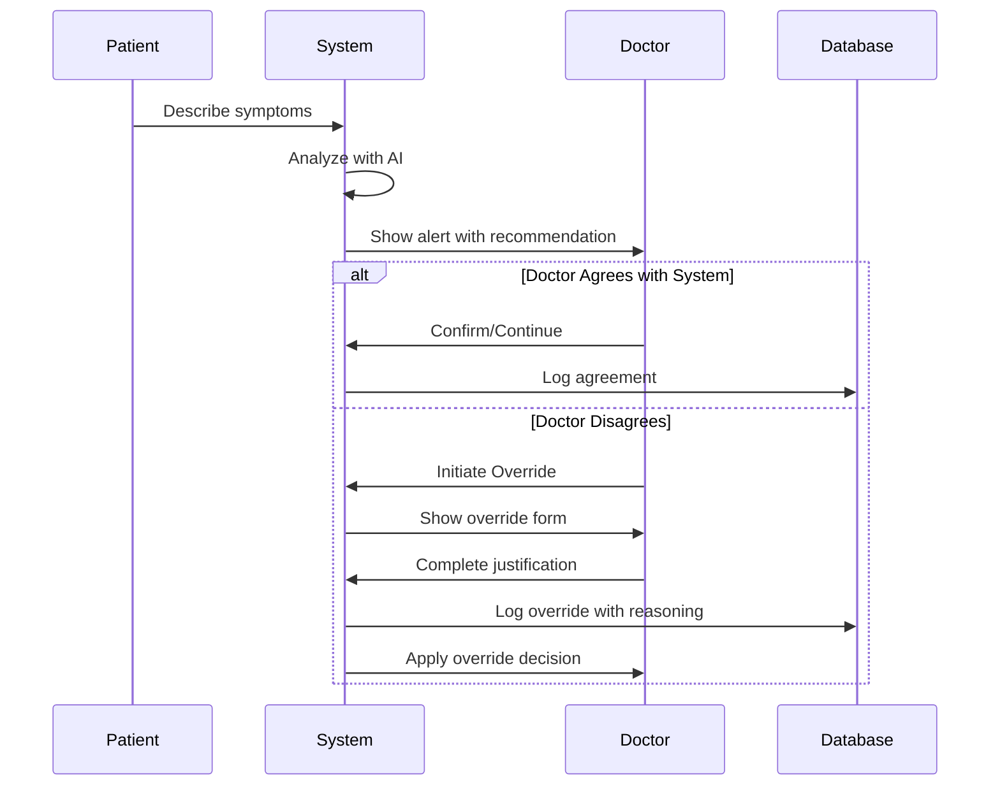

# Flujo de Override de Doctor
# Doctor Override Workflow

**Versión:** 1.0.0
**Fecha:** 2026-02-09
**Estado:** Borrador para Implementación
**Sistema:** Doctor.mx Clinical Decision Support

---

## Índice / Table of Contents

1. [Resumen Ejecutivo](#resumen-ejecutivo)
2. [Filosofía del Override](#filosofía-del-override)
3. [Tipos de Override](#tipos-de-override)
4. [Flujo de Trabajo](#flujo-de-trabajo)
5. [Interfaz de Usuario](#interfaz-de-usuario)
6. [Documentación de Override](#documentación-de-override)
7. [Análisis y Aprendizaje](#análisis-y-aprendizaje)
8. [Controles y Salvaguardas](#controles-y-salvaguardas)

---

## Resumen Ejecutivo

### Español
El flujo de override de doctor permite a los profesionales médicos sobrescribir las alertas y decisiones del sistema de detección de emergencias cuando, en su juicio clínico profesional, la recomendación del sistema no es la más apropiada para el paciente específico. Este mecanismo es fundamental para mantener la autonomía profesional del médico mientras se recolecta datos para mejorar el sistema.

### English
The doctor override workflow allows medical professionals to override emergency detection system alerts and decisions when, in their professional clinical judgment, the system's recommendation is not the most appropriate for the specific patient. This mechanism is essential for maintaining physician professional autonomy while collecting data to improve the system.

---

## Filosofía del Override

### Principios Fundamentales

#### 1. Autonomía Profesional
```
El sistema de IA es una herramienta de soporte a la decisión clínica,
NO un reemplazo del juicio profesional del médico.

El médico SIEMPRE tiene la autoridad final sobre el cuidado del paciente.
```

#### 2. Seguridad del Paciente Primero
```
Si hay duda entre el sistema y el médico:
- En emergencias: Seguir el curso más conservador
- En triaje: El médico puede ajustar hacia arriba o hacia abajo
- La seguridad del paciente prevalece sobre la "precisión" del sistema
```

#### 3. Transparencia y Responsabilidad
```
Todo override debe ser:
- Documentado con justificación clínica
- Trazable al médico específico
- Sujeto a auditoría y revisión
- Utilizado para aprendizaje del sistema
```

#### 4. Mejora Continua
```
Los overrides no son "errores" del sistema ni del médico:
- Son datos valiosos sobre edge cases
- Informan actualizaciones del algoritmo
- Revelan lagunas en el conocimiento médico
- Guían desarrollo de nuevas características
```

---

## Tipos de Override

### Clasificación por Dirección

#### Override de Escalamiento (Escalating Override)
**Definición:** Doctor aumenta el nivel de urgencia sobre lo detectado por el sistema.

```typescript
interface EscalatingOverride {
  systemDetection: {
    urgencyLevel: 'moderate' | 'low';
    urgencyScore: number; // 1-6
    action: 'consult_24h' | 'elective';
  };

  doctorDecision: {
    urgencyLevel: 'high' | 'critical';
    urgencyScore: number; // 7-10
    action: 'er_24h' | 'call_911';
  };

  clinicalReasoning: {
    primaryReason: string;
    contextFactors: string[];
    patientSpecificFactors: string[];
    evidence: string[];
  };
}
```

**Ejemplo:**
```
Sistema: Urgencia 4/10 - "Dolor abdominal, consulte en 24h"
Médico: Urgencia 8/10 - "Possibile abdomen agudo quirúrgico, acuda a urgencias"
Razón: "Paciente con antecedentes de cirugía abdominal, signs de irritación peritoneal"
```

#### Override de Descalamiento (De-escalating Override)
**Definición:** Doctor reduce el nivel de urgencia sobre lo detectado por el sistema.

```typescript
interface DeEscalatingOverride {
  systemDetection: {
    urgencyLevel: 'critical' | 'high';
    urgencyScore: number; // 7-10
    action: 'call_911' | 'er_24h';
  };

  doctorDecision: {
    urgencyLevel: 'moderate' | 'low';
    urgencyScore: number; // 1-6
    action: 'consult_24h' | 'elective';
  };

  clinicalReasoning: {
    primaryReason: string;
    mitigatingFactors: string[];
    alternativeExplanation: string;
    monitoringPlan: string;
  };

  safeguards: {
    patientInformed: boolean;
    followUpScheduled: boolean;
    redFlagsReassessed: boolean;
  };
}
```

**Ejemplo:**
```
Sistema: Urgencia 9/10 - "Dificultad para respirar, llame al 911"
Médico: Urgencia 5/10 - "Exacerbación leve de EPOC conocida"
Razón: "Paciente con EPOC crónica, SpO2 94% (baseline 93%), sin cambio de estado"
```

#### Override de Categoría (Category Override)
**Definición:** Doctor cambia la categoría de la emergencia sin cambiar necesariamente el nivel de urgencia.

```typescript
interface CategoryOverride {
  systemCategory: string; // "Cardiac", "Respiratory", etc.
  doctorCategory: string;

  rationale: string;
  impactOnTreatment: string;
}
```

**Ejemplo:**
```
Sistema: "Dolor de pecho - posible emergencia cardíaca"
Médico: "Dolor de pecho - posible emergencia respiratoria"
Razón: "Síntomas más consistentes con neumotórax que con IAM"
```

### Clasificación por Urgencia Temporal

#### Override Inmediato (Immediate Override)
**Durante la consulta activa:**
- Alerta en tiempo real durante el videoconsult
- Doctor ajusta mientras interactúa con paciente
- Requiere justificación rápida

#### Override Diferido (Deferred Override)
**Después de la consulta:**
- Doctor revisa caso y ajusta clasificación
- Más tiempo para reflexión y documentación
- Común en revisión de casos completados

---

## Flujo de Trabajo

### 1. Detección y Presentación de Alerta



### 2. Interfaz de Override

```typescript
interface OverrideInterface {
  alert: {
    id: string;
    timestamp: Date;
    systemRecommendation: {
      urgencyScore: number;
      urgencyLevel: string;
      action: string;
      recommendation: string;
      detectedFlags: string[];
    };
  };

  overrideOptions: {
    escalate?: {
      toLevel: number;
      toAction: string;
    };
    deEscalate?: {
      toLevel: number;
      toAction: string;
    };
    changeCategory?: {
      from: string;
      to: string;
    };
  };

  justificationForm: {
    required: {
      primaryReason: string; // Dropdown + free text
      clinicalContext: string; // Text area
      patientFactors: string[]; // Multi-select
    };

    optional: {
      alternativeDiagnosis?: string;
      supportingEvidence?: string;
      monitoringPlan?: string;
      patientInformed: boolean;
    };

    safeguards: {
      acknowledgeRisk: boolean; // For de-escalation
      patientConsent: boolean;
      followUpScheduled: boolean;
    };
  };
}
```

### 3. Proceso de Override Paso a Paso

#### Paso 1: Solicitud de Override
```typescript
async function initiateOverride(alertId: string, doctorId: string) {
  // 1. Verificar que el doctor tiene autoridad
  const doctorAuth = await verifyDoctorAuthority(doctorId);

  if (!doctorAuth.canOverride) {
    throw new Error('Doctor no autorizado para override');
  }

  // 2. Cargar contexto completo del caso
  const caseContext = await loadCaseContext(alertId);

  // 3. Presentar formulario de override
  return {
    alert: caseContext.alert,
    patientInfo: anonymize(caseContext.patient),
    systemReasoning: caseContext.systemReasoning,
    overrideForm: generateOverrideForm(caseContext)
  };
}
```

#### Paso 2: Justificación del Override
```typescript
interface OverrideJustification {
  // Información obligatoria
  overrideType: 'escalate' | 'deEscalate' | 'categorize';
  primaryReason: OverrideReason;
  clinicalExplanation: string; // Mínimo 50 caracteres

  // Contexto clínico
  patientContext: {
    age: number;
    knownConditions: string[];
    currentMedications: string[];
    vitalSigns?: VitalSigns;
  };

  // Factores específicos del caso
  caseSpecificFactors: {
    symptomDuration?: string;
    symptomProgression?: string;
    alleviatingFactors?: string[];
    exacerbatingFactors?: string[];
    previousEpisodes?: string;
  };

  // Razonamiento clínico
  clinicalReasoning: {
    whySystemIncorrect: string;
    whyAssessmentCorrect: string;
    supportingEvidence: string[];
    differentialDiagnosis?: string[];
  };

  // Salvaguardas (para de-escalation)
  safeguards?: {
    patientInformedOfRisk: boolean;
    patientAgreesToPlan: boolean;
    followUpScheduled: boolean;
    redFlagsReassessed: boolean;
    emergencyPlanProvided: boolean;
  };

  // Metadatos
  submittedBy: string;
  submittedAt: Date;
  confidenceLevel: 'high' | 'moderate' | 'low';
}
```

#### Códigos de Razón Predefinidos

```typescript
enum OverrideReason {
  // Para Escalation
  PATIENT_HISTORY_RISK = 'patient_history_risk',
  MEDICATION_INTERACTION = 'medication_interaction',
  ATYPICAL_PRESENTATION = 'atypical_presentation',
  CLINICAL_INTUITION = 'clinical_intuition',
  CONCERN_FOR_DETERIORATION = 'concern_for_deterioration',

  // Para De-escalation
  CHRONIC_CONDITION_BASELINE = 'chronic_condition_baseline',
  ALTERNATIVE_DIAGNOSIS = 'alternative_diagnosis',
  SYMPTOM_IMPROVEMENT = 'symptom_improvement',
  LOW_PROBABILITY = 'low_probability',
  PATIENT_PREFERENCE = 'patient_preference',

  // Para Categoría
  DIFFERENTIAL_CATEGORY = 'differential_category',
  MULTIPLE_ETIOLOGIES = 'multiple_etiologies',
  RECLASSIFICATION = 'reclassification',

  // General
  INSUFFICIENT_SYSTEM_INFO = 'insufficient_system_info',
  SYSTEM_MISINTERPRETATION = 'system_misinterpretation',
  ADDITIONAL_CONTEXT_AVAILABLE = 'additional_context_available',
}
```

#### Paso 3: Validación de Override
```typescript
async function validateOverride(
  justification: OverrideJustification
): Promise<ValidationResult> {

  const checks = {
    // 1. Completitud
    hasRequiredFields: justification.clinicalExplanation.length >= 50,
    hasPrimaryReason: justification.primaryReason !== undefined,

    // 2. Coherencia
    reasonMatchesType: validateReasonTypeMatch(
      justification.overrideType,
      justification.primaryReason
    ),

    // 3. Salvaguardas (para de-escalation)
    hasSafeguards: justification.overrideType !== 'deEscalate' ||
                   (justification.safeguards?.patientInformedOfRisk &&
                    justification.safeguards?.followUpScheduled),

    // 4. Riesgo excesivo
    acceptableRiskLevel: assessOverrideRisk(justification)
  };

  return {
    valid: Object.values(checks).every(c => c === true),
    checks,
    warnings: generateWarnings(justification),
    requiresSecondaryReview: shouldRequireReview(justification)
  };
}
```

#### Paso 4: Confirmación y Aplicación
```typescript
async function applyOverride(
  alertId: string,
  justification: OverrideJustification
): Promise<OverrideResult> {

  // 1. Validar justificación
  const validation = await validateOverride(justification);

  if (!validation.valid) {
    throw new Error('Override no válido: ' + validation.errors.join(', '));
  }

  // 2. Para overrides de alto riesgo, solicitar segunda opinión
  if (validation.requiresSecondaryReview) {
    const review = await requestSecondaryReview(alertId, justification);
    if (!review.approved) {
      throw new Error('Override requiere aprobación adicional');
    }
  }

  // 3. Aplicar override
  const result = {
    originalAlert: await getAlert(alertId),
    overrideApplied: {
      appliedBy: justification.submittedBy,
      appliedAt: new Date(),
      newUrgencyScore: calculateNewUrgency(justification),
      newAction: determineNewAction(justification),
      newRecommendation: generateNewRecommendation(justification)
    },
    justification,
    auditLog: generateAuditEntry(justification)
  };

  // 4. Guardar en base de datos (immutable)
  await saveOverrideImmutable(result);

  // 5. Actualizar caso en tiempo
  await updateCaseWithOverride(alertId, result);

  // 6. Notificar para análisis (async)
  await queueForLearningAnalysis(result);

  return result;
}
```

---

## Interfaz de Usuario

### Diseño Visual del Modal de Override

```typescript
interface OverrideModalUI {
  layout: {
    header: {
      title: string;
      systemRecommendation: {
        urgencyScore: number;
        urgencyLevel: string;
        color: string;
        action: string;
      };
      warning?: string; // Para overrides de alto riesgo
    };

    content: {
      overrideTypeSelector: {
        options: [
          { value: 'escalate', label: 'Aumentar Urgencia', color: 'red' },
          { value: 'maintain', label: 'Mantener + Documentar', color: 'blue' },
          { value: 'deEscalate', label: 'Reducir Urgencia', color: 'orange' }
        ];
        warning: string;
      };

      newLevelSelector: {
        type: 'slider' | 'dropdown';
        range: [1, 10];
        current: number;
        recommended?: number;
      };

      justificationSection: {
        primaryReason: {
          type: 'dropdown';
          options: OverrideReason[];
          required: true;
        };

        clinicalExplanation: {
          type: 'textarea';
          placeholder: 'Explique su razonamiento clínico detallado...';
          minLength: 50;
          required: true;
          suggestions?: string[]; // AI-powered suggestions
        };

        patientFactors: {
          type: 'multiSelect';
          options: [
            'Condiciones preexistentes',
            'Medicamentos actuales',
            'Signos vitales',
            'Historia previa',
            'Contexto psicosocial',
            'Preferencias del paciente'
          ];
        };

        alternativeDiagnosis?: {
          type: 'text';
          optional: true;
        };
      };

      safeguardsSection: {
        // Mostrar solo para de-escalation
        patientInformedOfRisk: {
          type: 'checkbox';
          label: 'He informado al paciente del riesgo',
          required: true;
        };

        followUpScheduled: {
          type: 'checkbox';
          label: 'He programado seguimiento',
          required: true;
        };

        emergencyInstructions: {
          type: 'checkbox';
          label: 'He proporcionado instrucciones de cuándo buscar emergencia',
          required: true;
        };
      };

      riskDisclosure: {
        type: 'checkbox';
        label: 'Entiendo que soy responsable de esta decisión clínica',
        required: true;
      };
    };

    footer: {
      buttons: [
        {
          label: 'Cancelar',
          action: 'cancel',
          variant: 'secondary'
        },
        {
          label: 'Solicitar Segunda Opinión',
          action: 'requestReview',
          variant: 'tertiary',
          showWhen: 'highRisk'
        },
        {
          label: 'Aplicar Override',
          action: 'apply',
          variant: 'primary',
          confirmWhen: 'deEscalate'
        }
      ];
    };
  };
}
```

### Ejemplo de Flujo Visual

```
┌─────────────────────────────────────────────────────────┐
│ ⚠️ Override de Detección de Emergencia                  │
├─────────────────────────────────────────────────────────┤
│                                                         │
│ SISTEMA RECOMIENDA:                                    │
│ ┌─────────────────────────────────────────────────┐    │
│ │ 🚨 URGENCIA CRÍTICA (9/10)                      │    │
│ │ Posible infarto al miocardio                    │    │
│ │ ACCIÓN: Llamar al 911 inmediatamente            │    │
│ └─────────────────────────────────────────────────┘    │
│                                                         │
│ ────────────────────────────────────────────────────   │
│                                                         │
│ SU DECISIÓN CLÍNICA:                                   │
│                                                         │
│ Tipo de Override:                                      │
│ ○ Aumentar Urgencia                                    │
│ ● Mantener + Documentar                                │
│ ○ Reducir Urgencia ⚠️                                 │
│                                                         │
│ Nuevo Nivel de Urgencia:                               │
│ [━━━━━━━━━━] 9/10                                     │
│                                                         │
│ ────────────────────────────────────────────────────   │
│                                                         │
│ JUSTIFICACIÓN REQUERIDA:                               │
│                                                         │
│ Razón Principal:                                       │
│ [Diagnóstico alternativo ▼]                            │
│                                                         │
│ Explicación Clínica: *                                 │
│ ┌─────────────────────────────────────────────────┐    │
│ │ Paciente con dolor torácico atípico. ECG        │    │
│ │ realizado sin cambios isquémicos agudos. Troponin│    │
│ │ negativa. Dolor más consistente con             │    │
│ │ reflujo gastroesofágico. Paciente estable.      │    │
│ └─────────────────────────────────────────────────┘    │
│                                                         │
│ Factores del Paciente:                                  │
│ ☑ Signos vitales normales                              │
│ ☑ ECG normal                                           │
│ ☐ Historia previa relevante                           │
│                                                         │
│ [+] Agregar factor adicional                           │
│                                                         │
│ ────────────────────────────────────────────────────   │
│                                                         │
│ ⚠️ USTED ESTÁ REDUCIENDO LA URGENCIA RECOMENDADA       │
│                                                         │
│ Para completar este override, debe confirmar:           │
│                                                         │
│ ☑ He informado al paciente del riesgo                  │
│ ☑ He programado seguimiento en 24h                     │
│ ☑ He proporcionado instrucciones de emergencia         │
│ ☑ Acepto responsabilidad clínica por esta decisión     │
│                                                         │
│ ────────────────────────────────────────────────────   │
│                                                         │
│ [Cancelar]  [Solicitar Revisión]  [Aplicar Override]   │
│                                                         │
└─────────────────────────────────────────────────────────┘
```

---

## Documentación de Override

### Registro Inmutable

```typescript
interface OverrideRecord {
  // Identificación
  id: string; // UUID
  timestamp: Date;
  doctorId: string;
  doctorLicense: string;
  patientCaseId: string; // Anonymized

  // Alerta Original
  originalAlert: {
    id: string;
    systemVersion: string;
    detectionTimestamp: Date;

    systemRecommendation: {
      urgencyScore: number;
      urgencyLevel: string;
      category: string;
      action: string;
      flags: string[];
      reasoning: string;
      confidence: number; // 0-1
    };
  };

  // Override Aplicado
  overrideApplied: {
    overrideType: 'escalate' | 'deEscalate' | 'categorize';
    newUrgencyScore: number;
    newUrgencyLevel: string;
    newCategory?: string;
    newAction: string;
    newRecommendation: string;
  };

  // Justificación
  justification: OverrideJustification;

  // Contexto Adicional
  additionalContext: {
    consultationMedium: 'video' | 'chat' | 'phone';
    consultationDuration?: number;
    patientAge?: number;
    patientGender?: string;
  };

  // Resultado
  outcome?: {
    patientFollowed: boolean;
    patientOutcome?: string;
    systemCorrect: boolean; // Was the system right after all?
    doctorCorrect: boolean; // Was the doctor right?
    learnedFromCase: boolean;
  };

  // Metadatos de Sistema
  metadata: {
    ipAddress: string;
    userAgent: string;
    platform: string;
    sessionDuration?: number;
  };

  // Firma Digital (para inmutabilidad)
  digitalSignature: {
    hash: string;
    signature: string;
    timestamp: Date;
  };
}
```

### Almacenamiento Inmutable

```typescript
// Cada override se almacena con un hash criptográfico
async function saveOverrideImmutable(record: OverrideRecord) {
  // 1. Generar hash del registro
  const recordHash = crypto
    .createHash('sha256')
    .update(JSON.stringify(record))
    .digest('hex');

  // 2. Crear registro con firma
  const signedRecord = {
    ...record,
    digitalSignature: {
      hash: recordHash,
      signature: signRecord(recordHash), // Usando llave privada
      timestamp: new Date()
    }
  };

  // 3. Guardar en tabla de overrides (append-only)
  await db.overrides.insert({
    data: signedRecord,
    immutable: true, // Constraint de base de datos
    created_at: new Date()
  });

  // 4. Guardar hash en blockchain (opcional, para máxima trazabilidad)
  await blockchain.recordHash(recordHash);

  return recordHash;
}
```

---

## Análisis y Aprendizaje

### 1. Análisis Automático de Overrides

```typescript
interface OverrideAnalysis {
  overrideRecord: OverrideRecord;

  // Clasificación
  classification: {
    wasJustified: boolean; // ¿El override fue clínicamente válido?
    systemError: boolean; // ¿El sistema estaba equivocado?
    doctorError: boolean; // ¿El médico estaba equivocado?
    sharedTruth: boolean; // ¿Ambas tenían razón? (contexto adicional)
  };

  // Categorización para aprendizaje
  learningCategory:
    | 'true_positive_system_error'  // Sistema equivocado, override correcto
    | 'true_negative_doctor_error'  // Sistema correcto, override incorrecto
    | 'contextual_disagreement'     // Ambas válidas con diferente contexto
    | 'uncertain';                  // Requiere revisión humana

  // Acciones recomendadas
  recommendedActions: [
    'update_algorithm' | 'update_threshold' |
    'add_exception' | 'update_documentation' |
    'flag_for_review' | 'no_action'
  ];

  // Métricas
  metrics: {
    overrideImpact: number; // -1 to +1 (negative = harmful)
    frequencyOfSimilarCases: number;
    consensusWithOtherDoctors: number; // % of agreement
  };

  // Caso para dataset de aprendizaje
  learningCase?: {
    input: any;
    correctOutput: any; // Based on override outcome
    weight: number; // For training
  };
}
```

### 2. Revisión Periódica por Comité

**Reporte Mensual de Overrides:**

```typescript
interface MonthlyOverrideReport {
  period: {
    startDate: Date;
    endDate: Date;
  };

  summary: {
    totalOverrides: number;
    overridesPer1000Cases: number;

    byType: {
      escalations: number;
      deEscalations: number;
      reclassifications: number;
    };

    bySpecialty: {
      [specialty: string]: {
        total: number;
        escalationRate: number;
        deEscalationRate: number;
      };
    };

    byDoctor: {
      top5OverrideUsers: Array<{
        doctorId: string;
        totalOverrides: number;
        justifiedRate: number;
      }>;
    };
  };

  analysis: {
    justifiedOverrides: number; // %
    potentiallyHarmfulOverrides: number; // %

    topSystemErrors: Array<{
      alertType: string;
      overrideCount: number;
      commonReasons: string[];
      recommendedFix: string;
    }>;

    edgeCasesDiscovered: string[];
  };

  recommendations: {
    algorithmUpdates: Array<{
      alertId: string;
      changeType: string;
      proposedChange: string;
      evidence: string;
    }>;

    documentationUpdates: string[];

    educationNeeds: Array<{
      topic: string;
      targetAudience: string[];
    }>;
  };
}
```

### 3. Sistema de Aprendizaje Automático

```typescript
// Incorporar overrides válidos al retraining del modelo
async function incorporateIntoTraining(
  justifiedOverrides: OverrideRecord[]
) {
  const trainingCases = justifiedOverrides
    .filter(o => o.classification.wasJustified && !o.classification.doctorError)
    .map(override => ({
      input: {
        symptoms: override.originalAlert.symptoms,
        context: override.justification.patientContext
      },
      output: {
        urgencyScore: override.overrideApplied.newUrgencyScore,
        category: override.overrideApplied.newCategory,
        action: override.overrideApplied.newAction
      },
      metadata: {
        source: 'doctor_override',
        justification: override.justification.clinicalExplanation,
        weight: calculateWeight(override) // More weight for clear-cut cases
      }
    }));

  // Actualizar modelo
  await retrainModel(trainingCases);

  // Validar que el modelo no ha empeorado en otros casos
  await regressionTesting();

  // Desplegar nueva versión si mejora
  if (await improvementCheck()) {
    await deployNewVersion();
  }
}
```

---

## Controles y Salvaguardas

### 1. Prevención de Abuso

```typescript
interface AbusePrevention {
  // Límites individuales
  rateLimits: {
    maxOverridesPerDay: 50;
    maxOverridesPerHour: 10;
    maxDeEscalationsPerDay: 20; // Más restrictivo
  };

  // Patrones sospechosos
  suspiciousPatterns: [
    {
      pattern: 'excessive_de_escalation',
      threshold: 'deEscalationRate > 50%',
      action: 'flag_for_review'
    },
    {
      pattern: 'copy_paste_justifications',
      threshold: 'identical_explanation > 5 times',
      action: 'require_unique_explanation'
    },
    {
      pattern: 'no_safeguards',
      threshold: 'missing_safeguards > 20%',
      action: 'mandatory_safeguard_training'
    }
  ];

  // Requerimientos de reentrenamiento
  competencyChecks: {
    requiredAfter: {
      harmfulOverrideCount: 3,
      patternFlagging: 2,
      justifiedRateBelow: 0.7 // <70% justified
    };
  };
}
```

### 2. Salvaguardas para De-escalation

**Requerimientos Especiales:**

```typescript
interface DeEscalationSafeguards {
  mandatoryChecks: [
    {
      check: 'patient_risk_disclosure',
      description: 'El paciente ha sido informado del riesgo',
      evidence: 'checkbox + timestamp'
    },
    {
      check: 'follow_up_scheduled',
      description: 'Seguimiento programado',
      evidence: 'appointment_id or timestamp'
    },
    {
      check: 'red_flags_reassessed',
      description: 'Signos de alarma reevaluados',
      evidence: 'clinical_notes'
    },
    {
      check: 'emergency_plan',
      description: 'Plan de emergencia proporcionado',
      evidence: 'instructions_sent'
    }
  ];

  autoTriggers: {
    requireSecondaryReviewIf: {
      originalUrgencyScore: number; // ≥9
      patientAge: number; // <18 or >65
      complexMedicalHistory: boolean;
      insufficientJustification: boolean;
    };

    autoDenyIf: {
      missingSafeguards: true;
      justificationTooBrief: true; // <50 chars
      noRiskAcknowledgment: true;
    };
  };
}
```

### 3. Notificación y Escalación

```typescript
interface NotificationSystem {
  // Alertas automáticas
  autoAlerts: {
    toMedicalDirector: [
      {
        trigger: 'potential_harm',
        condition: 'deEscalation + patient_outcome = adverse',
        urgency: 'immediate'
      },
      {
        trigger: 'pattern_concern',
        condition: 'override_rate > 3 SD above mean',
        urgency: 'within_24h'
      }
    ];

    toDoctor: [
      {
        trigger: 'override_confirmation',
        condition: 'override_applied',
        message: 'Override aplicado y documentado'
      },
      {
        trigger: 'learning_notification',
        condition: 'override_used_to_improve_system',
        message: 'Su override ayudó a mejorar el sistema'
      }
    ];
  };

  // Escalaciones
  escalations: {
    toClinicalSafetyCommittee: {
      triggers: [
        'serious_adverse_event_related_to_override',
        'pattern_of_questionable_de_escalations',
        'doctor_refuses_to_complete_justification'
      ];
    };

    toQualityImprovement: {
      triggers: [
        'repeated_system_error_identified',
        'opportunity_for_algorithm_enhancement',
        'need_for_additional_training'
      ];
    };
  };
}
```

---

## Métricas y KPIs

### Métricas de Override

| Métrica | Fórmula | Objetivo | Frecuencia de Reporte |
|---------|---------|----------|----------------------|
| Tasa de Override | Overrides / Total de alertas | <10% | Mensual |
| Tasa de Justificación | Overrides justificados / Total | >80% | Mensual |
| Tasa de De-escalation | De-escalations / Total overrides | <30% | Semanal |
| Tasa de Escalation | Escalations / Total overrides | Variable | Mensual |
| Precisión de Override | Overrides correctos / Total | >90% | Trimestral |
| Tiempo de Documentación | Promedio tiempo para justificar | <2 min | Mensual |
| Consenso entre Doctores | Acuerdo en overrides similares | >75% | Trimestral |

### Análisis de Tendencias

```
ALERTAS SOBRE OVERRIDES:
- Si la tasa de override aumenta >20%: Investigar cambio en población o degradación del sistema
- Si la tasa de justificación cae <70%: Ofrecer entrenamiento adicional
- Si la tasa de de-escalation aumenta >40%: Revisar si el sistema es demasiado conservador
```

---

## Anexos

### Anexo A: Plantilla de Justificación de Override

[Copia impresa del formulario para uso offline]

### Anexo B: Guía de Categorización de Overrides

[Guía detallada para clasificar tipos de overrides]

### Anexo C: Protocolo de Revisión de Overrides

[Proceso para revisión mensual del comité]

### Anexo D: Ejemplos de Overrides Justificados vs No Justificados

[Case studies para entrenamiento]

---

**Aprobado por:**
- Director Médico: _______________________ Fecha: ________
- Líder de Seguridad Clínica: _______________________ Fecha: ________

**Versión:** 1.0.0
**Próxima Revisión:** 2026-05-09
