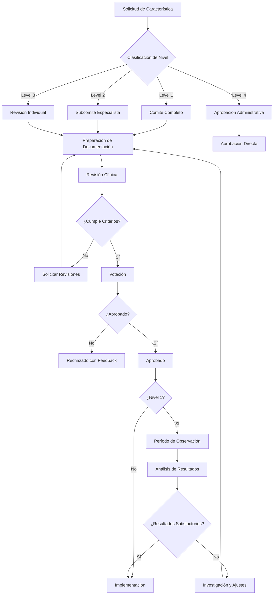

# Proceso de Aprobación del Consejo Médico
# Medical Review Board Approval Process

**Versión:** 1.0.0
**Fecha:** 2026-02-09
**Estado:** Borrador para Implementación
**Sistema:** Doctor.mx Clinical Governance

---

## Índice / Table of Contents

1. [Resumen Ejecutivo](#resumen-ejecutivo)
2. [Estructura del Consejo Médico](#estructura-del-consejo-médico)
3. [Proceso de Aprobación](#proceso-de-aprobación)
4. [Criterios de Evaluación](#criterios-de-evaluación)
5. [Flujo de Trabajo](#flujo-de-trabajo)
6. [Documentación Requerida](#documentación-requerida)
7. [Toma de Decisiones](#toma-de-decisiones)
8. [Mantenimiento de Registros](#mantenimiento-de-registros)

---

## Resumen Ejecutivo

### Español
Este documento establece el proceso formal para la aprobación de características clínicas y algoritmos de detección de emergencias por el Consejo Médico de Doctor.mx. El proceso asegura que todas las funcionalidades clínicas cumplan con los estándares de atención médica, evidencia científica y requisitos regulatorios.

### English
This document establishes the formal process for approval of clinical features and emergency detection algorithms by the Doctor.mx Medical Review Board. The process ensures all clinical features meet medical care standards, scientific evidence, and regulatory requirements.

---

## Estructura del Consejo Médico

### Composición del Consejo

```typescript
interface MedicalReviewBoard {
  coreMembers: {
    medicalDirector: {
      name: string;
      credentials: string[];
      specialty: string;
      yearsOfExperience: number;
      licenseNumber: string;
    };
    clinicalSafetyLead: {
      name: string;
      credentials: string[];
      specialty: 'EmergencyMedicine' | 'InternalMedicine';
      yearsOfExperience: number;
    };
  };

  specialtyAdvisors: Array<{
    id: string;
    name: string;
    specialty: MedicalSpecialty;
    credentials: string[];
    licenseNumber: string;
    affiliations: string[];
    conflictOfInterestDeclaration: string;
  }>;

  technicalLiaison: {
    name: string;
    role: string;
    responsibilities: string[];
  };

  legalAdvisor: {
    name: string;
    role: string;
    expertise: string[];
  };
}

type MedicalSpecialty =
  | 'Cardiology'
  | 'Neurology'
  | 'EmergencyMedicine'
  | 'InternalMedicine'
  | 'Pediatrics'
  | 'Psychiatry'
  | 'ObstetricsGynecology'
  | 'Geriatrics';
```

### Requisitos de Miembros

| Rol | Requisitos Mínimos |
|-----|-------------------|
| Director Médico | - Licencia médica vigente (México)<br>- 10+ años experiencia<br>- Especialidad en medicina de urgencias o interna<br>- Experiencia en salud digital |
| Líder de Seguridad Clínica | - Licencia médica vigente<br>- 8+ años experiencia<br>- Especialidad en urgencias o cuidados críticos<br>- Certificación en seguridad del paciente |
| Advisor Especialista | - Licencia médica vigente<br>- 5+ años experiencia en especialidad<br>- Afiliación académica preferida<br>- Sin conflictos de interés |
| Liaison Técnico | - Experiencia en desarrollo de software médico<br>- Conocimiento de regulaciones healthcare |
| Asesor Legal | - Licenciatura en derecho<br>- Especialización en derecho médico o salud digital |

### Quórum y Votación

**Quórum Mínimo:**
- Sesiones regulares: 60% de miembros
- Sesiones de aprobación crítica: 80% de miembros
- Director médico o Líder de seguridad clínica debe estar presente

**Requisitos de Votación:**
- Aprobación estándar: Mayoría simple (50% + 1)
- Aprobación de algoritmos críticos: Supermayoría (75%)
- Cambios mayores: Unanimidad o justificación documentada de disenso

---

## Proceso de Aprobación

### Niveles de Clasificación de Características

| Nivel | Descripción | Ejemplos | Requisitos de Aprobación |
|-------|-------------|----------|--------------------------|
| **Crítico (Level 1)** | Impacto directo en detección de emergencias potencialmente fatales | - Detección de IAM<br>- Detección de ACV<br>- Detección de dificultad respiratoria | - Revisión por 3 especialistas<br>- Unanimidad o supermayoría<br>- Validación con casos clínicos<br>- Período de observación |
| **Alto (Level 2)** | Impacto significativo en clasificación de urgencia | - Umbrales de signos vitales<br>- Interacciones medicamentosas<br>- Ajustes por condiciones preexistentes | - Revisión por 2 especialistas<br>- Supermayoría<br>- Validación con casos de prueba |
| **Medio (Level 3)** | Mejoras clínicas sin riesgo inmediato | - Mensajes de recomendación<br>- Flujo de usuario clínico<br>- Documentación para paciente | - Revisión por 1 especialista<br>- Mayoría simple<br>- Revisión de UX/contenido |
| **Bajo (Level 4)** | Cambios administrativos o no clínicos | - Cambios de UI no clínicos<br>- Reportes y métricas<br>- Configuración de sistema | - Revisión por Líder de Seguridad<br>- Aprobación administrativa |

### Flujo de Aprobación Detallado



---

## Criterios de Evaluación

### 1. Evidencia Científica

**Requisitos por Nivel:**

| Nivel | Evidencia Requerida |
|-------|---------------------|
| Level 1 | - Guías clínicas internacionales (ACC/AHA, AHA/ASA, NICE)<br>- Meta-análisis o estudios controlados<br>- Consenso de especialistas ≥80% |
| Level 2 | - Guías clínicas o estudios de cohorte<br>- Evidencia de práctica clínica estándar |
| Level 3 | - Textos de referencia o consenso menor |
| Level 4 | - Best practices o experiencia |

**Formato de Documentación de Evidencia:**

```typescript
interface ScientificEvidence {
  primarySources: Array<{
    type: 'guideline' | 'meta_analysis' | 'controlled_trial' | 'cohort_study' | 'expert_consensus';
    citation: string; // Formato Vancouver o APA
    url?: string;
    year: number;
    relevance: 'direct' | 'indirect' | 'supporting';
    quality: 'high' | 'moderate' | 'low';
  }>;

  secondarySources: Array<{
    type: 'textbook' | 'review_article' | 'clinical_database';
    citation: string;
    year?: number;
  }>;

  clinicalPractice: {
    standardOfCare: boolean;
    consensusLevel: number; // 0-100%
    specialistEndorsements: string[]; // Nombres y afiliaciones
  };

  evidenceSummary: {
    strengthOfEvidence: 'strong' | 'moderate' | 'limited' | 'expert_opinion';
    gapsInEvidence: string[];
    recommendationsForFutureResearch: string[];
  };
}
```

### 2. Seguridad del Paciente

**Checklist de Seguridad:**

```typescript
interface PatientSafetyChecklist {
  harmPotential: {
    level: 'critical' | 'high' | 'moderate' | 'low';
    scenarios: Array<{
      description: string;
      probability: 'rare' | 'unlikely' | 'possible' | 'likely';
      severity: 'minor' | 'moderate' | 'serious' | 'critical';
      mitigation: string;
    }>;
  };

  falseNegativeRisk: {
    acceptable: boolean;
    maxAcceptableRate: number; // % de falsos negativos
    monitoringPlan: string;
    rapidResponsePlan: string;
  };

  falsePositiveTolerance: {
    maxAcceptableRate: number; // % de falsos positivos
    impactOnPatient: string;
    impactOnSystem: string;
  };

  failSafeMechanisms: string[]; // "Triple check", "Human override required", etc.
}
```

**Principios de Seguridad:**

1. **Primum non nocere** (Primero, no dañar)
   - Sistema debe ser conservador (mejor falso positivo que falso negativo)
   - Umbrales de detección deben ser sensibles

2. **Transparencia**
   - Paciente debe saber cuándo sistema detecta emergencia
   - Recomendaciones deben ser claras y accionables
   - Limitaciones del sistema deben ser comunicadas

3. **Opción de Revisión Humana**
   - Doctor debe poder override del sistema
   - Sistema debe documentar override con razón

### 3. Usabilidad Clínica

**Criterios:**

| Aspecto | Métrica | Umbral |
|---------|---------|--------|
| Claridad de alertas | Escala 1-5 | ≥4 |
| Tiempo para comprender alerta | Segundos | <5 |
| Accionalidad de recomendación | Binaria (sí/no) | 100% sí |
| Pertinencia clínica | % especialistas que estarían de acuerdo | ≥80% |
| Interferencia con flujo clínico | % de doctores que reportan interferencia | ≤10% |

### 4. Rendimiento Técnico

```typescript
interface TechnicalPerformance {
  responseTime: {
    p50: number; // ms
    p95: number; // ms
    p99: number; // ms;
    max: number;
  };

  accuracy: {
    sensitivity: number; // %
    specificity: number; // %
    precision: number; // %
    f1Score: number;
  };

  reliability: {
    uptime: number; // %
    failureRate: number; // per million requests
    gracefulDegradation: string; // Behavior under load
  };

  scalability: {
    maxConcurrentUsers: number;
    throughputPerSecond: number;
  };
}
```

---

## Flujo de Trabajo

### 1. Solicitud de Aprobación

**Responsable:** Product Manager, Engineering Lead, o Clinical Lead

```typescript
interface ApprovalRequest {
  requestId: string;
  submittedBy: {
    name: string;
    role: string;
    department: string;
    date: Date;
  };

  feature: {
    name: string;
    description: string;
    level: 1 | 2 | 3 | 4;
    category: 'emergency_detection' | 'clinical_workflow' | 'patient_communication' | 'other';
    proposedReleaseDate: Date;
  };

  justification: {
    problemStatement: string;
    proposedSolution: string;
    expectedBenefits: string[];
    alternativesConsidered: string[];
  };

  technicalSpecs: {
    implementationDetails: string;
    testingApproach: string;
    rollbackPlan: string;
    monitoringPlan: string;
  };

  clinicalEvidence: ScientificEvidence;
  safetyAssessment: PatientSafetyChecklist;

  attachments: Array<{
    name: string;
    type: 'code' | 'documentation' | 'test_results' | 'other';
    url: string;
  }>;

  urgency: 'routine' | 'expedited' | 'emergency';
}
```

### 2. Triage de Solicitud

**Timeline:**
- Routine: 30 días para revisión completa
- Expedited: 7 días (circunstancias justificadas)
- Emergency: 24-48 horas (situaciones críticas de seguridad)

**Criterios para Expedited/Emergency:**
- Corrección de issue de seguridad crítico
- Cambio regulatorio requerido
- Riesgo inmediato a pacientes

### 3. Asignación de Revisores

```typescript
interface ReviewerAssignment {
  requestId: string;
  assignedReviewers: Array<{
    reviewerId: string;
    role: 'primary' | 'secondary' | 'tiebreaker';
    specialty: MedicalSpecialty;
    conflictOfInterest: boolean;
    expectedCompletionDate: Date;
  }>;

  reviewTimeline: {
    distributionDate: Date;
    individualReviewDeadline: Date;
    consensusMeetingDate: Date;
    finalDecisionDate: Date;
  };
}
```

**Reglas de Asignación:**
- Nivel 1: Mínimo 3 especialistas de diferentes especialidades relevantes
- Nivel 2: 2 especialistas
- Nivel 3: 1 especialista
- Revisores no deben tener conflicto de interés con la característica

### 4. Revisión Individual

**Plantilla de Revisión:**

```typescript
interface IndividualReview {
  reviewId: string;
  requestId: string;
  reviewerId: string;
  reviewDate: Date;

  overallAssessment: {
    recommendation: 'approve' | 'approve_with_conditions' | 'request_changes' | 'reject';
    confidence: number; // 0-100
    comments: string;
  };

  criteriaEvaluation: {
    scientificEvidence: {
      rating: number; // 1-5
      comments: string;
    };
    patientSafety: {
      rating: number; // 1-5
      concerns: string[];
      mitigationSuggestions: string[];
    };
    clinicalUsability: {
      rating: number; // 1-5
      comments: string;
    };
    technicalPerformance: {
      adequate: boolean;
      comments: string;
    };
  };

  specificConcerns: Array<{
    area: string;
    severity: 'critical' | 'major' | 'minor';
    description: string;
    suggestedChange?: string;
  }>;

  suggestedModifications: string[];

  conflictOfInterestDeclaration: string;
}
```

### 5. Consenso y Decisión Final

**Tipos de Decisión:**

1. **Aprobación Unánime:** Todos los revisores recomiendan "approve"
2. **Aprobación con Condiciones:** Aprobado con modificaciones requeridas
3. **Solicitar Cambios:** Rechazado temporalmente para revisiones
4. **Rechazo:** No aprobado, puede ser resubmitido después de cambios mayores

**Matriz de Decisión:**

| Revisión Primaria | Revisión Secundaria | Decisión |
|-------------------|---------------------|----------|
| Approve | Approve | ✅ Aprobado |
| Approve | Approve with Conditions | ⚠️ Aprobado con condiciones |
| Approve | Request Changes | 🔄 Solicitar cambios |
| Approve | Reject | ❌ Rechazar (mayoría) |
| Request Changes | Request Changes | 🔄 Solicitar cambios |
| Request Changes | Reject | ❌ Rechazar |
| Reject | Reject | ❌ Rechazar |

**Desempate:**
- Si hay desacuerdo y el feature es Level 1 o 2, se involucra tercer revisor
- Se puede convocar reunión del consejo completo para discusión
- Director Médico tiene voto de calidad en casos de empate persistente

---

## Documentación Requerida

### 1. Documentación Clínica

```markdown
# Especificación Clínica: [Nombre de Característica]

## Propósito Clínico
[Qué problema clínico resuelve]

## Población Objetivo
[Qué pacientes se benefician]

## Condiciones de Uso
[Cuándo debe activarse la característica]

## Evidencia Científica
- Referencias primarias
- Guías clínicas relevantes
- Estudios de apoyo

## Algoritmo/Método
[Descripción detallada del funcionamiento]

## Signos y Síntomas Detectados
[Listado completo con justificación]

## Umbrales de Decisión
[Criterios numéricos con evidencia]

## Recomendaciones Generadas
[Mensajes al paciente con justificación]

## Limitaciones Conocidas
[Qué NO detecta o puede confundir]

## Contraindicaciones
[En qué casos NO debe usarse]

## Referencias
[Listado completo en formato Vancouver]
```

### 2. Documentación de Casos de Prueba

```typescript
interface TestCaseDocumentation {
  featureId: string;
  version: string;

  positiveCases: Array<{
    id: string;
    description: string;
    input: any;
    expectedOutput: any;
    clinicalScenario: string;
    reference: string;
  }>;

  negativeCases: Array<{
    id: string;
    description: string;
    input: any;
    expectedOutput: any;
    reasonForNegative: string;
  }>;

  edgeCases: Array<{
    id: string;
    description: string;
    input: any;
    expectedOutput: any;
    whyEdgeCase: string;
  }>;

  performanceTargets: {
    minSensitivity: number;
    minSpecificity: number;
    maxResponseTime: number;
  };
}
```

### 3. Plan de Monitoreo Post-Implementación

```typescript
interface PostImplementationMonitoring {
  featureId: string;
  monitoringPeriod: number; // days

  metrics: {
    clinical: {
      detectionRate: number;
      falseNegativeRate: number;
      falsePositiveRate: number;
      specialistOverrideRate: number;
    };

    technical: {
      responseTime: number;
      errorRate: number;
      uptime: number;
    };

    userFeedback: {
      patientSatisfaction: number;
      doctorSatisfaction: number;
      reportCount: number;
    };
  };

  alertThresholds: {
    critical: Array<{ metric: string; threshold: number; action: string }>;
    warning: Array<{ metric: string; threshold: number; action: string }>;
  };

  reviewSchedule: {
    daily: boolean;
    weekly: boolean;
    monthly: boolean;
    quarterly: boolean;
  };
}
```

---

## Toma de Decisiones

### 1. Niveles de Aprobación

```typescript
type ApprovalStatus =
  | 'approved'              // Aprobado para implementación
  | 'approved_with_observation'  // Aprobado pero requiere monitoreo especial
  | 'conditional'           // Aprobado con modificaciones específicas
  | 'pilot'                 // Aprobado solo para piloto controlado
  | 'rejected'              // No aprobado
  | 'deferred'              // Pospuesto para más información
  | 'withdrawn';            // Retirado por solicitante
```

### 2. Condiciones para Aprobación

**Aprobación Directa:**
- Cumple todos los criterios clínicos, técnicos y de seguridad
- Evidencia científica fuerte o moderada
- Consenso entre revisores
- Plan de monitoreo adecuado

**Aprobación con Observación:**
- Cumple criterios pero hay incertidumbre residual
- Requiere monitoreo intensivo post-implementación
- Re-evaluación programada (ej. 30 días)

**Aprobación Condicional:**
- Requiere cambios específicos antes de release
- Changes deben ser verificados por revisor
- No puede ser implementado hasta cumplir condiciones

**Piloto:**
- Aprobado solo para uso controlado
- Requiere consentimiento informado adicional
- Datos recolectados para decisión final
- Duración limitada (ej. 90 días)

### 3. Razones para Rechazo

| Categoría | Razones Comunes | Ejemplos |
|-----------|-----------------|----------|
| **Evidencia Insuficiente** | Falta de respaldo científico | "No hay guías que soporten este umbral" |
| **Seguridad** | Riesgo inaceptable para pacientes | "Falso negativo potencial en caso crítico" |
| **Rendimiento** | No cumple especificaciones técnicas | "Tiempo de respuesta excede 2 segundos" |
| **Usabilidad** | No es clínicamente útil | "Mensaje confuso para paciente" |
| **Regulatorio** | No cumple requisitos legales | "Violación de normativas COFEPRIS" |
| **Alcance** | Fuera del alcance del sistema | "Requiere examen físico presencial" |

### 4. Proceso de Apelación

**Si una característica es rechazada:**

1. El solicitante puede solicitar reconsideración dentro de 14 días
2. Debe abordar todas las razones de rechazo
3. Puede presentar evidencia adicional
4. Se convoca panel de apelación (3 miembros adicionales del consejo)
5. Decisión de apelación es final

---

## Mantenimiento de Registros

### 1. Sistema de Registro

```typescript
interface ApprovalRecord {
  recordId: string;
  featureId: string;
  featureName: string;
  version: string;

  submission: {
    submittedDate: Date;
    submittedBy: string;
    documents: string[]; // URLs to documents
  };

  reviewProcess: {
    reviewers: string[];
    reviewDates: Date[];
    individualReviews: string[]; // URLs to reviews
    consensusMeeting?: {
      date: Date;
      attendees: string[];
      discussion: string;
    };
  };

  decision: {
    status: ApprovalStatus;
    decisionDate: Date;
    approvedBy: string[];
    conditions?: string[];
    validUntil?: Date; // For time-limited approvals
  };

  postApproval: {
    implementationDate?: Date;
    monitoringResults?: any;
    reevaluationDate?: Date;
    incidents: Array<{
      date: Date;
      description: string;
      resolution: string;
    }>;
  };

  auditTrail: Array<{
    timestamp: Date;
    action: string;
    performedBy: string;
    details: string;
  }>;
}
```

### 2. Retención de Documentos

| Tipo de Documento | Período de Retención | Razón |
|-------------------|---------------------|-------|
| Actas de reunión del consejo | 10 años | Historia clínica del sistema |
| Documentos de aprobación | Permanente | Regulatorio |
| Revisión de especialistas | 10 años | Auditoría |
| Casos de prueba | 5 años | Validación futura |
| Incidentes y correcciones | Permanente | Aprendizaje y liability |
| Comunicaciones con reguladores | Permanente | Cumplimiento |

### 3. Reportes Periódicos

**Reporte Trimestral al Consejo:**
- Características aprobadas en el trimestre
- Incidentes clínicos reportados
- Métricas de rendimiento
- Recomendaciones de mejora

**Reporte Anual:**
- Resumen anual de aprobaciones
- Análisis de tendencias
- Eficacia del proceso de aprobación
- Cambios propuestos al proceso

---

## Roles y Responsabilidades

### Director Médico
- Aprobar composición del consejo
- Convocar y presidir sesiones
- Voto de calidad en casos de empate
- Responsabilidad final de decisiones clínicas

### Líder de Seguridad Clínica
- Evaluar riesgos de seguridad del paciente
- Monitorear post-implementación
- Investigar incidentes clínicos
- Recomendar retiradas de características

### Especialistas Advisors
- Revisar características en su especialidad
- Proveer evidencia científica
- Participar en consenso
- Validar casos de prueba

### Liaison Técnico
- Asegurar documentación técnica completa
- Verificar cumplimiento de especificaciones
- Implementar monitoreo
- Facilitar comunicación técnica-médica

### Asesor Legal
- Validar cumplimiento regulatorio
- Revisar documentos de consentimiento
- Asegurar privacidad de datos
- Minimizar liability

---

## Matriz de Trazabilidad

| Característica | Nivel | Evidencia | Revisores | Decisión | Fecha | Documentos |
|----------------|-------|-----------|-----------|----------|-------|------------|
| Detección de IAM | 1 | ACC/AHA 2023 | Dra. Pérez, Dr. López, Dr. Khan | Aprobado con observación | 2026-01-15 | [link] |
| Umbral SpO2 <90% | 1 | ATS 2019 | Dra. Pérez, Dr. López | Aprobado | 2026-01-20 | [link] |
| Interacción Warfarina | 2 | Micromedex | Dr. Khan, Dra. González | Aprobado | 2026-02-01 | [link] |

---

## Anexos

### Anexo A: Plantilla de Solicitud de Aprobación

[Formulario estructurado]

### Anexo B: Guía para Revisores

[Criterios detallados de evaluación]

### Anexo C: Código de Ética del Consejo

[Estándares de conducta]

### Anexo D: Proceso de Gestión de Conflictos de Interés

[Procedimientos y declaraciones]

---

**Aprobado por:**
- Director Médico: _______________________ Fecha: ________
- Comité de Ética: _______________________ Fecha: ________

**Versión:** 1.0.0
**Próxima Revisión:** 2026-05-09
