# Clinical Workflows Documentation

**Platform:** Doctor.mx Telemedicine Platform
**Last Updated:** 2026-02-09
**Audience:** Medical Staff, Technical Teams, Healthcare Administrators

---

## Table of Contents

1. [Doctor Workflow](#doctor-workflow)
2. [Patient Journey](#patient-journey)
3. [Emergency Handling](#emergency-handling)
4. [Appointment Lifecycle](#appointment-lifecycle)
5. [Clinical Consultation Flow](#clinical-consultation-flow)
6. [SOAP Notes Integration](#soap-notes-integration)

---

## Doctor Workflow

### Overview

Doctors on Doctor.mx follow a streamlined workflow from registration to consultation completion. The system is designed to minimize administrative overhead while maintaining clinical excellence.

### Doctor Registration Flow

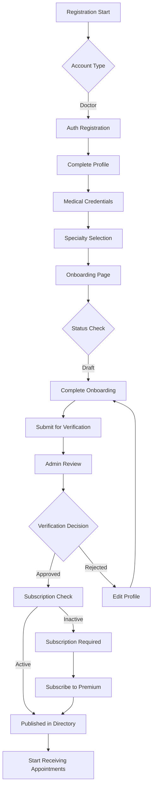

### Doctor Daily Workflow

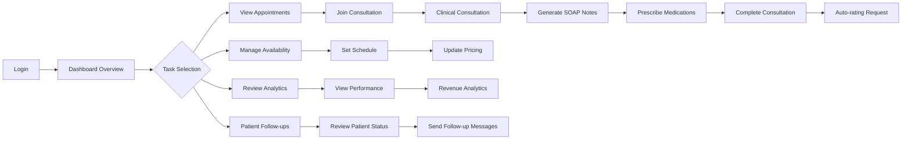

### Key Doctor Pages

| Page | Path | Purpose |
|------|------|---------|
| Dashboard | `/doctor` | Overview of appointments, earnings, and quick actions |
| Appointments | `/doctor/appointments` | View and manage upcoming and past consultations |
| Availability | `/doctor/availability` | Set schedule and time slots |
| Analytics | `/doctor/analytics` | Performance metrics and earnings |
| Consultation Room | `/doctor/consultation/[appointmentId]` | Active consultation interface |
| Prescriptions | `/doctor/prescription/[appointmentId]` | Generate and send prescriptions |
| Follow-ups | `/doctor/followups` | Monitor patient post-consultation status |

---

## Patient Journey

### Overview

Patients experience a frictionless journey from symptom discovery through consultation to follow-up care.

### Complete Patient Journey Diagram

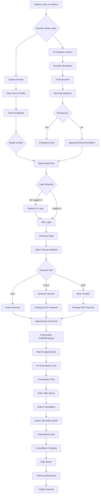

### Patient Entry Points

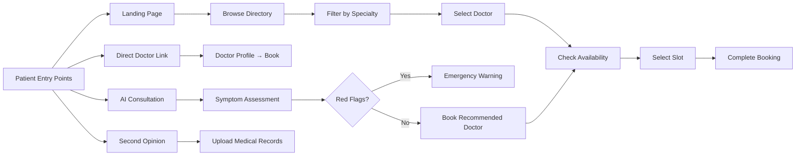

### Key Patient Pages

| Page | Path | Purpose |
|------|------|---------|
| Home | `/` | Landing page with doctor directory |
| Doctors | `/doctors` | Browse all verified doctors |
| Doctor Profile | `/doctors/[id]` | View doctor details, reviews, availability |
| AI Consultation | `/app/ai-consulta` | AI-powered symptom assessment |
| Booking | `/book/[doctorId]` | Select appointment time |
| Checkout | `/checkout/[appointmentId]` | Complete payment |
| Consultation Room | `/consultation/[appointmentId]` | Video consultation interface |
| Appointments | `/app/appointments` | View scheduled appointments |
| Follow-ups | `/app/followups` | Track post-consultation care |

---

## Emergency Handling

### Overview

Doctor.mx implements a multi-layered emergency detection system to prioritize patient safety. The system automatically identifies red flags and escalates appropriately.

### Emergency Detection Flow

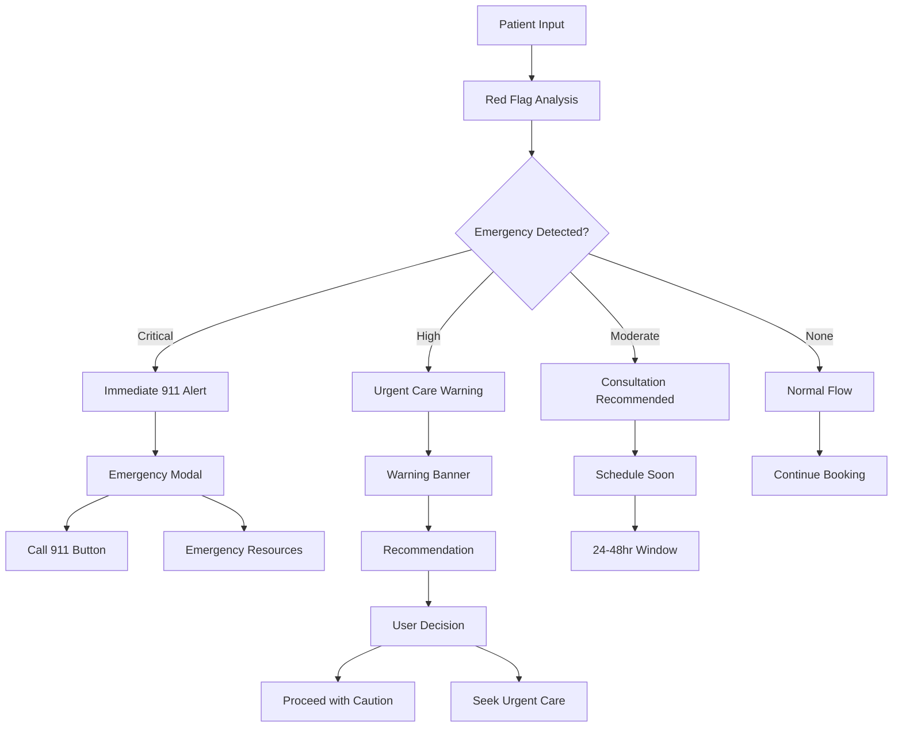

### Red Flag Categories

The enhanced red flag system (`src/lib/ai/red-flags-enhanced.ts`) classifies emergencies into severity levels:

#### Critical (Urgency Score 8-10)

| Condition | Pattern | Action |
|-----------|---------|--------|
| Stroke/ACV | Paralysis, face drooping, speech difficulty | Call 911 immediately |
| Cardiac Emergency | Chest pain, radiating pain, crushing sensation | Call 911, chew aspirin |
| Respiratory Failure | Cannot breathe, blue lips, cyanosis | Call 911 immediately |
| Severe Bleeding | Uncontrolled hemorrhage | Call 911, apply pressure |
| Anaphylaxis | Throat closing, tongue swelling | Call 911, use EpiPen |
| Suicidal Ideation | Wants to die, suicidal thoughts | Call 911 + Lifeline 800-911-2000 |
| Seizures | Convulsions, uncontrollable spasms | Call 911, protect from injury |
| Thunderclap Headache | Worst headache of life | Call 911, neuro imaging |
| Hypertensive Crisis | BP ≥180/120 with symptoms | Call 911 immediately |

#### High Severity (Urgency Score 5-7)

| Condition | Action |
|-----------|--------|
| Difficulty breathing | Emergency room within 2 hours |
| High fever (>40°C) | Immediate evaluation |
| Abdominal rigidity | Surgical emergency possible |
| Vision loss | Ophthalmic emergency within 2 hours |
| Severe pain (10/10) | Urgent evaluation |
| Diabetic hypoglycemia | Check glucose, administer carbs |
| Angioedema | Stop ACE inhibitor, ER visit |
| Deep vein thrombosis | ER for Doppler, PE risk |

### Condition-Specific Flags

The system considers patient medical history for enhanced detection:

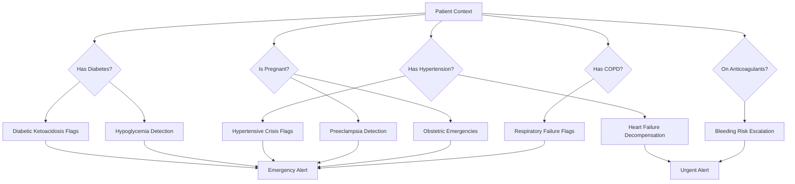

### Mental Health Crisis Handling

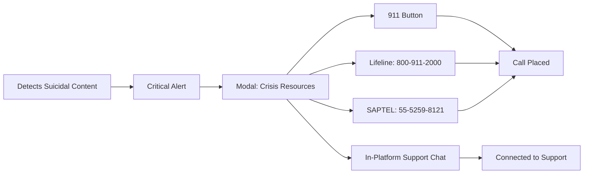

### Emergency Response Protocol

1. **Detection:** Pattern matching against symptom descriptions
2. **Classification:** Critical, High, or Moderate urgency
3. **Escalation:**
   - Critical: Immediate 911 call prompt with resources
   - High: Warning with recommendation for ER within 2-24 hours
   - Moderate: Recommendation for consultation within 24 hours
4. **Documentation:** All red flags logged for quality assurance
5. **Follow-up:** Automated check-in for urgent cases

---

## Appointment Lifecycle

### State Machine

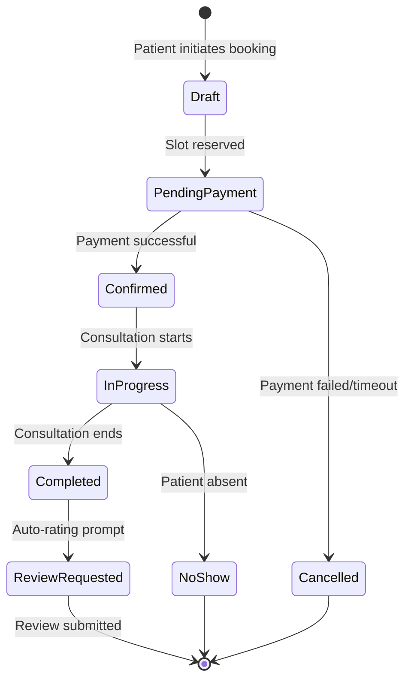

### State Transitions

| From | To | Trigger | System Actions |
|------|-----|---------|----------------|
| Draft | PendingPayment | Patient selects slot | Create appointment record, send confirmation |
| PendingPayment | Confirmed | Stripe webhook `payment_intent.succeeded` | Update status, send receipt, create video room |
| PendingPayment | Cancelled | Stripe webhook `payment_intent.payment_failed` | Release slot, notify patient |
| Confirmed | InProgress | Both parties join video | Mark consultation as active |
| InProgress | Completed | Doctor ends consultation | Generate SOAP note, request rating |
| InProgress | NoShow | Patient doesn't join (15 min after start) | Notify doctor, option to cancel |
| Completed | ReviewRequested | Automatic after completion | Send rating email/notification |

### Payment Methods

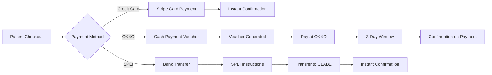

---

## Clinical Consultation Flow

### Pre-Consultation Phase

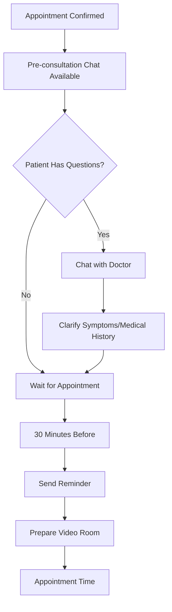

### Active Consultation Phase

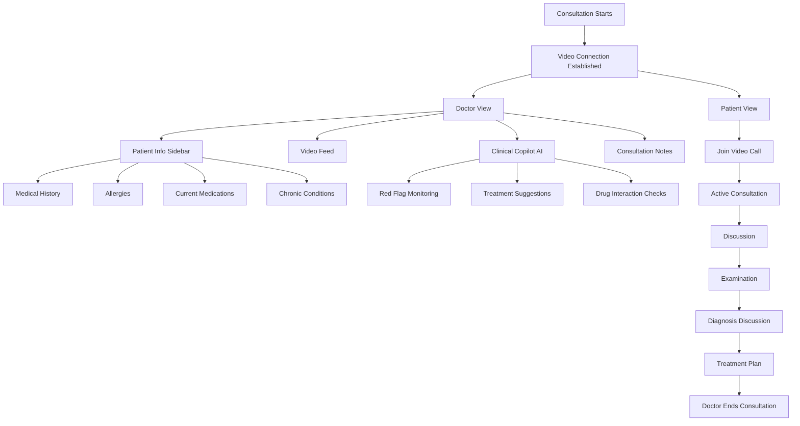

### Post-Consultation Phase

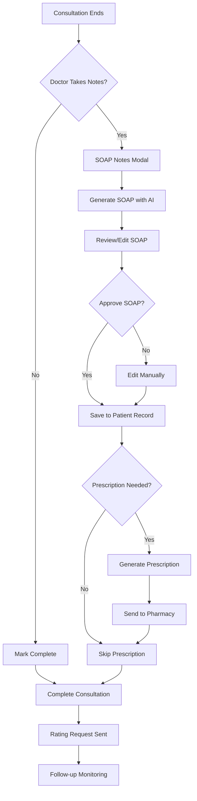

---

## SOAP Notes Integration

### SOAP Generation Workflow

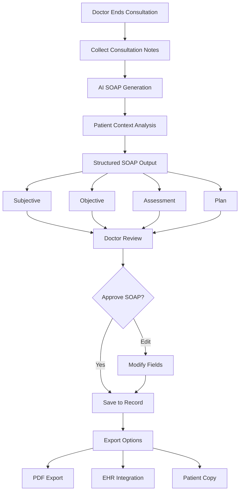

### SOAP Note Structure

The SOAP notes system (`src/lib/soap/`) generates structured clinical documentation:

- **Subjective:** Patient's reported symptoms, history, concerns
- **Objective:** Examination findings, vital signs, observable data
- **Assessment:** Clinical impression, diagnosis, differential diagnoses
- **Plan:** Treatment recommendations, medications, follow-up, referrals

### Multi-Specialist Consultation

For complex cases, the AI consultation system (`src/app/api/ai/consult/route.ts`) provides multi-specialist analysis:

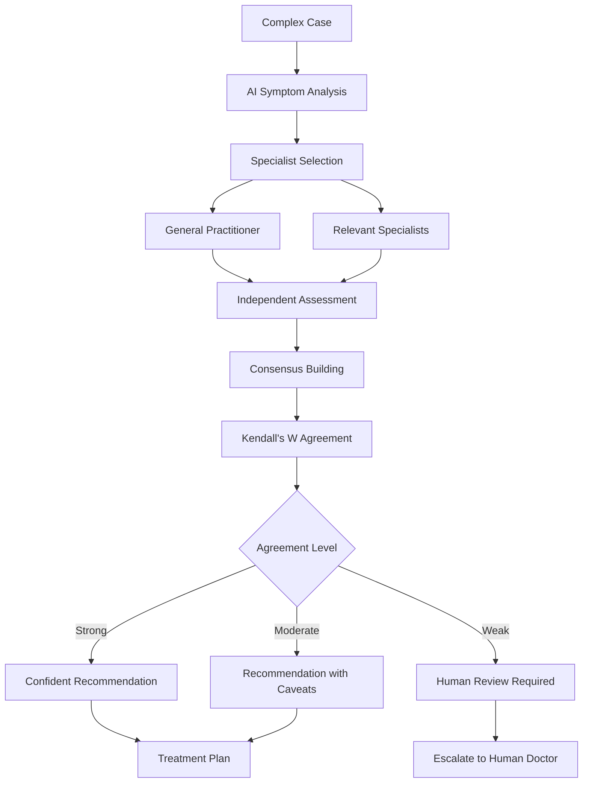

---

## Video Consultation Technical Details

### Video Room Creation

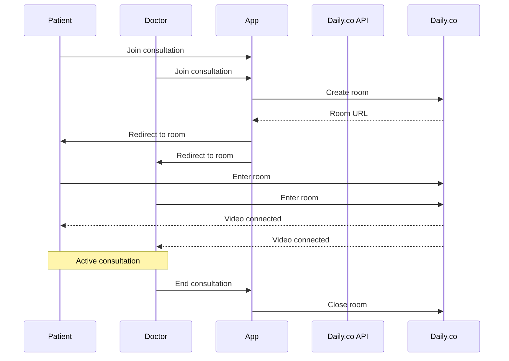

### Clinical Copilot Features

The Clinical Copilot (`src/components/ClinicalCopilot.tsx`) provides real-time assistance:

- **Red Flag Detection:** Continuous monitoring of conversation
- **Treatment Suggestions:** Evidence-based recommendations
- **Drug Interactions:** Check against patient medications
- **Dosing Guidelines:** Pediatric and adult dosing
- **Diagnostic Support:** Differential diagnosis suggestions
- **Documentation Assistance:** SOAP note generation

---

## Follow-up System

### Automated Follow-ups

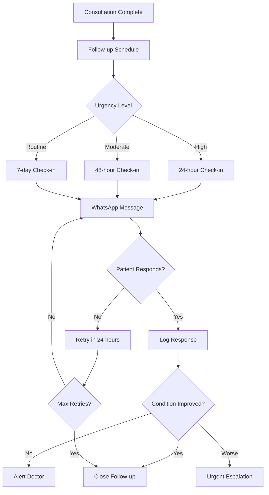

---

## Quality Assurance

### Consultation Quality Metrics

- **Red Flag Detection Rate:** % of emergencies properly identified
- **SOAP Note Completion:** % of consultations with SOAP notes
- **Patient Satisfaction:** Post-consultation ratings
- **Follow-up Adherence:** % of patients completing follow-ups
- **Time to Documentation:** Average time from consult to SOAP note
- **Prescription Accuracy:** Drug interaction checks performed

---

## Compliance and Safety

### Mexican Healthcare Compliance

1. **Emergency Triage:** Complies with Mexican emergency care standards
2. **Prescription Regulations:** Digital prescriptions compliant with COFEPRIS
3. **Data Privacy:** Patient data handled per Mexican privacy laws
4. **Medical Liability:** Clear scope limitations for telemedicine
5. **Emergency Resources:** Access to 911 and mental health crisis lines

### Safety Mechanisms

1. **Red Flag System:** Multi-layered emergency detection
2. **Mandatory Disclaimer:** Platform limitations clearly communicated
3. **Doctor Verification:** Only verified doctors can consult
4. **Prescription Controls:** Doctor-only prescription generation
5. **Audit Trail:** All consultations logged for quality review

---

## Quick Reference

### Emergency Phone Numbers (Mexico)

- **Emergency Services:** 911
- **Lifeline (Suicide Prevention):** 800-911-2000
- **SAPTEL (Mental Health):** 55-5259-8121
- **Crisis Line:** 800-290-0024

### System Status Codes

- `draft`: Doctor profile incomplete
- `pending`: Doctor awaiting verification
- `approved`: Doctor verified and active
- `pending_payment`: Appointment awaiting payment
- `confirmed`: Appointment paid and scheduled
- `in_progress`: Active consultation
- `completed`: Consultation finished
- `cancelled`: Appointment cancelled
- `no_show`: Patient missed appointment

### Consultation Duration

- **Standard:** 30 minutes
- **Slot Interval:** 30 minutes
- **Buffer Time:** 0 minutes (back-to-back scheduling)
- **Cancellation Window:** Up to appointment time
- **Payment Timeout:** 3 days (OXXO), instant (cards/SPEI)

---

## Support

For technical support or clinical workflow questions:

- **Technical Issues:** Contact development team
- **Clinical Questions:** Consult medical director
- **Emergency Protocols:** Refer to this documentation
- **Platform Training:** Schedule onboarding session

---

**Document Version:** 1.0
**Last Review:** 2026-02-09
**Next Review:** 2026-05-09
