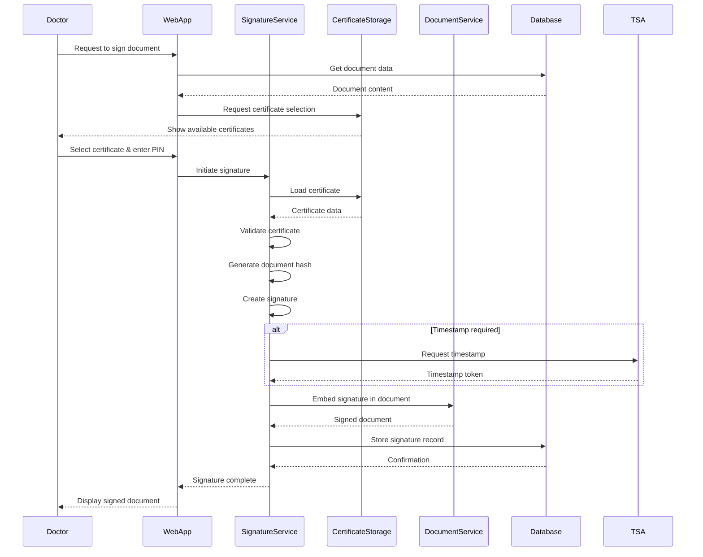
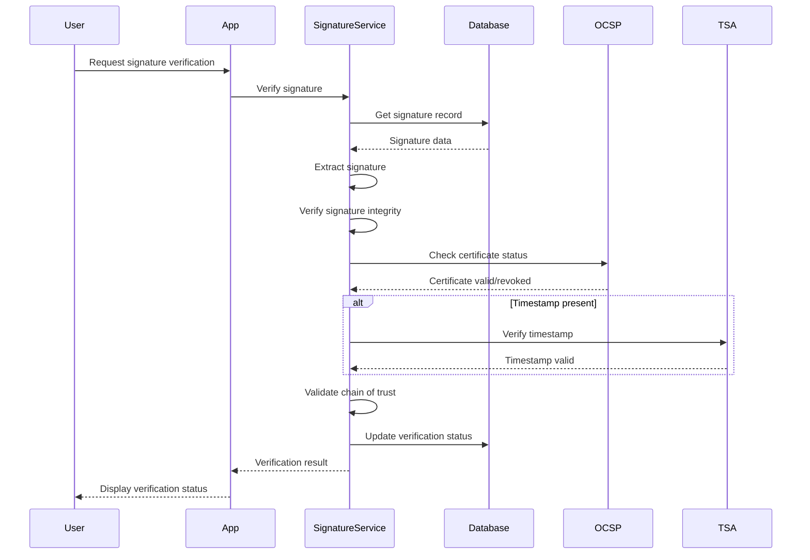

# Digital Signature System Architecture

**Version:** 1.0
**Last Updated:** February 9, 2026
**Project:** Doctor.mx Telemedicine Platform
**Status:** Design Phase

---

## Table of Contents

1. [Overview](#overview)
2. [System Architecture](#system-architecture)
3. [Component Design](#component-design)
4. [Data Flow](#data-flow)
5. [Security Architecture](#security-architecture)
6. [Scalability Considerations](#scalability-considerations)
7. [Integration Points](#integration-points)

---

## Overview

### Purpose

The Digital Signature System provides secure, legally compliant electronic signature capabilities for Doctor.mx, enabling:

- **Clinical Record Signing**: SOAP consultations and medical notes
- **Prescription Signing**: Electronic prescriptions with legal validity
- **NOM-004 Compliance**: Meeting Mexican medical record standards
- **Audit Trail**: Complete signature history and verification

### Design Principles

1. **Legal Compliance**: Adherence to Mexican law (LFEA, NOM-004-SSA3-2012)
2. **Security First**: Multi-layer security with key protection
3. **User Experience**: Seamless signing workflow for doctors
4. **Scalability**: Handle high-volume signature operations
5. **Interoperability**: Support multiple certificate providers

### Key Technologies

- **X.509 Certificates**: Standard digital certificate format
- **PKCS#11**: Hardware token interface
- **CAdES**: CMS Advanced Electronic Signatures
- **Timestamping**: Trusted timestamp authority integration
- **Blockchain**: Optional signature anchoring for enhanced integrity

---

## System Architecture

### High-Level Architecture

```
┌─────────────────────────────────────────────────────────────────┐
│                         DOCTOR.MX                               │
├─────────────────────────────────────────────────────────────────┤
│                                                                   │
│  ┌──────────────┐    ┌──────────────┐    ┌──────────────┐     │
│  │   Web App    │    │  Mobile App  │    │  Admin Panel │     │
│  │  (Next.js)   │    │  (React)     │    │   (Dashboard)│     │
│  └──────┬───────┘    └──────┬───────┘    └──────┬───────┘     │
│         │                    │                    │             │
│         └────────────────────┼────────────────────┘             │
│                              │                                  │
│                    ┌─────────▼──────────┐                       │
│                    │   API Gateway      │                       │
│                    │  (Next.js API)     │                       │
│                    └─────────┬──────────┘                       │
│                              │                                  │
│         ┌────────────────────┼────────────────────┐            │
│         │                    │                    │            │
│  ┌──────▼──────┐    ┌───────▼────────┐    ┌──────▼──────┐    │
│  │   Signature  │    │   Document    │    │  Compliance │    │
│  │   Service    │    │   Service     │    │   Service   │    │
│  │  (Signing)   │    │ (Storage)     │    │ (Audit)     │    │
│  └──────┬──────┘    └───────┬────────┘    └──────┬──────┘    │
│         │                   │                    │            │
│         └───────────────────┼────────────────────┘            │
│                             │                                 │
│                    ┌────────▼────────┐                        │
│                    │  Database Layer │                        │
│                    │  (Supabase)     │                        │
│                    └─────────────────┘                        │
└───────────────────────────────────────────────────────────────┘

                              │
                              ▼
┌─────────────────────────────────────────────────────────────┐
│                    EXTERNAL SERVICES                         │
├─────────────────────────────────────────────────────────────┤
│  ┌──────────────┐  ┌──────────────┐  ┌──────────────┐     │
│  │   SAT        │  │   Timestamp  │  │  Certificate │     │
│  │  e.firma     │  │   Authority  │  │  Providers   │     │
│  │  Validation  │  │  (TSA)       │  │  (Optional)  │     │
│  └──────────────┘  └──────────────┘  └──────────────┘     │
└─────────────────────────────────────────────────────────────┘
```

### Core Components

#### 1. Signature Service

**Responsibilities:**
- Certificate validation and management
- Signature generation (CAdES/XAdES)
- Signature verification
- Certificate revocation checking (CRL/OCSP)
- Timestamp integration

**Technology Stack:**
- Node.js with crypto APIs
- WebAssembly for client-side signing
- Hardware token integration (PKCS#11)

#### 2. Document Service

**Responsibilities:**
- Document preparation for signing
- Signature embedding (PDF/XML)
- Document version control
- Long-term signature preservation (LTV)

**Technology Stack:**
- PDF generation libraries
- XML processing for structured data
- Storage integration (S3/Supabase Storage)

#### 3. Compliance Service

**Responsibilities:**
- NOM-004 compliance validation
- Audit trail generation
- Signature policy enforcement
- Legal validity verification

**Technology Stack:**
- Compliance rule engine
- Blockchain integration (optional)
- Immutable audit logging

---

## Component Design

### Signature Service Architecture

```
┌──────────────────────────────────────────────────────────────┐
│                    SIGNATURE SERVICE                         │
├──────────────────────────────────────────────────────────────┤
│                                                               │
│  ┌──────────────┐   ┌──────────────┐   ┌──────────────┐    │
│  │ Certificate  │   │  Signature   │   │ Validation   │    │
│  │   Manager    │   │   Generator  │   │   Engine     │    │
│  │              │   │              │   │              │    │
│  │ - Load Cert  │   │ - CAdES-B    │   │ - Verify     │    │
│  │ - Validate   │   │ - XAdES-B    │   │ - OCSP       │    │
│  │ - Extract    │   │ - Timestamp  │   │ - CRL        │    │
│  │   Public Key │   │ - LTV        │   │ - Chain      │    │
│  └──────────────┘   └──────────────┘   └──────────────┘    │
│          │                  │                  │             │
│          └──────────────────┼──────────────────┘             │
│                             │                                │
│                    ┌────────▼────────┐                       │
│                    │  Policy Engine  │                       │
│                    │                 │                       │
│                    │ - NOM-004       │                       │
│                    │ - LFEA          │                       │
│                    │ - Custom Rules  │                       │
│                    └─────────────────┘                       │
└──────────────────────────────────────────────────────────────┘
```

### Database Schema

```sql
-- Digital Certificates
CREATE TABLE digital_certificates (
  id UUID PRIMARY KEY DEFAULT uuid_generate_v4(),
  user_id UUID NOT NULL REFERENCES profiles(id),

  -- Certificate information
  certificate_type TEXT NOT NULL, -- 'e.firma', 'commercial', 'internal'
  certificate_number TEXT NOT NULL,
  issuer_dn TEXT NOT NULL,
  subject_dn TEXT NOT NULL,
  serial_number TEXT NOT NULL,

  -- Validity
  valid_from TIMESTAMPTZ NOT NULL,
  valid_until TIMESTAMPTZ NOT NULL,

  -- Certificate data (encrypted at rest)
  public_key TEXT NOT NULL,
  certificate_pem TEXT, -- Stored if user consents

  -- Status
  status TEXT NOT NULL DEFAULT 'active', -- 'active', 'revoked', 'expired'
  revocation_reason TEXT,
  revoked_at TIMESTAMPTZ,

  -- Metadata
  created_at TIMESTAMPTZ NOT NULL DEFAULT NOW(),
  updated_at TIMESTAMPTZ NOT NULL DEFAULT NOW(),

  UNIQUE (user_id, certificate_number)
);

-- Digital Signatures
CREATE TABLE digital_signatures (
  id UUID PRIMARY KEY DEFAULT uuid_generate_v4(),

  -- Document reference
  document_type TEXT NOT NULL, -- 'soap_consultation', 'prescription', etc.
  document_id TEXT NOT NULL,
  document_version INTEGER NOT NULL DEFAULT 1,

  -- Signatory
  certificate_id UUID NOT NULL REFERENCES digital_certificates(id),
  signer_user_id UUID NOT NULL REFERENCES profiles(id),
  signer_name TEXT NOT NULL,
  signer_role TEXT NOT NULL, -- 'doctor', 'admin'

  -- Signature data
  signature_value TEXT NOT NULL, -- Base64 encoded
  signature_algorithm TEXT NOT NULL, -- 'RSA-SHA256', etc.
  signature_format TEXT NOT NULL, -- 'CAdES-B', 'XAdES-B', 'PAdES-B'

  -- Timestamp
  signed_at TIMESTAMPTZ NOT NULL DEFAULT NOW(),
  timestamp_token TEXT, -- RFC 3161 timestamp token

  -- Verification status
  verification_status TEXT NOT NULL DEFAULT 'pending', -- 'valid', 'invalid', 'pending'
  verification_details JSONB,

  -- Technical data
  signing_digest TEXT, -- Hash of signed data
  signing_algorithm TEXT,

  -- Metadata
  created_at TIMESTAMPTZ NOT NULL DEFAULT NOW(),
  ip_address INET,
  user_agent TEXT
);

-- Certificate Revocation
CREATE TABLE certificate_revocations (
  id UUID PRIMARY KEY DEFAULT uuid_generate_v4(),
  certificate_id UUID NOT NULL REFERENCES digital_certificates(id),

  -- Revocation details
  revocation_time TIMESTAMPTZ NOT NULL DEFAULT NOW(),
  revocation_reason TEXT NOT NULL, -- 'key_compromise', 'cessation_of_operation', etc.
  revoked_by UUID REFERENCES profiles(id),

  -- Certificate Authority data
  crl_number TEXT,
  ocsp_response TEXT,

  created_at TIMESTAMPTZ NOT NULL DEFAULT NOW()
);

-- Signature Audit Log
CREATE TABLE signature_audit_log (
  id UUID PRIMARY KEY DEFAULT uuid_generate_v4(),

  -- Event details
  event_type TEXT NOT NULL, -- 'sign', 'verify', 'revoke', 'expire'
  signature_id UUID REFERENCES digital_signatures(id),
  certificate_id UUID REFERENCES digital_certificates(id),

  -- User context
  user_id UUID REFERENCES profiles(id),
  user_role TEXT,

  -- Event data
  event_data JSONB,
  ip_address INET,
  user_agent TEXT,

  -- Result
  success BOOLEAN NOT NULL,
  error_message TEXT,

  created_at TIMESTAMPTZ NOT NULL DEFAULT NOW()
);

-- Signature Policies
CREATE TABLE signature_policies (
  id UUID PRIMARY KEY DEFAULT uuid_generate_v4(),
  name TEXT NOT NULL UNIQUE,

  -- Policy configuration
  document_types TEXT[] NOT NULL,
  required_signature_level TEXT NOT NULL, -- 'advanced', 'qualified'

  -- Certificate requirements
  allowed_certificate_types TEXT[] NOT NULL,
  min_key_length INTEGER NOT NULL DEFAULT 2048,
  allowed_algorithms TEXT[] NOT NULL,

  -- Validation requirements
  require_timestamp BOOLEAN NOT NULL DEFAULT false,
  require_ocsp_check BOOLEAN NOT NULL DEFAULT true,
  require_crl_check BOOLEAN NOT NULL DEFAULT true,

  -- Compliance requirements
  nom_004_compliant BOOLEAN NOT NULL DEFAULT false,
  lfea_compliant BOOLEAN NOT NULL DEFAULT true,

  -- Policy status
  is_active BOOLEAN NOT NULL DEFAULT true,
  effective_date TIMESTAMPTZ NOT NULL DEFAULT NOW(),
  expiry_date TIMESTAMPTZ,

  created_at TIMESTAMPTZ NOT NULL DEFAULT NOW(),
  updated_at TIMESTAMPTZ NOT NULL DEFAULT NOW()
);

-- Indexes for performance
CREATE INDEX idx_digital_signatures_document ON digital_signatures(document_type, document_id);
CREATE INDEX idx_digital_signatures_signer ON digital_signatures(signer_user_id);
CREATE INDEX idx_digital_signatures_signed_at ON digital_signatures(signed_at DESC);
CREATE INDEX idx_digital_certificates_user ON digital_certificates(user_id);
CREATE INDEX idx_digital_certificates_status ON digital_certificates(status);
CREATE INDEX idx_signature_audit_log_event ON signature_audit_log(event_type, created_at DESC);
```

---

## Data Flow

### Document Signing Flow



### Signature Verification Flow



---

## Security Architecture

### Threat Model

| Threat | Likelihood | Impact | Mitigation |
|--------|------------|--------|------------|
| Private key theft | Low | High | HSM/PKCS#11, secure enclave |
| Signature forgery | Low | High | Certificate validation, OCSP |
| Man-in-the-middle | Low | Medium | Certificate pinning, TLS 1.3 |
| Replay attacks | Low | Medium | Timestamps, nonces |
| Certificate compromise | Low | High | CRL monitoring, short validity |
| Document tampering | Low | High | Document hashing, immutability |

### Security Controls

#### 1. Key Protection

**Hardware Security Module (HSM):**
- Private keys never leave secure environment
- FIPS 140-2 Level 3 certification
- Secure key generation and storage

**Client-Side Protection:**
- Private keys stored in secure enclaves
- PIN/biometric authentication required
- Anti-tampering mechanisms

#### 2. Certificate Validation

**Validation Steps:**
1. Certificate chain verification
2. expiration checking
3. revocation status (OCSP/CRL)
4. policy compliance
5. issuer trust validation

#### 3. Signature Security

**Signature Properties:**
- Non-repudiation: Signer cannot deny signing
- Integrity: Any modification invalidates signature
- Authenticity: Links document to signer identity
- Timestamping: Proves when signing occurred

#### 4. Audit Trail

**Logging Requirements:**
- All signature operations logged
- Immutable audit records
- Blockchain anchoring (optional)
- Regular audit reviews

---

## Scalability Considerations

### Performance Targets

| Metric | Target | Rationale |
|--------|--------|-----------|
| Signing latency | < 3 seconds | User experience |
| Verification latency | < 1 second | Batch processing |
| Concurrent signatures | 100/second | Peak hours |
| Storage overhead | < 5% of document | Acceptable overhead |

### Scaling Strategies

#### 1. Horizontal Scaling

- Stateless signature service instances
- Load balancing across multiple nodes
- Distributed certificate caching

#### 2. Caching Strategy

- Certificate validation caching (TTL: 1 hour)
- OCSP response caching (TTL: 24 hours)
- Document hash caching

#### 3. Async Processing

- Signature generation for bulk operations
- Background verification for non-critical docs
- Queue-based timestamp requests

---

## Integration Points

### 1. SOAP Consultation Integration

```typescript
// SOAP consultation signing
interface SOAPConsultationSignature {
  consultationId: string
  doctorId: string
  signature: DigitalSignature
  timestamp: Date
  verificationUrl: string
}
```

### 2. Prescription Integration

```typescript
// Prescription signing
interface PrescriptionSignature {
  prescriptionId: string
  doctorId: string
  medications: Medication[]
  signature: DigitalSignature
  qrCode: string // For pharmacy verification
}
```

### 3. External Certificate Providers

**Supported Providers:**
- SAT e.firma (primary)
- Commercial CAs (optional)
- Internal certificates (development)

**Integration Interface:**
```typescript
interface CertificateProvider {
  validateCertificate(cert: X509Certificate): Promise<boolean>
  checkRevocation(cert: X509Certificate): Promise<RevocationStatus>
  getCertificateChain(cert: X509Certificate): Promise<X509Certificate[]>
}
```

### 4. Timestamp Authority Integration

```typescript
interface TimestampAuthority {
  requestTimestamp(hash: Buffer): Promise<TimestampToken>
  verifyTimestamp(token: TimestampToken): Promise<boolean>
}
```

---

## Implementation Phases

### Phase 1: Foundation (Weeks 1-4)
- Database schema implementation
- Basic certificate management
- Simple signature generation
- Core verification logic

### Phase 2: Integration (Weeks 5-8)
- SOAP consultation signing
- Prescription signing
- UI components for signing
- Audit logging

### Phase 3: Compliance (Weeks 9-12)
- NOM-004 compliance validation
- Timestamp integration
- OCSP/CRL checking
- Legal validity verification

### Phase 4: Advanced Features (Weeks 13-16)
- Hardware token support
- Long-term validation (LTV)
- Blockchain anchoring
- Batch operations

---

## Monitoring & Observability

### Key Metrics

- Signature success rate
- Average signing time
- Certificate validation failures
- Revocation check latency
- Verification success rate

### Alerting

- Failed signature operations
- Expired certificates
- Revoked certificates in use
- TSA service unavailability
- Unusual signature patterns

---

## Conclusion

This architecture provides a secure, scalable, and compliant digital signature system for Doctor.mx. The modular design allows for incremental implementation while maintaining legal compliance and security best practices.

The system supports multiple certificate providers, integrates seamlessly with existing clinical workflows, and provides the audit trail required by Mexican healthcare regulations.

---

**Next Steps:**
1. Review and approve architecture
2. Begin Phase 1 implementation
3. Establish partnerships with certificate providers
4. Conduct legal review of compliance requirements
