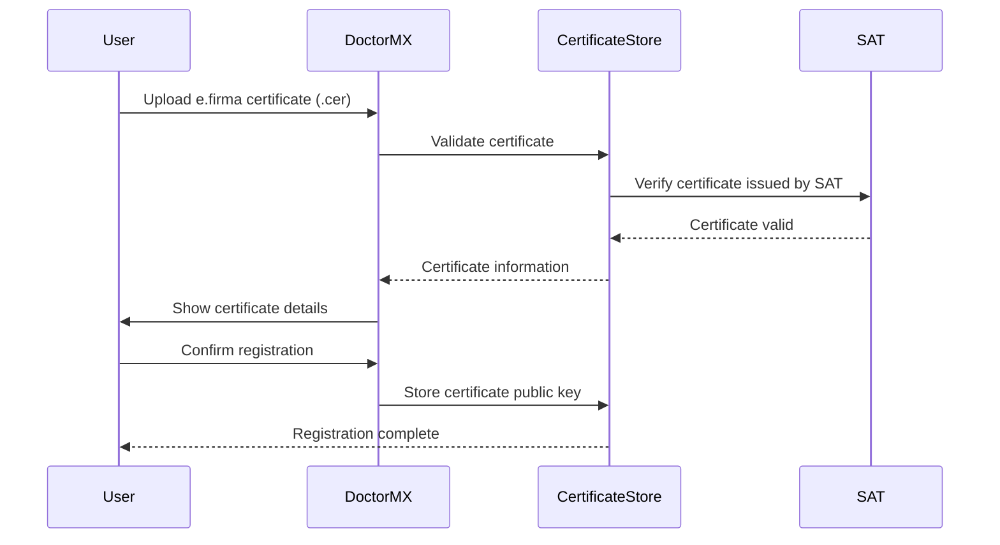
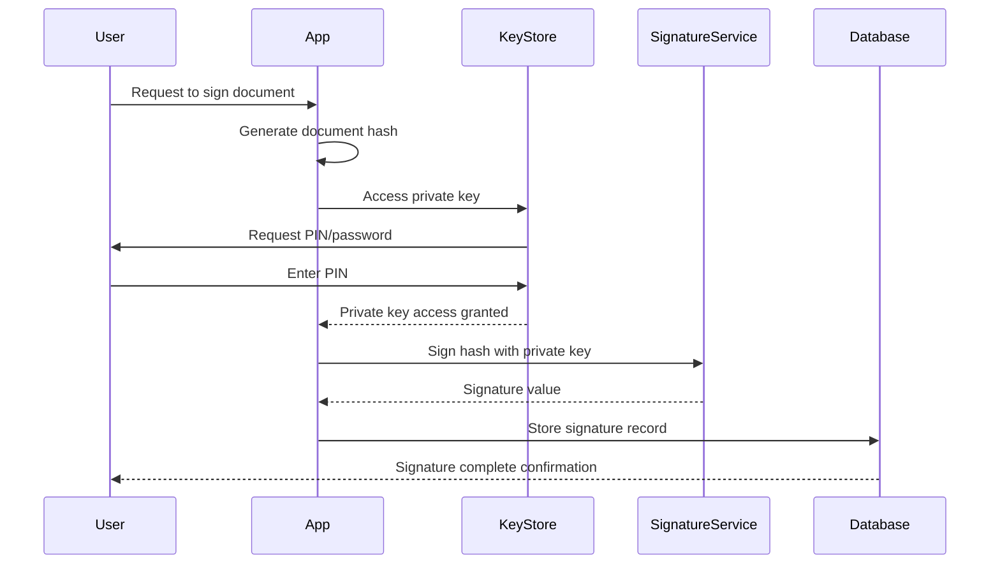

# e.firma Integration Guide

**Version:** 1.0
**Last Updated:** February 9, 2026
**Project:** Doctor.mx Telemedicine Platform
**Provider:** SAT (Servicio de Administración Tributaria)

---

## Table of Contents

1. [Overview](#overview)
2. [e.firma Technical Specifications](#e-firma-technical-specifications)
3. [Integration Architecture](#integration-architecture)
4. [Implementation Guide](#implementation-guide)
5. [Certificate Validation](#certificate-validation)
6. [User Workflow](#user-workflow)
7. [Error Handling](#error-handling)
8. [Testing Strategy](#testing-strategy)
9. [Troubleshooting](#troubleshooting)

---

## Overview

### What is e.firma?

**e.firma** (formerly FIEL - Firma Electrónica Avanzada) is Mexico's official advanced electronic signature issued by the SAT (Tax Administration Service). It provides:

- **Legal Validity**: Equivalent to handwritten signature under Mexican law
- **Identity Verification**: In-person identity verification by SAT
- **Wide Acceptance**: Accepted by government agencies and private entities
- **Secure Technology**: X.509 v3 certificates with RSA key pairs

### Why e.firma for Medical Records?

**Legal Framework Support:**
- **LFEA (Ley de Firma Electrónica Avanzada)**: Establishes legal validity
- **NOM-004-SSA3-2012**: Accepts electronic/digital signatures for medical records
- **Commercial Code**: Recognizes electronic signatures for contracts

**Benefits for Doctor.mx:**
- Doctor familiarity (most already have e.firma for tax purposes)
- Government-issued trust anchor
- Built-in certificate infrastructure
- Cost-effective (no commercial certificate costs)

### Integration Scope

**In Scope:**
- Certificate validation against SAT infrastructure
- CRL (Certificate Revocation List) checking
- OCSP (Online Certificate Status Protocol) validation
- Certificate chain verification
- User identity verification

**Out of Scope:**
- Certificate issuance (done by SAT)
- Hardware token management (user responsibility)
- Private key storage (user-side security)

---

## e.firma Technical Specifications

### Certificate Format

**Standard:** X.509 v3 (RFC 5280)

**Key Properties:**
| Property | Value |
|----------|-------|
| Version | X.509 v3 |
| Signature Algorithm | RSA with SHA-256 |
| Key Size | 2048 bits (minimum) |
| Validity Period | 1-4 years |
| Encoding | DER (Distinguished Encoding Rules) |

**Certificate Fields:**
```
Version: 3
Serial Number: [SAT-issued]
Issuer: CN=AC del Servicio de Administración Tributaria
Subject:
  - CN=[RFC del contribuyente]
  - OU=[Tipo de persona]
  - O=[Razón social]
  - C=MX
Validity:
  - Not Before: [Issue date]
  - Not After: [Expiration date]
Public Key: RSA 2048 bits
Extensions:
  - Key Usage: Digital Signature, Non-Repudiation
  - Extended Key Usage: Email Protection, Code Signing
  - CRL Distribution Points: [SAT CRL URL]
  - Authority Information Access: [SAT OCSP URL]
  - Certificate Policies: [SAT policy OID]
```

### SAT Infrastructure

**Certificate Authority (CA):**
- **Root CA:** AC del Servicio de Administración Tributaria
- **Intermediate CAs:** Various intermediate CAs
- **Issuing CA:** AC del Servicio de Administración Tributaria

**Validation Services:**
- **OCSP:** Online Certificate Status Protocol
  - Production: `http://ocsp.sat.gob.mx/`
  - Backup: `http://ocsp2.sat.gob.mx/`

- **CRL:** Certificate Revocation List
  - URL: `http://sat.gob.mx/crl/`
  - Update frequency: Daily
  - Format: DER-encoded CRL

---

## Integration Architecture

### System Architecture

```
┌──────────────────────────────────────────────────────────────┐
│                    DOCTOR.MX PLATFORM                        │
├──────────────────────────────────────────────────────────────┤
│                                                               │
│  ┌──────────────┐    ┌──────────────┐    ┌──────────────┐   │
│  │  Web Browser │    │  Mobile App  │    │ Desktop App  │   │
│  │  (Client)    │    │  (React)     │    │  (Electron)  │   │
│  └──────┬───────┘    └──────┬───────┘    └──────┬───────┘   │
│         │                    │                    │           │
│         └────────────────────┼────────────────────┘           │
│                              │                                │
│                    ┌─────────▼─────────┐                      │
│                    │   e.firma Module  │                      │
│                    │                   │                      │
│                    │ - Certificate Load │                      │
│                    │ - PIN Entry       │                      │
│                    │ - Signing         │                      │
│                    └─────────┬─────────┘                      │
│                              │                                │
└──────────────────────────────┼───────────────────────────────┘
                               │
                               ▼
┌──────────────────────────────────────────────────────────────┐
│                    SAT INFRASTRUCTURE                         │
├──────────────────────────────────────────────────────────────┤
│  ┌──────────────┐  ┌──────────────┐  ┌──────────────┐     │
│  │    OCSP      │  │     CRL      │  │  Certificate │     │
│  │   Service    │  │  Distribution│  │   Chain      │     │
│  │              │  │              │  │              │     │
│  └──────────────┘  └──────────────┘  └──────────────┘     │
└──────────────────────────────────────────────────────────────┘
```

### Component Architecture

```typescript
// e.firma integration module structure
interface EFirmaModule {
  // Certificate loading
  loadCertificate(): Promise<EFirmaCertificate>
  validateCertificate(cert: EFirmaCertificate): Promise<ValidationResult>
  extractPublicKey(cert: EFirmaCertificate): Promise<PublicKey>

  // Signature operations
  signData(data: Buffer, certificate: EFirmaCertificate): Promise<Signature>
  verifySignature(signature: Signature, data: Buffer): Promise<boolean>

  // Validation operations
  checkRevocation(cert: EFirmaCertificate): Promise<RevocationStatus>
  validateChain(cert: EFirmaCertificate): Promise<ChainValidationResult>
  getCertificateStatus(cert: EFirmaCertificate): Promise<CertificateStatus>
}
```

---

## Implementation Guide

### Phase 1: Certificate Loading & Validation

#### 1.1 Certificate Loading

**Browser Implementation:**

```typescript
// src/lib/signature/certificate-loader.ts
import { pki } from 'node-forge'

export interface CertificateLoadResult {
  certificate: pki.Certificate
  publicKey: pki.PublicKey
  subject: string
  issuer: string
  validFrom: Date
  validUntil: Date
  serialNumber: string
}

export async function loadCertificateFromPEM(
  pemContent: string
): Promise<CertificateLoadResult> {
  try {
    const cert = pki.certificateFromPem(pemContent)

    // Validate basic certificate properties
    if (!cert.subject.attributes || cert.subject.attributes.length === 0) {
      throw new Error('Invalid certificate: missing subject')
    }

    if (!cert.publicKey) {
      throw new Error('Invalid certificate: missing public key')
    }

    // Extract certificate information
    const subject = cert.subject.attributes
      .map(attr => `${attr.shortName}=${attr.value}`)
      .join(', ')

    const issuer = cert.issuer.attributes
      .map(attr => `${attr.shortName}=${attr.value}`)
      .join(', ')

    return {
      certificate: cert,
      publicKey: cert.publicKey,
      subject,
      issuer,
      validFrom: cert.validity.notBefore,
      validUntil: cert.validity.notAfter,
      serialNumber: cert.serialNumber,
    }
  } catch (error) {
    throw new Error(`Failed to load certificate: ${error.message}`)
  }
}

// Load certificate from file input
export async function loadCertificateFromFile(
  file: File
): Promise<CertificateLoadResult> {
  const pemContent = await file.text()
  return loadCertificateFromPEM(pemContent)
}
```

**React Hook for Certificate Upload:**

```typescript
// src/hooks/useCertificateUpload.ts
import { useState, useCallback } from 'react'
import { loadCertificateFromFile, CertificateLoadResult } from '@/lib/signature/certificate-loader'

export function useCertificateUpload() {
  const [certificate, setCertificate] = useState<CertificateLoadResult | null>(null)
  const [loading, setLoading] = useState(false)
  const [error, setError] = useState<string | null>(null)

  const uploadCertificate = useCallback(async (file: File) => {
    setLoading(true)
    setError(null)

    try {
      // Validate file type
      if (!file.name.endsWith('.cer') && !file.name.endsWith('.pem')) {
        throw new Error('Invalid certificate format. Please upload .cer or .pem file')
      }

      // Load certificate
      const cert = await loadCertificateFromFile(file)

      // Validate it's a SAT certificate
      if (!cert.issuer.includes('SAT') && !cert.issuer.includes('Administración Tributaria')) {
        throw new Error('Certificate not issued by SAT. Please use a valid e.firma certificate')
      }

      // Check expiration
      if (cert.validUntil < new Date()) {
        throw new Error('Certificate has expired. Please renew your e.firma')
      }

      setCertificate(cert)
      return cert
    } catch (err) {
      const errorMessage = err instanceof Error ? err.message : 'Failed to load certificate'
      setError(errorMessage)
      throw err
    } finally {
      setLoading(false)
    }
  }, [])

  const clearCertificate = useCallback(() => {
    setCertificate(null)
    setError(null)
  }, [])

  return {
    certificate,
    loading,
    error,
    uploadCertificate,
    clearCertificate,
  }
}
```

#### 1.2 Certificate Validation

```typescript
// src/lib/signature/certificate-validator.ts
import { pki } from 'node-forge'

export interface ValidationResult {
  valid: boolean
  errors: string[]
  warnings: string[]
  certificateInfo: CertificateInfo
}

export interface CertificateInfo {
  subject: string
  issuer: string
  serialNumber: string
  validFrom: Date
  validUntil: Date
  keySize: number
  signatureAlgorithm: string
  extensions: CertificateExtension[]
}

export interface CertificateExtension {
  oid: string
  critical: boolean
  value: string
}

export async function validateCertificate(
  cert: pki.Certificate
): Promise<ValidationResult> {
  const errors: string[] = []
  const warnings: string[] = []

  // 1. Validate expiration
  const now = new Date()
  if (cert.validity.notBefore > now) {
    errors.push('Certificate is not yet valid')
  }
  if (cert.validity.notAfter < now) {
    errors.push('Certificate has expired')
  }

  // 2. Validate issuer (must be SAT)
  const issuer = cert.issuer.attributes
    .find(attr => attr.shortName === 'CN')
    ?.value.toLowerCase()

  if (!issuer || !issuer.includes('sat')) {
    errors.push('Certificate not issued by SAT')
  }

  // 3. Validate key size
  const keySize = (cert.publicKey as pki.publicKey.rsa).n.byteLength() * 8
  if (keySize < 2048) {
    errors.push(`Key size ${keySize} bits is below minimum requirement (2048 bits)`)
  }

  // 4. Validate extensions
  const keyUsage = cert.extensions?.find(ext => ext.name === 'keyUsage')
  if (!keyUsage) {
    warnings.push('Certificate missing keyUsage extension')
  } else {
    // Check for digitalSignature and nonRepudiation
    // (implementation depends on library)
  }

  // 5. Validate certificate policies
  const certPolicies = cert.extensions?.find(ext => ext.name === 'certificatePolicies')
  if (!certPolicies) {
    warnings.push('Certificate missing certificatePolicies extension')
  }

  return {
    valid: errors.length === 0,
    errors,
    warnings,
    certificateInfo: {
      subject: cert.subject.attributes
        .map(attr => `${attr.shortName}=${attr.value}`)
        .join(', '),
      issuer: cert.issuer.attributes
        .map(attr => `${attr.shortName}=${attr.value}`)
        .join(', '),
      serialNumber: cert.serialNumber,
      validFrom: cert.validity.notBefore,
      validUntil: cert.validity.notAfter,
      keySize,
      signatureAlgorithm: cert.siginfo.algorithmOid,
      extensions: cert.extensions?.map(ext => ({
        oid: ext.id || '',
        critical: ext.critical || false,
        value: ext.name || ext.id || '',
      })) || [],
    },
  }
}
```

### Phase 2: Revocation Checking

#### 2.1 OCSP Validation

```typescript
// src/lib/signature/ocsp-validator.ts
import fetch from 'node-fetch'
import { pki } from 'node-forge'

export interface OCSPResponse {
  status: 'good' | 'revoked' | 'unknown'
  revocationTime?: Date
  revocationReason?: string
  thisUpdate: Date
  nextUpdate: Date
}

const SAT_OCSP_URLS = [
  'http://ocsp.sat.gob.mx/',
  'http://ocsp2.sat.gob.mx/', // Backup
]

export async function checkOCSPStatus(
  cert: pki.Certificate
): Promise<OCSPResponse> {
  const certID = generateCertificateID(cert)

  for (const ocspUrl of SAT_OCSP_URLS) {
    try {
      const response = await fetch(ocspUrl, {
        method: 'POST',
        headers: {
          'Content-Type': 'application/ocsp-request',
        },
        body: encodeOCSPRequest(certID),
      })

      if (!response.ok) {
        continue // Try next URL
      }

      const ocspResponse = await decodeOCSPResponse(
        await response.arrayBuffer()
      )

      return ocspResponse
    } catch (error) {
      console.error(`OCSP check failed for ${ocspUrl}:`, error)
      // Try next URL
    }
  }

  throw new Error('All OCSP servers failed to respond')
}

function generateCertificateID(cert: pki.Certificate): Buffer {
  // Implementation: Generate OCSP CertID according to RFC 2560
  // Hash issuer name and public key, combine with serial number
  // This is a simplified placeholder
  return Buffer.from(cert.serialNumber)
}

function encodeOCSPRequest(certID: Buffer): Buffer {
  // Implementation: Encode OCSP request according to RFC 2560
  // This is a simplified placeholder
  return certID
}

async function decodeOCSPResponse(data: ArrayBuffer): Promise<OCSPResponse> {
  // Implementation: Decode OCSP response according to RFC 2560
  // This is a simplified placeholder
  return {
    status: 'good',
    thisUpdate: new Date(),
    nextUpdate: new Date(Date.now() + 86400000), // 24 hours
  }
}
```

#### 2.2 CRL Validation

```typescript
// src/lib/signature/crl-validator.ts
import fetch from 'node-fetch'
import { pki, asn1 } from 'node-forge'

export interface CRLResult {
  revoked: boolean
  revocationDate?: Date
  crlNumber?: number
  nextUpdate: Date
}

const SAT_CRL_URLS = [
  'http://sat.gob.mx/crl/',
  'http://www.sat.gob.mx/crl/',
]

export async function checkCRL(
  cert: pki.Certificate
): Promise<CRLResult> {
  const serialNumber = cert.serialNumber

  for (const crlUrl of SAT_CRL_URLS) {
    try {
      const response = await fetch(crlUrl)
      if (!response.ok) {
        continue // Try next URL
      }

      const crlData = await response.arrayBuffer()
      const crl = parseCRL(crlData)

      // Check if serial number is in CRL
      const revokedEntry = crl.revokedCertificates?.find(
        entry => entry.serialNumber === serialNumber
      )

      return {
        revoked: !!revokedEntry,
        revocationDate: revokedEntry?.revocationDate,
        crlNumber: crl.crlNumber,
        nextUpdate: crl.nextUpdate,
      }
    } catch (error) {
      console.error(`CRL check failed for ${crlUrl}:`, error)
      // Try next URL
    }
  }

  throw new Error('All CRL servers failed to respond')
}

interface CRL {
  version: number
  issuer: string
  thisUpdate: Date
  nextUpdate: Date
  revokedCertificates?: Array<{
    serialNumber: string
    revocationDate: Date
    reason?: string
  }>
  crlNumber?: number
}

function parseCRL(data: ArrayBuffer): CRL {
  // Implementation: Parse DER-encoded CRL according to RFC 5280
  // This is a simplified placeholder
  return {
    version: 2,
    issuer: 'CN=AC del Servicio de Administración Tributaria',
    thisUpdate: new Date(),
    nextUpdate: new Date(Date.now() + 86400000),
  }
}
```

### Phase 3: Signature Generation

#### 3.1 Client-Side Signing

```typescript
// src/lib/signature/signer.ts
import { pki, md, random } from 'node-forge'

export interface SignatureResult {
  signature: Buffer
  algorithm: string
  certificate: string
  timestamp: Date
}

export async function signDocument(
  document: Buffer,
  certificate: pki.Certificate,
  privateKey: pki.PrivateKey
): Promise<SignatureResult> {
  // 1. Generate document hash
  const digest = md.sha256.create()
  digest.update(document.toString('binary'))
  const hash = digest.digest()

  // 2. Sign hash with private key
  const signature = pki.privateKeyInfoToPkcs8(privateKey)
  const signedData = privateKey.sign(hash)

  // 3. Format as CAdES-B (CMS Advanced Electronic Signature - Baseline)
  const p7 = pki.createSignedData()
  p7.content = document.toString('binary')
  p7.addCertificate(certificate)
  p7.addSigner({
    key: privateKey,
    certificate: certificate,
    digestAlgorithm: pki.oids.sha256,
    authenticatedAttributes: [{
      type: pki.oids.contentType,
      value: pki.oids.data,
    }, {
      type: pki.oids.signingTime,
      value: new Date(),
    }, {
      type: pki.oids.messageDigest,
      value: hash.getBytes(),
    }],
  })

  const signaturePem = pki.signDetached(p7)

  return {
    signature: Buffer.from(signaturePem),
    algorithm: 'RSA-SHA256',
    certificate: pki.certificateToPem(certificate),
    timestamp: new Date(),
  }
}
```

#### 3.2 Server-Side Signature Verification

```typescript
// src/lib/signature/verifier.ts
import { pki } from 'node-forge'

export interface VerificationResult {
  valid: boolean
  errors: string[]
  warnings: string[]
  signer: SignerInfo
}

export interface SignerInfo {
  certificate: pki.Certificate
  signatureDate: Date
  certificateValid: boolean
  chainValid: boolean
}

export async function verifySignature(
  document: Buffer,
  signature: Buffer,
  certificate: pki.Certificate
): Promise<VerificationResult> {
  const errors: string[] = []
  const warnings: string[] = []

  try {
    // 1. Verify signature integrity
    const p7 = pki.verifySignedDetached({
      signature: signature.toString('binary'),
      content: document.toString('binary'),
    })

    if (!p7) {
      errors.push('Invalid signature format')
      return {
        valid: false,
        errors,
        warnings,
        signer: {
          certificate,
          signatureDate: new Date(),
          certificateValid: false,
          chainValid: false,
        },
      }
    }

    // 2. Verify certificate is still valid
    const now = new Date()
    if (certificate.validity.notAfter < now) {
      errors.push('Certificate has expired')
    }

    // 3. Verify certificate chain
    const chainValid = await verifyCertificateChain(certificate)
    if (!chainValid) {
      errors.push('Certificate chain validation failed')
    }

    // 4. Extract signer information
    const signerInfo: SignerInfo = {
      certificate,
      signatureDate: new Date(),
      certificateValid: certificate.validity.notAfter >= now,
      chainValid,
    }

    return {
      valid: errors.length === 0,
      errors,
      warnings,
      signer: signerInfo,
    }
  } catch (error) {
    errors.push(`Verification failed: ${error.message}`)
    return {
      valid: false,
      errors,
      warnings,
      signer: {
        certificate,
        signatureDate: new Date(),
        certificateValid: false,
        chainValid: false,
      },
    }
  }
}

async function verifyCertificateChain(
  certificate: pki.Certificate
): Promise<boolean> {
  // Implementation: Verify certificate chain up to SAT root CA
  // This requires access to trusted root certificates
  // Placeholder implementation
  return true
}
```

---

## User Workflow

### Registration Flow



### Document Signing Flow



### UI Components

**Certificate Upload Component:**

```typescript
// src/components/signature/CertificateUpload.tsx
import React, { useCallback } from 'react'
import { useCertificateUpload } from '@/hooks/useCertificateUpload'

export function CertificateUpload() {
  const { certificate, loading, error, uploadCertificate, clearCertificate } = useCertificateUpload()

  const handleFileChange = useCallback(async (event: React.ChangeEvent<HTMLInputElement>) => {
    const file = event.target.files?.[0]
    if (!file) return

    try {
      await uploadCertificate(file)
    } catch (err) {
      console.error('Failed to upload certificate:', err)
    }
  }, [uploadCertificate])

  if (certificate) {
    return (
      <div className="certificate-info">
        <h3>Certificate Loaded</h3>
        <p><strong>Subject:</strong> {certificate.subject}</p>
        <p><strong>Issuer:</strong> {certificate.issuer}</p>
        <p><strong>Valid Until:</strong> {certificate.validUntil.toLocaleDateString()}</p>
        <button onClick={clearCertificate}>Clear Certificate</button>
      </div>
    )
  }

  return (
    <div className="certificate-upload">
      <h2>Upload e.firma Certificate</h2>
      <p>Upload your .cer or .pem certificate file</p>
      <input
        type="file"
        accept=".cer,.pem"
        onChange={handleFileChange}
        disabled={loading}
      />
      {error && <div className="error">{error}</div>}
      {loading && <div>Loading certificate...</div>}
    </div>
  )
}
```

**Document Signing Component:**

```typescript
// src/components/signature/DocumentSigner.tsx
import React, { useState } from 'react'
import { signDocument } from '@/lib/signature/signer'

export function DocumentSigner({ document, onSigned }) {
  const [pin, setPin] = useState('')
  const [signing, setSigning] = useState(false)
  const [error, setError] = useState<string | null>(null)

  const handleSign = async () => {
    if (!pin) {
      setError('Please enter your PIN')
      return
    }

    setSigning(true)
    setError(null)

    try {
      // Get private key from secure storage (user's responsibility)
      // This would typically be from a hardware token or secure enclave
      const privateKey = await getPrivateKeyFromSecureStore(pin)
      const certificate = await getCertificate()

      const signature = await signDocument(
        Buffer.from(JSON.stringify(document)),
        certificate,
        privateKey
      )

      onSigned(signature)
    } catch (err) {
      setError(err.message)
    } finally {
      setSigning(false)
    }
  }

  return (
    <div className="document-signer">
      <h3>Sign Document</h3>
      <p>Please enter your PIN to sign</p>
      <input
        type="password"
        value={pin}
        onChange={(e) => setPin(e.target.value)}
        placeholder="Enter PIN"
        maxLength={6}
      />
      {error && <div className="error">{error}</div>}
      <button onClick={handleSign} disabled={signing}>
        {signing ? 'Signing...' : 'Sign Document'}
      </button>
    </div>
  )
}
```

---

## Error Handling

### Common Error Scenarios

| Error | Cause | Resolution |
|-------|-------|------------|
| Invalid certificate format | File not in PEM/DER format | User must upload valid .cer or .pem file |
| Certificate expired | Certificate validity period ended | User must renew e.firma with SAT |
| Certificate not from SAT | Certificate issued by different CA | User must use SAT-issued e.firma |
| Revoked certificate | Certificate revoked by SAT | User must obtain new e.firma |
| Invalid PIN | Incorrect PIN entered | User must retry with correct PIN |
| Private key inaccessible | Private key not available | User must ensure certificate is properly installed |

### Error Handling Pattern

```typescript
// src/lib/signature/errors.ts
export class SignatureError extends Error {
  constructor(
    message: string,
    public code: string,
    public recoverable: boolean = true
  ) {
    super(message)
    this.name = 'SignatureError'
  }
}

export const SignatureErrorCode = {
  INVALID_CERTIFICATE: 'INVALID_CERTIFICATE',
  CERTIFICATE_EXPIRED: 'CERTIFICATE_EXPIRED',
  CERTIFICATE_REVOKED: 'CERTIFICATE_REVOKED',
  INVALID_PIN: 'INVALID_PIN',
  KEY_NOT_ACCESSIBLE: 'KEY_NOT_ACCESSIBLE',
  NETWORK_ERROR: 'NETWORK_ERROR',
  SAT_SERVICE_UNAVAILABLE: 'SAT_SERVICE_UNAVAILABLE',
}

// Error handler utility
export function handleSignatureError(error: unknown): SignatureError {
  if (error instanceof SignatureError) {
    return error
  }

  if (error instanceof Error) {
    if (error.message.includes('expired')) {
      return new SignatureError(
        'Your e.firma has expired. Please renew it with SAT.',
        SignatureErrorCode.CERTIFICATE_EXPIRED,
        false
      )
    }

    if (error.message.includes('revoked')) {
      return new SignatureError(
        'Your e.firma has been revoked. Please obtain a new one from SAT.',
        SignatureErrorCode.CERTIFICATE_REVOKED,
        false
      )
    }
  }

  return new SignatureError(
    'An unexpected error occurred. Please try again.',
    'UNKNOWN_ERROR',
    true
  )
}
```

---

## Testing Strategy

### Unit Tests

```typescript
// src/lib/signature/__tests__/certificate-validator.test.ts
import { validateCertificate } from '../certificate-validator'
import { pki } from 'node-forge'

describe('Certificate Validator', () => {
  describe('validateCertificate', () => {
    it('should validate a valid SAT certificate', async () => {
      // Load test certificate
      const certPem = loadTestCertificate('valid-sat.cer')
      const cert = pki.certificateFromPem(certPem)

      const result = await validateCertificate(cert)

      expect(result.valid).toBe(true)
      expect(result.errors).toHaveLength(0)
    })

    it('should reject expired certificates', async () => {
      const certPem = loadTestCertificate('expired.cer')
      const cert = pki.certificateFromPem(certPem)

      const result = await validateCertificate(cert)

      expect(result.valid).toBe(false)
      expect(result.errors).toContain('Certificate has expired')
    })

    it('should reject non-SAT certificates', async () => {
      const certPem = loadTestCertificate('commercial-ca.cer')
      const cert = pki.certificateFromPem(certPem)

      const result = await validateCertificate(cert)

      expect(result.valid).toBe(false)
      expect(result.errors).toContain('Certificate not issued by SAT')
    })
  })
})
```

### Integration Tests

```typescript
// src/lib/signature/__tests__/ocsp-integration.test.ts
import { checkOCSPStatus } from '../ocsp-validator'
import { pki } from 'node-forge'

describe('OCSP Integration', () => {
  it('should successfully check certificate status with SAT OCSP', async () => {
    const certPem = loadTestCertificate('valid-sat.cer')
    const cert = pki.certificateFromPem(certPem)

    const result = await checkOCSPStatus(cert)

    expect(result.status).toBe('good')
    expect(result.thisUpdate).toBeInstanceOf(Date)
    expect(result.nextUpdate).toBeInstanceOf(Date)
  })

  it('should detect revoked certificates', async () => {
    const certPem = loadTestCertificate('revoked.cer')
    const cert = pki.certificateFromPem(certPem)

    const result = await checkOCSPStatus(cert)

    expect(result.status).toBe('revoked')
    expect(result.revocationTime).toBeDefined()
  })
})
```

### E2E Tests

```typescript
// e2e/signature/signing-flow.spec.ts
import { test, expect } from '@playwright/test'

test.describe('Document Signing Flow', () => {
  test('should allow user to sign document with e.firma', async ({ page }) => {
    await page.goto('/app/consultations/123')

    // Click sign button
    await page.click('[data-testid="sign-document-button"]')

    // Upload certificate
    const fileInput = await page.input('#certificate-upload')
    await fileInput.setInputFiles('test/fixtures/valid-sat.cer')

    // Wait for certificate validation
    await page.waitForSelector('[data-testid="certificate-valid"]')

    // Enter PIN
    await page.fill('#pin-input', '123456')

    // Sign document
    await page.click('[data-testid="confirm-sign-button"]')

    // Verify success message
    await page.waitForSelector('[data-testid="signature-success"]')
  })
})
```

---

## Troubleshooting

### Common Issues

**Issue: Certificate not recognized**

Possible causes:
- Certificate file is corrupted
- Certificate format not supported
- Certificate is not in PEM/DER format

Solution:
1. Verify certificate file is not corrupted
2. Check certificate is in .cer or .pem format
3. Try converting certificate to PEM format using OpenSSL

**Issue: OCSP/CRL checks failing**

Possible causes:
- SAT services temporarily unavailable
- Network connectivity issues
- Firewall blocking access to SAT servers

Solution:
1. Check network connectivity
2. Verify SAT services are accessible
3. Check firewall rules allow access to sat.gob.mx

**Issue: Private key not accessible**

Possible causes:
- Private key not installed on user's system
- Hardware token not connected
- Incorrect PIN entered

Solution:
1. Verify e.firma is properly installed
2. Check hardware token is connected
3. Verify correct PIN is entered

### Debug Mode

```typescript
// Enable debug logging
const DEBUG = process.env.NODE_ENV === 'development'

export function debugLog(message: string, data?: any) {
  if (DEBUG) {
    console.log(`[e.firma Debug] ${message}`, data || '')
  }
}
```

---

## Best Practices

1. **Always validate certificates** before allowing signature operations
2. **Check revocation status** for every signature verification
3. **Use HTTPS/TLS** for all certificate and signature data
4. **Never store private keys** on server-side
5. **Log all signature operations** for audit trail
6. **Implement retry logic** for SAT service calls
7. **Cache OCSP responses** to reduce load on SAT servers
8. **Provide clear error messages** to guide users
9. **Test with test certificates** before production rollout
10. **Monitor SAT service availability** for proactive issue detection

---

## Resources

### Official SAT Resources

- **e.firma Information:** https://www.sat.gob.mx/portal/public/tramites/firma-electronica-avanzada-efirma
- **OCSP Service:** http://ocsp.sat.gob.mx/
- **CRL Distribution:** http://sat.gob.mx/crl/

### Technical Documentation

- **RFC 5280:** Internet X.509 Public Key Infrastructure Certificate and CRL Profile
- **RFC 2560:** X.509 Internet Public Key Infrastructure Online Certificate Status Protocol
- **RFC 5652:** Cryptographic Message Syntax (CMS)

### Legal References

- **LFEA:** Ley de Firma Electrónica Avanzada
- **NOM-004-SSA3-2012:** Norma Oficial Mexicana del expediente clínico
- **Código de Comercio:** Articles 89-109 on electronic signatures

---

## Next Steps

1. Set up development environment with test certificates
2. Implement certificate loading and validation
3. Integrate with SAT OCSP/CRL services
4. Build signing UI components
5. Implement signature verification
6. Conduct thorough testing
7. Deploy to staging environment
8. User acceptance testing with doctors
9. Production deployment
10. Monitor and optimize performance

---

**Document Control**

- **Owner:** Doctor.mx Engineering Team
- **Last Updated:** February 9, 2026
- **Next Review:** March 9, 2026
- **Version:** 1.0

---

**Disclaimer:** This integration guide is based on publicly available information about SAT's e.firma infrastructure. Actual implementation may require adjustments based on SAT's technical specifications and any changes to their services.
