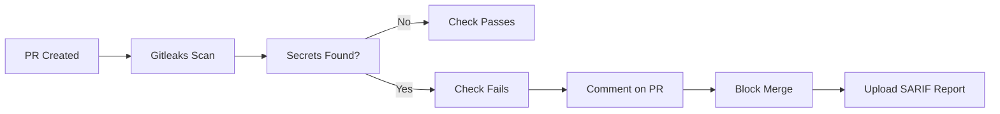

# Secret Scanning - Doctormx Security

> **Last Updated:** 2026-02-11
> **Status:** Active
> **Owner:** Security Team

## Overview

This document outlines the secret scanning implementation for Doctormx using Gitleaks. The system automatically detects leaked secrets, API keys, tokens, and other sensitive credentials in the codebase.

## Architecture

### CI/CD Integration

- **GitHub Actions:** `.github/workflows/secret-scan.yml`
  - Triggers: Pull requests, pushes to main/develop
  - Blocks PRs if secrets are detected
  - Uploads SARIF reports to GitHub Security tab
  - Exits with code 1 on detection (fails build)

### Local Development

- **Pre-commit Hooks:** `.pre-commit-config.yaml`
  - Runs `gitleaks detect` before each commit
  - Blocks commits if secrets are detected
  - Scans only staged files for performance

### Manual Scanning

```bash
# Scan entire repository
npm run scan:secrets

# Scan only staged files
npm run scan:secrets:staged

# Run with custom config
gitleaks detect --source . --config .gitleaks.toml
```

## Installation

### Initial Setup

```bash
# Install security tools (gitleaks, pre-commit)
npm run scan:install

# Enable pre-commit hooks
npm run precommit-install
# OR
pre-commit install
```

### Requirements

- Gitleaks 8.18.2+
- pre-commit 3.0.0+
- Python 3.7+ (for pre-commit)

## Detection Patterns

Gitleaks detects the following secret types:

| Category | Patterns |
|----------|----------|
| **API Keys** | AWS, GCP, Azure, Stripe, SendGrid, Twilio, etc. |
| **Tokens** | JWT, OAuth, Slack, Discord, GitHub PAT, etc. |
| **Credentials** | Database URLs, SMTP credentials, SSH keys |
| **Certificates** | Private keys, PEM files, certificates |
| **Secrets** | Passwords, API secrets, authentication tokens |

## Incident Response

### When a Secret is Detected

#### 1. Immediate Actions

```bash
# 1. DO NOT push the code
git reset --soft HEAD~1  # Undo commit if not pushed

# 2. Find the secret
npm run scan:secrets

# 3. Identify location
gitleaks detect --verbose --source .
```

#### 2. Credential Rotation

**CRITICAL:** If a secret was already pushed to GitHub:

| Secret Type | Rotation Priority | Actions |
|-------------|-------------------|---------|
| Database Password | Critical | Rotate immediately, update all connections |
| API Keys (Production) | Critical | Revoke key, generate new one, update apps |
| JWT Secrets | Critical | Rotate secret, invalidate all tokens, re-authenticate users |
| SSH Keys | High | Generate new key, update authorized_keys |
| Webhook Secrets | Medium | Regenerate secret, update webhook endpoints |
| Test/Dev Keys | Low | Rotate at next convenience |

#### 3. Removal from History

```bash
# 1. Remove secret from current files
# Edit the file to remove the secret

# 2. Remove from git history (if pushed)
git filter-branch --force --index-filter \
  "git rm --cached --ignore-unmatch path/to/file" \
  --prune-empty --tag-name-filter cat -- --all

# OR use BFG Repo-Cleaner (faster)
# bfg --delete-files secret-file.txt
# git reflog expire --expire=now --all && git gc --prune=now

# 3. Force push (ONLY after rotation)
git push origin --force --all
git push origin --force --tags
```

## False Positives

### Allowed Exceptions

Some patterns are safe to commit:

| Pattern | Reason | Handling |
|---------|--------|----------|
| Environment variable references | `process.env.VARIABLE` | Auto-excluded by gitleaks |
| Example/placeholder values | `YOUR_API_KEY_HERE` | Safe, no actual secret |
| Test data with fake secrets | Pre-generated test keys | Use `gitleaks:allow` comment |
| Public documentation | Public keys, example configs | Add to `.gitleaks.allow` |

### Excluding Files

**Option 1: `.gitignore` (Recommended)**

```bash
# Never commit these
.env.local
.env.*.local
*.pem
*.key
secrets/
```

**Option 2: `.gitleaks.toml`**

```toml
[allowlist]
  description = "Global allow list"
  paths = [
    '''tests\/fixtures\/''',
    '''\.env\.example''',
    '''docs\/examples\/'''
  ]

  regexes = [
    "process\\.env\\.",
    "YOUR_API_KEY",
    "test_.*_key"
  ]
```

**Option 3: Inline Comments**

```typescript
// gitleaks:allow
const testKey = "test_sk_1234567890abcdef";
```

## Testing Detection

### Create Test File

```bash
# Create file with intentional secret
echo 'AWS_SECRET_ACCESS_KEY="wJalrXUtnFEMI/K7MDENG/bPxRfiCYEXAMPLEKEY"' > test-secret.txt

# Run scan
npm run scan:secrets

# Should detect and fail
```

### Expected Output

```
    ○
    │╲
    │ ○
    ○ ░
    ░ ○
    ○ ░
    ░  ○
Finding:     AWS Secret Access Key
Secret:      wJalrXUtnFEMI/K7MDENG/bPxRfiCYEXAMPLEKEY
File:        test-secret.txt
Line:        1
Fingerprint: AWS_SECRET_ACCESS_KEY:wJalrXUtnFEMI/K7MDENG/bPxRfiCYEXAMPLEKEY
```

## CI/CD Behavior

### On Pull Request



### GitHub Security Tab

1. Go to: **Security > Code scanning**
2. View: **Gitleaks alerts**
3. Filter by: **Severity, Path, Pattern**
4. Actions: **Dismiss as false positive, Open in file**

## Maintenance

### Update Gitleaks

```bash
# Check current version
gitleaks --version

# Update to latest
bash scripts/install-tools.sh --gitleaks-only
```

### Update Patterns

Gitleaks updates pattern definitions regularly. To update:

1. Check releases: https://github.com/gitleaks/gitleaks/releases
2. Update version in `.github/workflows/secret-scan.yml`
3. Update version in `scripts/install-tools.sh`
4. Re-run installation

## Troubleshooting

### Issue: "gitleaks: command not found"

```bash
# Solution: Install gitleaks
npm run scan:install

# Or add to PATH manually
export PATH="$HOME/.local/bin:$PATH"
```

### Issue: Pre-commit hook not running

```bash
# Check if hooks are installed
ls -la .git/hooks/pre-commit

# Re-install hooks
pre-commit install
```

### Issue: False positive on valid code

```bash
# Create local allowlist
cat > .gitleaks.allow << EOF
# Allow specific patterns
process\.env\.
NEXT_PUBLIC_.*
EOF

# Commit the allowlist
git add .gitleaks.allow
```

## Compliance

This implementation aligns with:

- **SOC 2:** CC6.1 - Logical and Physical Access Controls
- **HIPAA:** 164.308(a)(1) - Security Management Process
- **PCI DSS:** Requirement 3 - Protect stored cardholder data
- **ISO 27001:** A.9.4.1 - Information access restriction

## Audit Trail

All secret scans are logged:

| Scan Type | Location | Retention |
|-----------|----------|-----------|
| CI/CD Scans | GitHub Actions logs | 90 days |
| SARIF Reports | GitHub Security tab | Indefinite |
| Pre-commit | Local git hooks | Local only |

## References

- [Gitleaks Documentation](https://github.com/gitleaks/gitleaks)
- [GitHub Code Scanning](https://docs.github.com/en/code-security/code-scanning)
- [OWASP Secret Scanning](https://owasp.org/www-project-secrets-scanning/)
- [Pre-commit Documentation](https://pre-commit.com/)

## Emergency Contacts

| Role | Contact |
|------|---------|
| Security Lead | security@doctormx.com |
| DevOps Lead | devops@doctormx.com |
| On-call Engineer | oncall@doctormx.com |

---

**Version History:**

- v1.0 (2026-02-11): Initial implementation with Gitleaks 8.18.2
