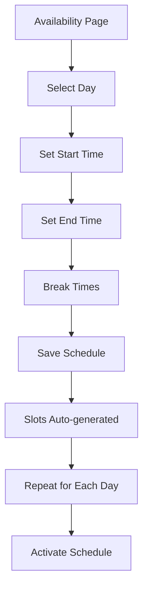
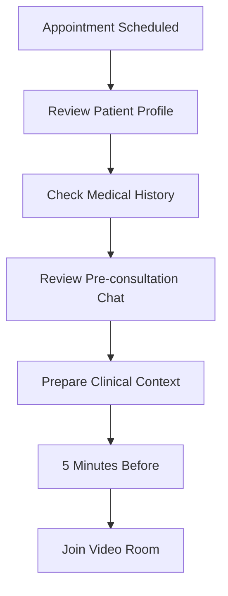
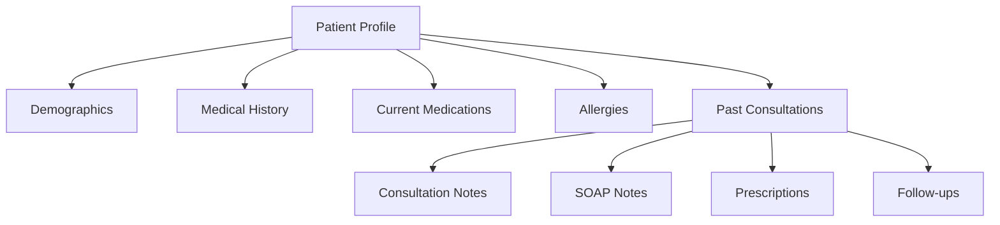
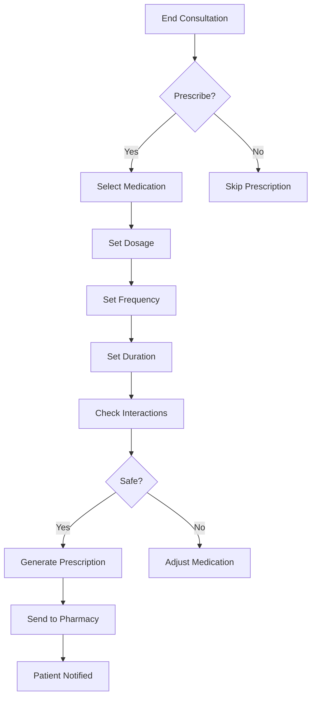
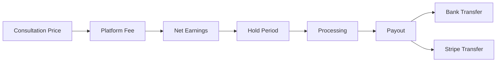

# Doctor User Guide

**Platform:** Doctor.mx Telemedicine Platform
**Last Updated:** 2026-02-09

---

## Quick Start for Doctors

### First Time Setup

```mermaid
flowchart LR
    A[Register Account] --> B[Complete Medical Profile]
    B --> C[Upload Credentials]
    C --> D[Set Specialty]
    D --> E[Configure Pricing]
    E --> F[Set Availability]
    F --> G[Submit for Verification]
    G --> H[Wait 24-48 hours]
    H --> I[Receive Approval]
    I --> J[Start Consultations]
```

---

## Dashboard Overview

### Navigation Menu

| Section | Description | Key Features |
|---------|-------------|--------------|
| **Dashboard** | Home base with overview | Today's appointments, earnings, quick actions |
| **Consultas** | Appointment management | View, filter, join consultations |
| **Disponibilidad** | Schedule settings | Set working hours, block time off |
| **Finanzas** | Earnings and payouts | Revenue analytics, payout history |
| **Pacientes** | Patient directory | Patient history, medical records |
| **Seguimientos** | Follow-up management | Monitor post-consultation status |

### Dashboard Widgets

1. **Today's Schedule**
   - Upcoming consultations
   - Quick join button
   - Patient preview

2. **Earnings Summary**
   - Today's revenue
   - Week-to-date
   - Month-to-date

3. **Pending Actions**
   - Unread messages
   - Follow-up requests
   - Prescription renewals

---

## Managing Availability

### Setting Your Schedule

### Availability Rules

- **Minimum Slot:** 30 minutes
- **Booking Window:** Up to 30 days in advance
- **Cancellation:** Patients can cancel up to appointment time
- **Time Zone:** All times in Mexico Central Time

### Blocking Time Off

1. Go to Availability page
2. Select "Block Time" button
3. Choose date range
4. Select reason (optional)
5. Confirm block

---

## Consultation Workflow

### Before the Consultation

### During the Consultation

```mermaid
flowchart LR
    A[Video Connected] --> B[Initial Assessment]
    B --> C[Use Clinical Copilot]
    C --> D[Check Red Flags]
    D --> E[Discussion]
    E --> F[Examination]
    F --> G[Diagnosis]
    G --> H[Treatment Plan]
    H --> I[Generate SOAP]
    I --> J[Prescribe if Needed]
    J --> K[End Consultation]
```

### Clinical Copilot Features

| Feature | Purpose | Usage |
|---------|---------|-------|
| **Red Flag Detection** | Identify emergencies | Automatically monitors conversation |
| **Drug Interactions** | Check medication safety | Before prescribing |
| **Dosing Guidelines** | Pediatric and adult doses | Reference during consultation |
| **Treatment Suggestions** | Evidence-based options | Clinical decision support |
| **SOAP Generation** | Document consultation | Auto-generate from notes |

### Ending the Consultation

1. **Complete Clinical Notes**
   - Document key findings
   - Treatment recommendations
   - Follow-up plan

2. **Generate SOAP Note**
   - Review AI-generated SOAP
   - Edit as needed
   - Approve for patient record

3. **Prescribe Medications** (if needed)
   - Select from formulary
   - Set dosage and frequency
   - Send to patient's pharmacy

4. **Set Follow-up**
   - Specify check-in timing
   - Assign monitoring questions
   - Activate automated follow-up

5. **End Session**
   - Video room closes
   - Patient receives summary
   - Rating request sent

---

## Patient Management

### Viewing Patient History

### Pre-consultation Chat

Before appointments, patients may message questions:

1. Receive notification of new message
2. Review patient query
3. Respond with clarification
4. Build consultation context

### Follow-up Management

Monitor patient progress after consultation:

| Status | Meaning | Action Required |
|--------|---------|-----------------|
| **Pending** | Follow-up scheduled | Wait for check-in |
| **Active** | Patient responded | Review status |
| **Improved** | Condition better | Close follow-up |
| **Unchanged** | No improvement | Consider adjustment |
| **Worse** | Deterioration | Urgent contact needed |
| **Escalated** | Requires attention | Immediate follow-up |

---

## Prescriptions

### Creating a Prescription

### Prescription Features

- **Formulary Integration:** Mexican medication database
- **Interaction Checking:** Automatic drug-drug interaction alerts
- **Digital Signature:** COFEPRIS-compliant electronic prescriptions
- **Pharmacy Network:** Send to patient's preferred pharmacy

---

## Earnings and Payouts

### Understanding Your Revenue

### Pricing Configuration

1. Go to **Finanzas** → **Pricing**
2. Set base consultation price (in MXN)
3. Adjust for premium features
4. Save changes

### Payout Schedule

- **Hold Period:** 7 days after consultation
- **Processing:** 1-2 business days
- **Payout Method:** Bank transfer or Stripe
- **Frequency:** Weekly (Mondays)

---

## Best Practices

### For Better Consultations

1. **Pre-consultation Preparation**
   - Review patient history beforehand
   - Check pre-consultation chat messages
   - Prepare clinical context

2. **During Consultation**
   - Maintain professional demeanor on video
   - Use Clinical Copilot for decision support
   - Document thoroughly in real-time

3. **Post-consultation**
   - Complete SOAP notes promptly
   - Set appropriate follow-up
   - Respond to patient questions

### For Better Ratings

- Join consultations on time
- Maintain good video/audio quality
- Show empathy and active listening
- Provide clear explanations
- Follow up on treatment plans

### For Higher Earnings

- Maintain high availability
- Keep ratings above 4.5 stars
- Respond quickly to messages
- Complete follow-ups diligently
- Offer premium features when appropriate

---

## Troubleshooting

### Common Issues

| Issue | Solution |
|-------|----------|
| **Video not connecting** | Check internet connection, refresh page |
| **Can't hear patient** | Check microphone permissions, try different browser |
| **Clinical Copilot not working** | Refresh page, check subscription status |
| **Prescription not sending** | Verify pharmacy information, check internet |
| **Follow-up not triggering** | Check follow-up settings, verify patient phone |

### Getting Help

- **Technical Support:** support@doctory.mx
- **Clinical Questions:** medical@doctory.mx
- **Payment Issues:** finance@doctory.mx

---

## Profile Management

### Updating Your Profile

1. Go to **Perfil**
2. Edit sections:
   - **Personal Information:** Name, photo, bio
   - **Medical Credentials:** License, specialty, education
   - **Practice Information:** Clinic, languages spoken
   - **Pricing:** Consultation fees

### Profile Visibility

- **Verified Doctors:** Visible in directory
- **Pending Doctors:** Not visible until approved
- **Inactive Doctors:** Hidden from search results

---

## Mobile Access

### Doctor Mobile App

The platform is mobile-optimized for:

- **Joining consultations** on the go
- **Checking schedule** anywhere
- **Messaging patients** quickly
- **Reviewing earnings** conveniently

### Recommended Setup

- Use desktop for clinical work
- Use mobile for quick checks and messaging
- Ensure stable internet for consultations

---

## Subscription Plans

### Free Plan

- Basic consultation features
- Standard availability tools
- Weekly payouts
- Limited analytics

### Premium Plan

- Advanced Clinical Copilot
- Priority placement in directory
- Daily payouts available
- Detailed analytics
- Bulk messaging
- Custom branding options

---

## Legal and Compliance

### Responsibilities

- Maintain valid medical license
- Practice within scope of specialty
- Follow Mexican medical regulations
- Complete SOAP documentation
- Respond to patient follow-ups

### Liability

- Platform provides tools, not medical advice
- Doctor retains clinical decision-making authority
- Malpractice insurance recommended
- Clear scope limitations for telemedicine

---

## Tips for Success

### First Week

1. Set up your complete profile
2. Configure availability for maximum visibility
3. Do 5-10 trial consultations with friends/family
4. Get comfortable with Clinical Copilot
5. Understand SOAP note generation

### First Month

1. Aim for 4.5+ star rating
2. Build patient base through consistency
3. Respond to messages within 1 hour
4. Complete all follow-ups
5. Ask satisfied patients for reviews

### Ongoing

1. Maintain regular availability
2. Keep profile updated
3. Stay current with platform features
4. Provide feedback to improve platform
5. Build long-term patient relationships

---

**Document Version:** 1.0
**Last Review:** 2026-02-09
