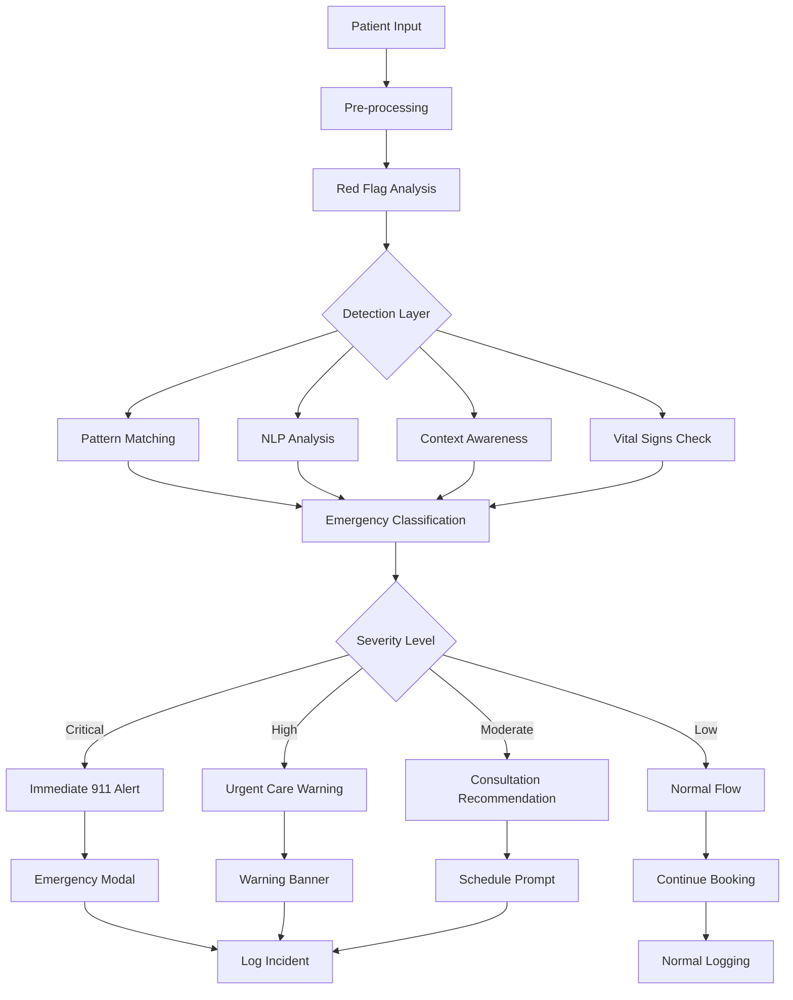
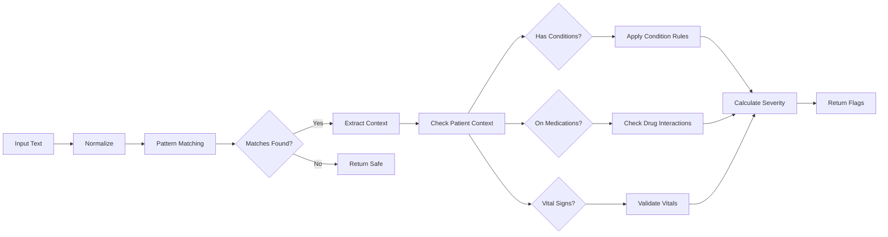
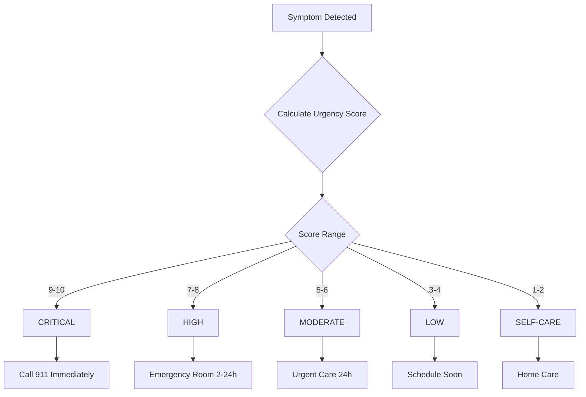
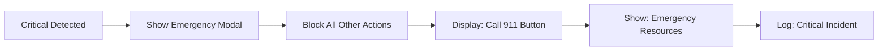
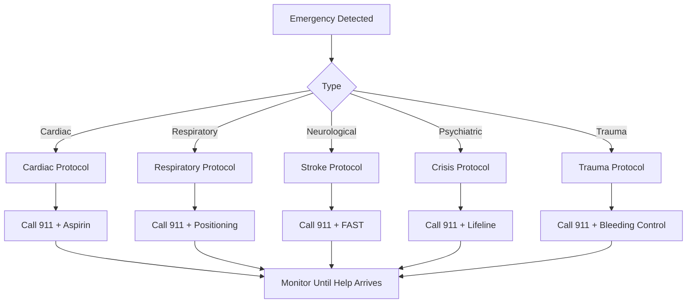
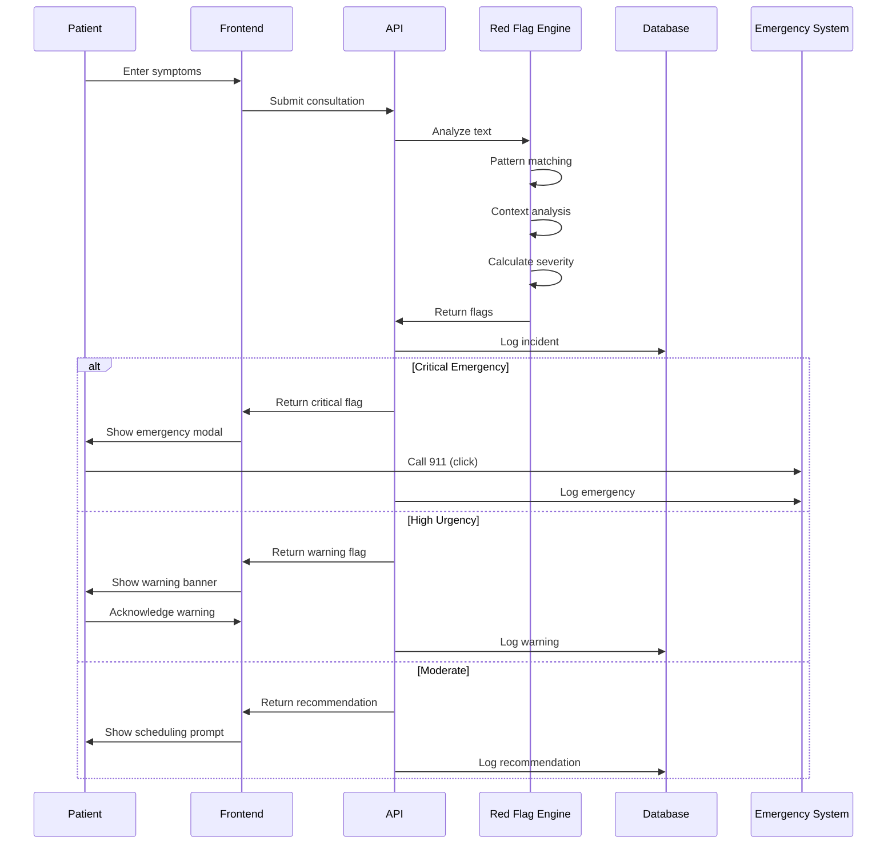
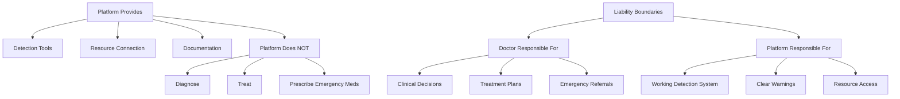
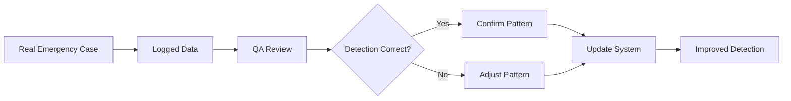

# Emergency Handling Protocols

**Platform:** Doctor.mx Telemedicine Platform
**Last Updated:** 2026-02-09
**Version:** 2.0 (Enhanced Red Flag System)

---

## Overview

Doctor.mx implements a comprehensive emergency detection and response system to ensure patient safety. This document outlines the technical implementation, clinical protocols, and escalation procedures for handling medical emergencies through the platform.

---

## Table of Contents

1. [System Architecture](#system-architecture)
2. [Red Flag Detection](#red-flag-detection)
3. [Emergency Triage Levels](#emergency-triage-levels)
4. [Clinical Protocols](#clinical-protocols)
5. [Technical Implementation](#technical-implementation)
6. [Compliance and Legal](#compliance-and-legal)

---

## System Architecture

### Multi-Layered Safety System



### Component Overview

| Component | Purpose | Location |
|-----------|---------|----------|
| **Enhanced Red Flags** | Pattern-based emergency detection | `src/lib/ai/red-flags-enhanced.ts` |
| **Triage System** | Care level classification | `src/lib/triage/index.ts` |
| **Emergency Alert Component** | UI display of emergencies | `src/components/EmergencyAlert.tsx` |
| **AI Consult API** | Conversational red flag detection | `src/app/api/ai/consult/route.ts` |
| **Clinical Copilot** | Real-time monitoring during consults | `src/components/ClinicalCopilot.tsx` |

---

## Red Flag Detection

### Enhanced Detection Algorithm

The enhanced red flag system (`red-flags-enhanced.ts`) implements:



### Detection Categories

#### 1. Pattern-Based Detection

Regular expressions match symptom descriptions:

```typescript
// Example: Chest pain patterns
pattern: /dolor.*pecho.*opresivo|dolor.*pecho.*brazo|angina|siento.*que.*me.*muero/
```

#### 2. Context-Aware Detection

Enhanced based on patient profile:

```typescript
// Diabetes-specific red flags
CONDITION_SPECIFIC_FLAGS.diabetes = [
  {
    pattern: /confusión|desorientado|habla.*enredada/,
    message: 'Posible hiperglucemia o hipoglucemia',
    severity: 'critical',
    urgencyScore: 9
  }
]
```

#### 3. Medication Interaction Detection

Checks for dangerous drug-symptom combinations:

```typescript
// Warfarin + bleeding symptoms
MEDICATION_INTERACTIONS.warfarina = {
  interactingSymptoms: ['sangrado', 'hemorragia', 'moretones'],
  alert: 'Paciente en anticoagulación: sangrado requiere evaluación inmediata',
  urgencyBonus: 2
}
```

#### 4. Vital Signs Analysis

Direct measurement of dangerous values:

```typescript
// Blood pressure crisis
if (systolic >= 180 || diastolic >= 120) {
  return {
    message: 'Crisis hipertensiva - Presión arterial ≥180/120',
    severity: 'critical',
    urgencyScore: 9
  }
}
```

---

## Emergency Triage Levels

### Severity Classification



### Level Definitions

#### CRITICAL (Score 9-10)

**Definition:** Immediate life threat requiring emergency intervention.

**Examples:**
- Cardiac arrest symptoms
- Stroke signs (FAST)
- Respiratory failure
- Severe bleeding
- Anaphylaxis
- Suicidal ideation

**Action:**


**Response Time:** Immediate (0 minutes)

#### HIGH (Score 7-8)

**Definition:** Serious condition requiring urgent evaluation.

**Examples:**
- Difficulty breathing
- High fever (>40°C)
- Abdominal rigidity
- Vision loss
- Severe pain (10/10)

**Action:**
- Display prominent warning
- Recommend ER within 2-24 hours
- Allow continuation with caution
- Log for QA review

**Response Time:** 2-24 hours

#### MODERATE (Score 5-6)

**Definition:** Condition needing medical attention but not emergent.

**Examples:**
- Moderate fever
- Persistent symptoms
- Urinary problems
- Skin infections

**Action:**
- Show informational banner
- Recommend consultation within 24 hours
- Allow normal booking flow

**Response Time:** 24 hours

---

## Clinical Protocols

### Emergency Response Protocol



### Specific Protocols

#### Cardiac Emergency

**When:** Chest pain, radiating pain, pressure, crushing sensation

**Actions:**
1. Display critical alert
2. Instruct to call 911
3. Recommend chewing one aspirin (if not allergic)
4. Sit patient in comfortable position
5. Unlock front door for EMS
6. Have medications list ready

**Platform Response:**
- Block all other actions
- Provide CPR instructions link
- Monitor patient location

#### Stroke (ACV)

**When:** Face drooping, arm weakness, speech difficulty

**Actions:**
1. Display critical alert with FAST protocol
2. Instruct to call 911 immediately
3. Note time of symptom onset
4. Do not give food/medication
5. Lie patient on side

**Platform Response:**
- Time stamp critical for thrombolysis window
- Provide stroke center locator
- Alert system to potential disability claim

#### Respiratory Emergency

**When:** Cannot breathe, blue lips, cyanosis, severe asthma

**Actions:**
1. Display critical alert
2. Call 911
3. Sit patient upright
4. Use rescue inhaler if available
5. Loosen tight clothing
6. Monitor consciousness

**Platform Response:**
- Track SpO2 if entered
- Provide breathing exercise link
- Alert to potential intubation need

#### Psychiatric Emergency

**When:** Suicidal ideation, self-harm intent

**Actions:**
1. Display critical crisis alert
2. Provide 911 option
3. Show mental health resources:
   - Línea de la Vida: 800-911-2000
   - SAPTEL: 55-5259-8121
   - Crisis Line: 800-290-0024
4. Offer in-platform support chat
5. Do not leave patient alone

**Platform Response:**
- Mandatory crisis resources display
- Optional geolocation for EMS
- Flag for mandatory follow-up

#### Hypertensive Crisis

**When:** BP ≥180/120 with symptoms

**Actions:**
1. Display high urgency alert
2. Recommend immediate ER visit
3. Recheck blood pressure
4. Note associated symptoms
5. Bring current medications

**Platform Response:**
- Track BP readings
- Alert for organ damage risk
- Provide stroke/heart attack warning

#### Diabetic Emergency

**When:** Confusion, fruity breath, nausea/vomiting (diabetes patient)

**Actions:**
1. Display critical alert
2. Check blood glucose immediately
3. If <70: Administer fast-acting glucose
4. If >250 with ketones: ER visit
5. Monitor consciousness

**Platform Response:**
- Flag diabetes in patient profile
- Track glucose readings
- Alert to DKA/HHS risk

---

## Technical Implementation

### Emergency Detection Flow



### Code Integration Points

#### 1. AI Consultation API

**File:** `src/app/api/ai/consult/route.ts`

```typescript
// Detect red flags in conversation
const redFlagCheck = detectRedFlags(userMessage)

if (redFlagCheck.hasRedFlag) {
  return {
    urgency: 'emergency',
    message: 'Se detectaron síntomas de emergencia',
    recommendation: 'Busca atención médica inmediata'
  }
}
```

#### 2. Enhanced Red Flag System

**File:** `src/lib/ai/red-flags-enhanced.ts`

```typescript
export function detectRedFlagsEnhanced(
  text: string,
  patientContext?: PatientContext
): RedFlagResult {
  // 1. Standard red flags
  // 2. Condition-specific flags
  // 3. Medication interactions
  // 4. Vital signs
  // 5. Age-specific considerations

  return {
    detected: boolean,
    flags: RedFlag[],
    highestSeverity: RedFlagSeverity,
    requiresEmergencyEscalation: boolean,
    urgencyScore: number
  }
}
```

#### 3. Emergency Alert Component

**File:** `src/components/EmergencyAlert.tsx`

```typescript
interface EmergencyAlertProps {
  message: string;
  symptoms: string[];
  severity: 'critical' | 'high';
  onDismiss?: () => void;
  onCall911?: () => void;
}
```

#### 4. Clinical Copilot Integration

**File:** `src/components/ClinicalCopilot.tsx`

Real-time monitoring during consultations:
- Continuous red flag detection
- Doctor notification system
- Emergency intervention suggestions

---

## Data Logging and QA

### Incident Logging

All emergency incidents are logged:

```typescript
interface EmergencyLog {
  timestamp: Date;
  patientId: string;
  flagsDetected: RedFlag[];
  severity: RedFlagSeverity;
  urgencyScore: number;
  patientContext: PatientContext;
  actionTaken: string;
  outcome: string;
}
```

### Quality Assurance Metrics

1. **Detection Rate:** % of emergencies properly identified
2. **False Positive Rate:** % of non-emergencies flagged
3. **Response Time:** Time from detection to patient alert
4. **Escalation Rate:** % of critical cases requiring 911
5. **Patient Outcome:** Tracking post-escalation outcomes

### Review Process

1. **Automatic Review:** All critical incidents flagged for human review
2. **Weekly Audit:** Sample of high-urgency cases reviewed
3. **Monthly Analysis:** Aggregate data for system improvement
4. **Quarterly Update:** Red flag patterns updated based on data

---

## Compliance and Legal

### Mexican Healthcare Compliance

#### Emergency Care Standards

The system aligns with:
- **NOM-004-SSA3-2012:** Emergency medical services
- **NOM-017-SSA2-2012:** Triage and emergency classification
- **COFEPRIS Regulations:** Telemedicine emergency protocols

#### Liability Limitations



### Disclaimer Requirements

All emergency interactions must include:

1. **Platform Limitations:** "This is not emergency care"
2. **911 Instruction:** "Call 911 for life-threatening emergencies"
3. **Scope Statement:** "This platform connects you with doctors"
4. **Resource Provision:** Emergency contact numbers provided

### Data Privacy

Emergency data handling:
- Encrypted storage of incident logs
- Limited access to QA team only
- Retention per Mexican law
- Patient access to own emergency records

---

## Training and Education

### Doctor Training

All doctors must complete:

1. **Emergency Protocol Training**
   - Red flag recognition
   - System escalation procedures
   - 911 coordination

2. **Platform Training**
   - Using clinical copilot
   - Interpreting alerts
   - Responding to emergencies

3. **Scenario Practice**
   - Cardiac emergencies
   - Stroke identification
   - Psychiatric crises

### Patient Education

In-app education includes:

1. **Pre-consultation:** When to use emergency services
2. **During detection:** Clear instructions for each emergency type
3. **Post-emergency:** Follow-up care coordination

---

## Continuous Improvement

### System Updates

**Monthly:** Pattern refinement based on real cases
**Quarterly:** New red flag additions
**Annually:** Complete protocol review

### Feedback Loop



---

## Emergency Contacts (Mexico)

### Primary Emergency Numbers

- **911:** Universal emergency number
- **Locatel:** 56 58 11 11 (Mexico City)

### Mental Health Crisis

- **Línea de la Vida:** 800-911-2000
- **SAPTEL:** 55-5259-8121
- **Crisis Line:** 800-290-0024

### Poison Control

- **Toxicology:** 55 5127 5000

### Specialized Emergencies

- **Burn Unit:** Refer to local hospital
- **Trauma:** Refer to nearest trauma center
- **Pediatric:** Refer to pediatric ER

---

## Conclusion

The Doctor.mx emergency handling system prioritizes patient safety through:

1. **Multi-layered detection** of emergency symptoms
2. **Immediate escalation** to appropriate care
3. **Clear communication** with patients and doctors
4. **Comprehensive logging** for quality improvement
5. **Mexican healthcare compliance** for legal protection

**Remember:** This system is a tool, not a replacement for emergency medical services. When in doubt, always call 911.

---

**Document Version:** 2.0
**Last Review:** 2026-02-09
**Next Review:** 2026-05-09
**Responsible:** Medical Director + Engineering Team
