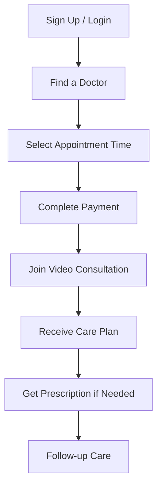
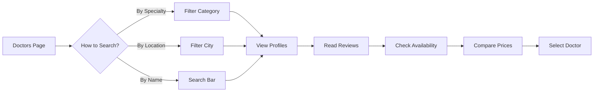
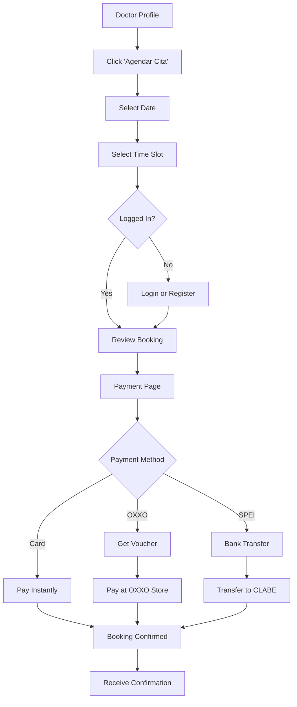
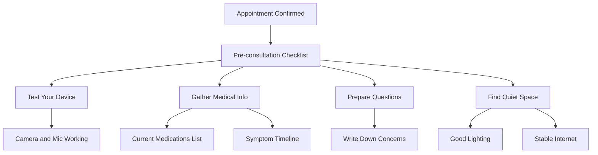
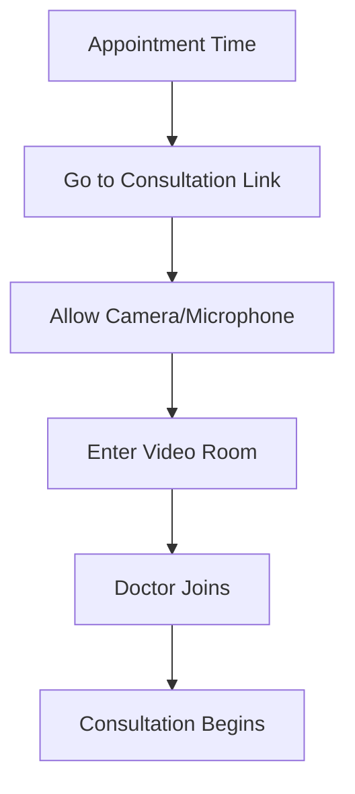
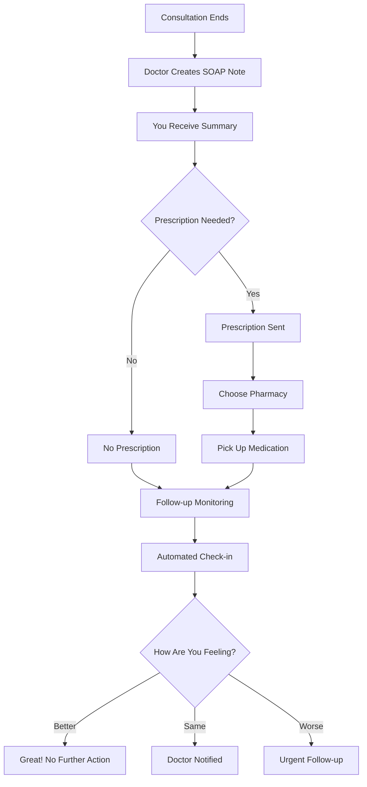
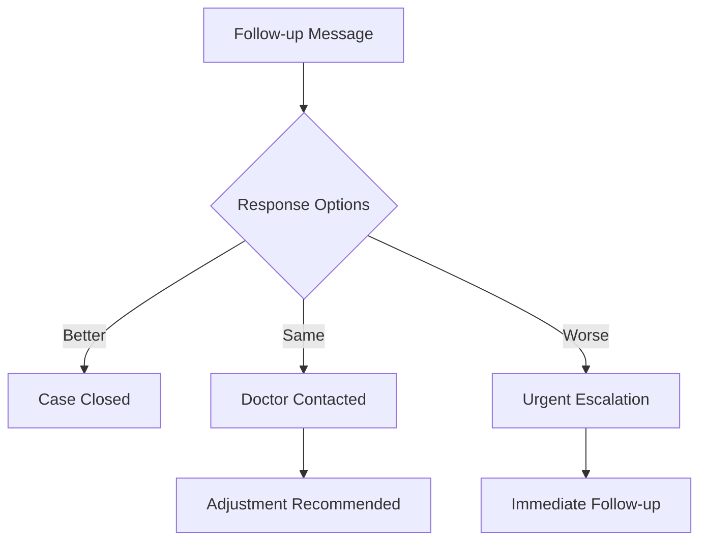
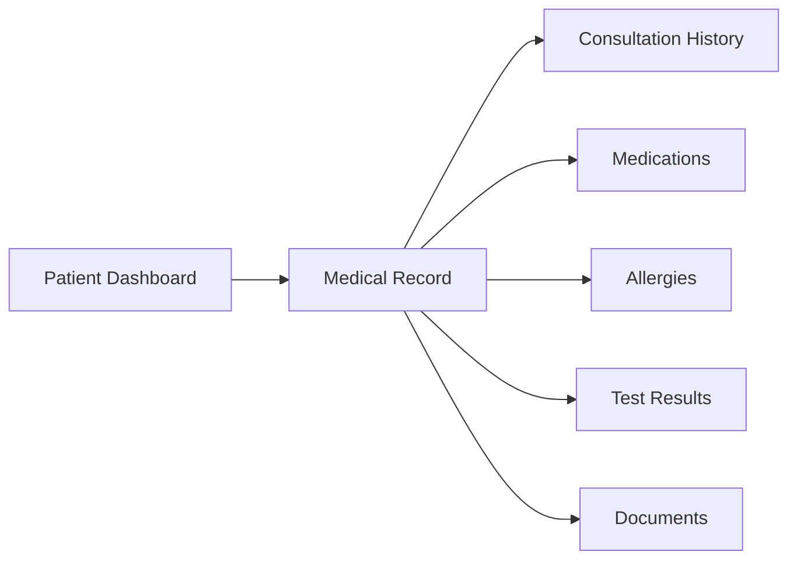
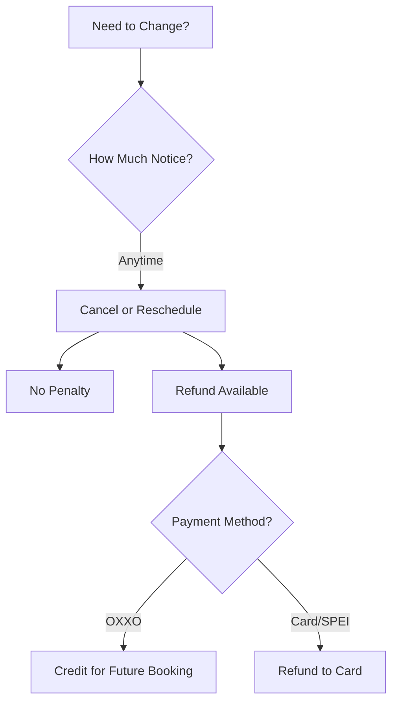
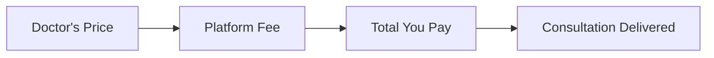

# Patient User Guide

**Platform:** Doctor.mx Telemedicine Platform
**Last Updated:** 2026-02-09

---

## Welcome to Doctor.mx

Doctor.mx connects you with verified Mexican doctors through secure video consultations. Get medical care from home, safely and conveniently.

---

## Quick Start

### Your First Consultation

---

## Finding the Right Doctor

### Browse Doctors

### Doctor Profiles Include

- **Photo and Name**
- **Medical Specialty**
- **Education and Credentials**
- **Languages Spoken**
- **Consultation Price**
- **Patient Reviews and Ratings**
- **Available Times**
- **Professional Bio**

---

## Booking an Appointment

### Step-by-Step Booking

### Payment Methods

#### Credit/Debit Card (Instant)
- Visa, Mastercard, American Express
- Instant confirmation
- Secure Stripe processing

#### OXXO (Cash)
- Generate voucher online
- Pay at any OXXO store
- 3-day window to complete
- Confirmed after payment

#### SPEI (Bank Transfer)
- Instant bank transfer
- Use CLABE number
- Available at major banks
- Confirmed immediately

### What Happens After Booking?

1. **Immediate Confirmation Email**
2. **WhatsApp Message** (if phone provided)
3. **Calendar Invitation** (add to your calendar)
4. **Pre-consultation Chat** (ask questions beforehand)

---

## Before Your Consultation

### Prepare for Your Visit

### Pre-consultation Checklist

**Technology Setup:**
- [ ] Test camera and microphone
- [ ] Check internet connection
- [ ] Use Chrome or Safari browser
- [ ] Enable camera/microphone permissions

**Medical Information:**
- [ ] List current medications
- [ ] Note known allergies
- [ ] Prepare symptom timeline
- [ ] Have relevant medical records handy

**Environment:**
- [ ] Find quiet, private space
- [ ] Ensure good lighting
- [ ] Have water nearby
- [ ] Allow 30 minutes uninterrupted

### Pre-consultation Chat

Before your appointment, you can message your doctor:

1. Go to **Mis Citas**
2. Select upcoming appointment
3. Use chat to:
   - Provide symptom details
   - Share medical history
   - Ask preparation questions

---

## During Your Consultation

### Joining the Video Call

### What to Expect

1. **Introduction** (2-3 minutes)
   - Doctor greets you
   - Confirms your identity
   - Asquires about your main concern

2. **Discussion** (10-15 minutes)
   - Describe your symptoms
   - Answer doctor's questions
   - Show any visible symptoms (rash, swelling, etc.)

3. **Examination** (5-10 minutes)
   - Doctor may ask you to:
     - Show throat/ears
     - Check breathing
     - Move affected areas
     - Measure temperature if available

4. **Diagnosis & Plan** (5-10 minutes)
   - Doctor explains findings
   - Discusses treatment options
   - Recommends medications if needed
   - Sets follow-up plan

### Tips for Better Consultations

- **Be specific** about symptoms and when they started
- **Be honest** about all medications and supplements
- **Ask questions** if anything is unclear
- **Show, don't just tell** visible symptoms
- **Take notes** during the consultation

---

## After Your Consultation

### Immediate Follow-up

### Consultation Summary

After each visit, you'll receive:

- **SOAP Note** (Subjective, Objective, Assessment, Plan)
- **Treatment Recommendations**
- **Prescription** (if applicable)
- **Follow-up Instructions**
- **Self-care Guidelines**

### Prescriptions

If prescribed medication:

1. **Digital Prescription** sent to your phone
2. **Choose Pharmacy** from network
3. **Pick Up** at your convenience
4. **Dosage Instructions** included

Accepted at major Mexican pharmacy chains:
- Farmacias del Ahorro
- Benavides
- Guadalajara
- San Pablo
- And many independent pharmacies

---

## Follow-up Care

### Automated Monitoring

After your consultation, you may receive:

- **24-hour check-in** for urgent cases
- **48-hour check-in** for moderate cases
- **7-day check-in** for routine cases

Respond to check-ins to let your doctor know how you're feeling.

### If You're Not Improving

### Message Your Doctor

Have questions after your consultation?

1. Go to **Mis Citas**
2. Select completed consultation
3. Send a message
4. Doctor responds within 24 hours

---

## Emergency Situations

### When to Call 911

**Call 911 immediately if you experience:**

- Chest pain or pressure
- Difficulty breathing
- Sudden weakness or paralysis
- Severe bleeding
- Loss of consciousness
- Severe allergic reaction
- Suicidal thoughts

### Our AI Safety System

Doctor.mx uses AI to detect emergency symptoms:

- **Red Flag Detection** alerts both you and the doctor
- **Emergency Resources** provided automatically
- **Crisis Support** for mental health emergencies
- **911 Integration** for immediate help connection

**Remember:** This platform is for non-emergency medical care. Always call 911 for life-threatening emergencies.

---

## Your Health Record

### Accessing Your Medical History

### Your Health Record Includes

- **Past Consultations**
- **SOAP Notes** from each visit
- **Prescription History**
- **Allergy Information**
- **Chronic Conditions**
- **Vaccination Records**

### Sharing Your Record

You can share your record with:
- Other family members
- Other doctors on the platform
- Healthcare providers (export PDF)

---

## Managing Appointments

### View Your Appointments

Go to **Mis Citas** to see:

- **Upcoming** appointments
- **Completed** consultations
- **Cancelled** visits
- **Payment history**

### Rescheduling or Cancelling

### Late Policy

- **You can cancel** anytime before the appointment
- **Doctor may cancel** in emergencies
- **No-show** results in no refund
- **Reschedule** anytime before appointment

---

## Payment and Pricing

### Understanding Costs

### Price Range

Consultation prices vary by doctor:
- **General Practice:** $300-600 MXN
- **Specialists:** $500-1500 MXN
- **Premium Services:** $1000-2000 MXN

### What's Included

- 30-minute video consultation
- SOAP note documentation
- Prescription generation (if needed)
- Follow-up monitoring
- Access to consultation summary

### Refund Policy

- **Full refund** if cancelled before appointment
- **Credit** for future bookings if doctor cancels
- **No refund** for no-shows
- **Partial refund** for technical difficulties (case-by-case)

---

## Ratings and Reviews

### After Your Consultation

You'll receive a rating request:

1. **Rate 1-5 stars** on:
   - Doctor's knowledge
   - Communication clarity
   - Time spent
   - Overall satisfaction

2. **Write a Review** (optional)
   - Share your experience
   - Help other patients
   - Provide feedback to doctor

### Why Reviews Matter

- **Help others** choose the right doctor
- **Improve doctor performance**
- **Build trust** in the platform
- **Quality assurance** for everyone

---

## Technical Help

### Common Issues

| Issue | Solution |
|-------|----------|
| **Video not connecting** | Check internet, refresh page, try different browser |
| **Can't hear doctor** | Check volume, test microphone |
| **Screen frozen** | Refresh page, rejoin consultation |
| **Can't access chat** | Close and reopen chat window |
| **Payment not processing** | Try different payment method, contact support |

### Getting Support

- **Email:** support@doctory.mx
- **WhatsApp:** +52 XX XXXX XXXX
- **Live Chat:** Available on website
- **Response Time:** Within 24 hours

---

## Privacy and Security

### Your Information is Protected

- **Encrypted** video consultations
- **Secure** payment processing
- **Private** medical records
- **HIPAA-compliant** storage
- **Mexican privacy law** compliant

### Who Can See Your Information?

- **You** - Always have access
- **Your Doctors** - Only those you consult
- **Platform Admin** - Only for technical support
- **Never shared** with third parties

---

## Tips for Best Experience

### For Your Consultation

1. **Be on time** - Join 5 minutes early
2. **Be prepared** - Have your questions ready
3. **Be honest** - Share all relevant information
4. **Be thorough** - Don't minimize symptoms
5. **Be engaged** - Ask questions, take notes

### For Better Care

1. **Use pre-consultation chat** - Provide context beforehand
2. **Show symptoms** - Let doctor see what you're describing
3. **Take photos** - Of rashes, swelling, injuries
4. **Track symptoms** - Note when they started, what makes them better/worse
5. **Follow through** - Complete treatment plans, respond to follow-ups

---

## Family Accounts

### Managing Family Members

You can add family members to your account:

1. Go to **Perfil**
2. Select **Family Members**
3. Add member details
4. Book appointments for them

### Pediatric Consultations

- For children under 18
- Parent/guardian must be present
- Pediatricians available
- Growth and development tracking

---

## Accessibility

### Platform Features

- **Screen reader** compatible
- **Closed captioning** available
- **Multiple languages** supported
- **Mobile optimized** for phones/tablets
- **Large text** options available

### Language Support

Consultations available in:
- Spanish (primary)
- English
- Indigenous languages (select doctors)

---

## Next Steps

### Ready for Your First Consultation?

1. **Sign up** or log in
2. **Browse doctors** by specialty
3. **Book your appointment**
4. **Complete payment**
5. **Join video call** at appointment time
6. **Get care** from home

### Questions?

- **Browse our FAQ** on the website
- **Contact support** - we're here to help
- **Read doctor profiles** - learn about our providers
- **Check reviews** - see what other patients say

---

**Welcome to Doctor.mx - Your Health, Your Way.**

---

**Document Version:** 1.0
**Last Review:** 2026-02-09
