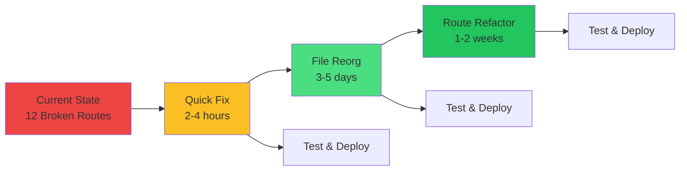

# Doctor.mx Architecture Analysis - Summary

## 📋 Overview

This directory contains comprehensive architecture analysis of the Doctor.mx application, identifying critical navigation and layout issues where user-accessible routes lack proper navigation wrappers.

## 🚨 Critical Issue

**50% of navigation menu items lead to pages without navigation bars**, stranding users without a way to navigate back except through browser controls.

## 📁 Documentation Files

### 1. **architecture-analysis.md**
Complete architecture overview including:
- Critical issue identification
- Current layout system
- File structure problems
- Root cause analysis
- Impact assessment
- Technical debt analysis

### 2. **user-journeys.md**
Mermaid diagrams showing:
- Guest user journey
- Patient user journey (current state with issues)
- Doctor user journey (current state with issues)
- Complete feature access map
- Ideal user journey (fixed state)
- Current vs desired routing flows
- User pain points

### 3. **routing-structure.md**
Detailed routing analysis:
- Route inventory with layout status
- 16 routes ✅ WITH layout (working)
- 12 routes ❌ WITHOUT layout (broken)
- Navigation menu vs route reality
- Route structure diagrams
- File organization anti-patterns
- Recommended routing structure

### 4. **recommendations.md**
Implementation solutions:
- **Quick Win** (2 hours): Wrap components in Layout
- **Proper Solution** (1 week): Restructure file organization
- **Best Solution** (2 weeks): Implement nested route layouts
- Testing plan
- Risk assessment
- Success metrics
- Timeline estimates

### 5. **fix-layouts.sh**
Automated script to apply quick fix

## 🎯 Quick Reference

### Routes That Need Immediate Fix

| Route | Component | In Nav? | Severity |
|-------|-----------|---------|----------|
| `/community` | HealthCommunity | ✅ YES | 🔴 Critical |
| `/marketplace` | HealthMarketplace | ✅ YES | 🔴 Critical |
| `/gamification` | GamificationDashboard | ✅ YES | 🔴 Critical |
| `/ai-referrals` | AIReferralSystem | ✅ YES | 🔴 Critical |
| `/doctor-panel` | EnhancedDoctorPanel | ✅ YES | 🔴 Critical |
| `/blog` | HealthBlog | ✅ YES | 🟡 High |
| `/faq` | FAQ | ✅ YES | 🟡 High |
| `/expert-qa` | ExpertQA | ✅ YES | 🟡 High |
| `/affiliate` | AffiliateDashboard | No | 🟢 Medium |
| `/subscriptions` | SubscriptionPlans | No | 🟢 Medium |
| `/qa` | QABoard | No | 🟢 Medium |
| `/doctor-dashboard` | DoctorDashboard | No | 🟢 Medium |

## ⚡ Quick Start - Apply Fix Now

### Option 1: Manual Fix (Recommended for Learning)

1. Open any component file listed above (e.g., `HealthCommunity.jsx`)
2. Add import at top:
   ```jsx
   import Layout from './Layout';
   ```
3. Wrap the return statement:
   ```jsx
   return (
     <Layout>
       {/* existing content */}
     </Layout>
   );
   ```
4. Test the route in browser
5. Repeat for all 12 components

### Option 2: Automated Fix

```bash
cd /Users/lukatenbosch/Downloads/doctory
chmod +x json/fix-layouts.sh
./json/fix-layouts.sh
```

## 📊 Impact Summary

### Current State
- ❌ 12 routes without proper layout
- ❌ 8 routes in navigation menu are broken
- ❌ Users get stranded without navigation
- ❌ Unprofessional user experience
- ❌ High bounce rate risk

### After Fix
- ✅ All routes have proper layout
- ✅ All navigation menu items work correctly
- ✅ Consistent user experience
- ✅ Professional appearance
- ✅ Users can always navigate

## 🔍 Mermaid Diagrams

All diagrams are embedded in the markdown files. View them in:
- GitHub
- VS Code with Mermaid extension
- Any Markdown viewer with Mermaid support
- Online at mermaid.live

### Key Diagrams:

1. **Patient Journey (Current)** - Shows 4 broken routes
2. **Doctor Journey (Current)** - Shows 2 broken routes
3. **Feature Access Map** - Shows all route groups and their status
4. **Route Structure** - Visual representation of routes with/without layout
5. **Routing Flow Sequence** - Before and after fix comparison

## 📈 Metrics

### Problem Scale
- Total Routes: 28
- Routes in `/components/`: 12 (should be in `/pages/`)
- Routes without Layout: 12 (43%)
- Nav menu items broken: 8 out of 15 (53%)

### User Impact
- Patient features broken: 4 out of 8 (50%)
- Doctor features broken: 2 out of 5 (40%)
- Content routes broken: 4 out of 4 (100%)

## 🛠️ Recommended Implementation Path



1. **Phase 1**: Apply quick fix TODAY (get site working)
2. **Phase 2**: File reorganization NEXT SPRINT (clean up structure)
3. **Phase 3**: Route refactoring WHEN TIME ALLOWS (best practice)

## 🔗 Navigation Menu Reference

From `Layout.jsx` (lines 221-275), when user is logged in:

```
Doctores        → /doctors         ✅ Works
Consultar IA    → /doctor          ✅ Works
Imágenes        → /vision          ✅ Works
Referencias     → /ai-referrals    ❌ BROKEN
Comunidad       → /community       ❌ BROKEN
Tienda          → /marketplace     ❌ BROKEN
Puntos          → /gamification    ❌ BROKEN
Dashboard       → /dashboard       ✅ Works

[For Doctors]
Panel Doctor    → /doctor-panel    ❌ BROKEN
```

## ⚠️ Warning Signs for Users

When a route is broken, users experience:
1. Click menu item → Page loads → Navigation disappears
2. No logo, no menu, no way back
3. Must use browser back button
4. Looks like website is broken
5. Loss of trust and confusion

## 🎯 Success Criteria

- [x] All documentation complete
- [ ] Quick fix implemented
- [ ] All routes tested
- [ ] Navigation menu verified
- [ ] Mobile navigation tested
- [ ] User acceptance testing passed

## 📞 Next Steps

1. **Review** all documentation files
2. **Decide** on implementation approach (Quick vs Proper vs Best)
3. **Implement** chosen solution
4. **Test** thoroughly
5. **Deploy** and monitor

## 📚 Additional Resources

- `/src/components/Layout.jsx` - The Layout component
- `/src/main.jsx` - Current routing configuration
- `/src/pages/` - Pages with proper layout (examples)
- `/src/components/` - Components needing Layout wrapper

## 🤝 For Other AIs / Developers

This analysis is designed to be comprehensive and actionable. Any AI or developer reviewing this should be able to:

1. ✅ Understand the problem immediately
2. ✅ See visual diagrams of the issues
3. ✅ Know exactly which files to fix
4. ✅ Have multiple implementation options
5. ✅ Access testing and success criteria

The documentation is self-contained with:
- Clear problem statements
- Visual mermaid diagrams
- File-by-file breakdowns
- Code examples
- Testing plans
- Risk assessments

---

**Analysis Date**: October 30, 2025  
**Status**: Complete - Ready for Implementation  
**Severity**: Critical  
**Priority**: P0 - Immediate Action Required  
**Estimated Fix Time**: 2 hours (quick fix) to 2 weeks (complete refactor)
