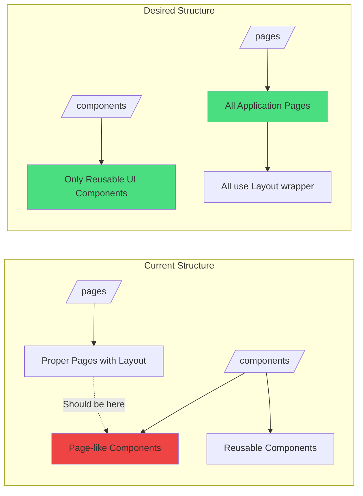
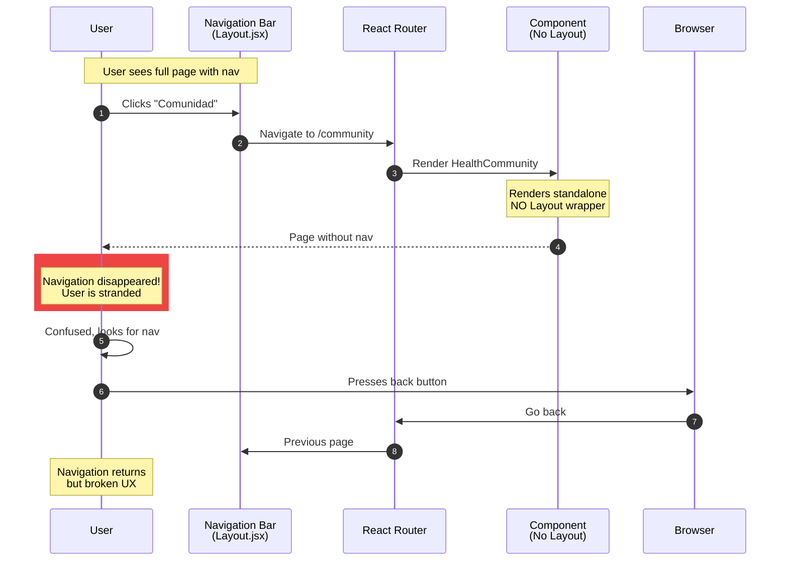

# Doctor.mx Routing Structure Analysis

## Current Route Configuration

### Routes in `/src/main.jsx`

```jsx
// Current routing implementation with issues marked
```

## Route Inventory with Layout Status

### ✅ Routes WITH Layout (Working Correctly)

| Route | Component | Location | Protected | Layout |
|-------|-----------|----------|-----------|--------|
| `/` | App | App.jsx | No | Own Layout |
| `/login` | Login | pages/Login.jsx | No | Auth Layout |
| `/register` | Register | pages/Register.jsx | No | Auth Layout |
| `/doctor` | DoctorAI | pages/DoctorAI.jsx | Yes | ✅ Has Layout |
| `/doctors` | DoctorDirectory | pages/DoctorDirectory.jsx | No | ✅ Has Layout |
| `/doctors/:id` | DoctorProfile | pages/DoctorProfile.jsx | No | ✅ Has Layout |
| `/dashboard` | PatientDashboard | pages/PatientDashboard.jsx | Yes | ✅ Has Layout |
| `/vision` | VisionConsultation | pages/VisionConsultation.jsx | Yes | ✅ Has Layout |
| `/pharmacy/portal` | PharmacyPortal | pages/PharmacyPortal.jsx | Yes | ✅ Has Layout |
| `/pay/checkout` | PaymentCheckout | pages/PaymentCheckout.jsx | Yes | ✅ Has Layout |
| `/connect` | ConnectLanding | pages/ConnectLanding.jsx | No | ✅ Has Layout |
| `/connect/signup` | DoctorSignup | pages/DoctorSignup.jsx | No | ✅ Has Layout |
| `/connect/verify` | DoctorVerification | pages/DoctorVerification.jsx | Yes | ✅ Has Layout |
| `/connect/subscription` | DoctorSubscriptionMgmt | pages/DoctorSubscriptionManagement.jsx | Yes | ✅ Has Layout |
| `/connect/subscription-setup` | DoctorSubscriptionSetup | pages/DoctorSubscriptionSetup.jsx | Yes | ✅ Has Layout |
| `/connect/dashboard` | DoctorDashboard | pages/DoctorDashboard.jsx | Yes | ✅ Has Layout |

### ❌ Routes WITHOUT Layout (BROKEN)

| Route | Component | Location | Protected | Layout | In Nav? |
|-------|-----------|----------|-----------|--------|---------|
| `/community` | HealthCommunity | components/HealthCommunity.jsx | Yes | ❌ None | ✅ YES |
| `/marketplace` | HealthMarketplace | components/HealthMarketplace.jsx | Yes | ❌ None | ✅ YES |
| `/gamification` | GamificationDashboard | components/GamificationDashboard.jsx | Yes | ❌ None | ✅ YES |
| `/affiliate` | AffiliateDashboard | components/AffiliateDashboard.jsx | Yes | ❌ None | No |
| `/subscriptions` | SubscriptionPlans | components/SubscriptionPlans.jsx | Yes | ❌ None | No |
| `/doctor-panel` | EnhancedDoctorPanel | components/EnhancedDoctorPanel.jsx | Yes | ❌ None | ✅ YES |
| `/ai-referrals` | AIReferralSystem | components/AIReferralSystem.jsx | Yes | ❌ None | ✅ YES |
| `/qa` | QABoard | components/QABoard.jsx | No | ❌ None | No |
| `/faq` | FAQ | components/FAQ.jsx | No | ❌ None | ✅ YES |
| `/faq/doctors` | FAQ | components/FAQ.jsx | No | ❌ None | No |
| `/blog` | HealthBlog | components/HealthBlog.jsx | No | ❌ None | ✅ YES |
| `/expert-qa` | ExpertQA | components/ExpertQA.jsx | No | ❌ None | ✅ YES |
| `/doctor-dashboard` | DoctorDashboard (component) | components/DoctorDashboard.jsx | Yes | ❌ None | No |

## Route Structure Diagram

```mermaid
graph TB
    subgraph "Routes WITH Layout ✅"
        A1[/ - Landing] 
        A2[/doctor - AI Consult]
        A3[/doctors - Directory]
        A4[/dashboard - Patient]
        A5[/vision - Images]
        A6[/connect/* - Doctor Flow]
    end
    
    subgraph "Routes WITHOUT Layout ❌"
        B1[/community - In Nav]
        B2[/marketplace - In Nav]
        B3[/gamification - In Nav]
        B4[/ai-referrals - In Nav]
        B5[/doctor-panel - In Nav]
        B6[/blog - In Nav]
        B7[/faq - In Nav]
        B8[/expert-qa - In Nav]
        B9[/affiliate]
        B10[/subscriptions]
        B11[/qa]
        B12[/doctor-dashboard]
    end
    
    Nav[Navigation Menu] -.Links To.-> B1
    Nav -.Links To.-> B2
    Nav -.Links To.-> B3
    Nav -.Links To.-> B4
    Nav -.Links To.-> B5
    Nav -.Links To.-> B6
    Nav -.Links To.-> B7
    Nav -.Links To.-> B8
    
    style A1 fill:#4ade80
    style A2 fill:#4ade80
    style A3 fill:#4ade80
    style A4 fill:#4ade80
    style A5 fill:#4ade80
    style A6 fill:#4ade80
    style B1 fill:#ef4444
    style B2 fill:#ef4444
    style B3 fill:#ef4444
    style B4 fill:#ef4444
    style B5 fill:#ef4444
    style B6 fill:#ef4444
    style B7 fill:#ef4444
    style B8 fill:#ef4444
    style B9 fill:#fbbf24
    style B10 fill:#fbbf24
    style B11 fill:#fbbf24
    style B12 fill:#fbbf24
```

## File Organization Issues



## Navigation Menu vs Route Reality

### Layout.jsx Navigation Links (Lines 221-275)

```jsx
// When user is logged in, navigation shows:
<Link to="/doctors">Doctores</Link>              // ✅ Has Layout
<Link to="/doctor">Consultar IA</Link>           // ✅ Has Layout
<Link to="/vision">Imágenes</Link>               // ✅ Has Layout
<Link to="/ai-referrals">Referencias</Link>      // ❌ NO Layout - BROKEN
<Link to="/community">Comunidad</Link>           // ❌ NO Layout - BROKEN
<Link to="/marketplace">Tienda</Link>            // ❌ NO Layout - BROKEN
<Link to="/gamification">Puntos</Link>           // ❌ NO Layout - BROKEN
<Link to="/dashboard">Dashboard</Link>           // ✅ Has Layout

// Doctor-specific
<Link to="/doctor-panel">Panel Doctor</Link>     // ❌ NO Layout - BROKEN
```

## Critical Navigation Breaks



## Route Groups Analysis

### Patient-Facing Routes

```mermaid
graph TD
    subgraph "Patient Routes"
        P1[/doctor - Consultation ✅]
        P2[/doctors - Directory ✅]
        P3[/vision - Analysis ✅]
        P4[/dashboard - Dashboard ✅]
        P5[/community - Community ❌]
        P6[/marketplace - Shop ❌]
        P7[/gamification - Points ❌]
        P8[/ai-referrals - Referrals ❌]
    end
    
    Success[Good UX ✅] --> P1
    Success --> P2
    Success --> P3
    Success --> P4
    
    Broken[Broken UX ❌] --> P5
    Broken --> P6
    Broken --> P7
    Broken --> P8
    
    style Success fill:#4ade80
    style Broken fill:#ef4444
    style P1 fill:#4ade80
    style P2 fill:#4ade80
    style P3 fill:#4ade80
    style P4 fill:#4ade80
    style P5 fill:#ef4444
    style P6 fill:#ef4444
    style P7 fill:#ef4444
    style P8 fill:#ef4444
```

### Doctor-Facing Routes

```mermaid
graph TD
    subgraph "Doctor Routes"
        D1[/connect - Landing ✅]
        D2[/connect/signup - Signup ✅]
        D3[/connect/verify - Verify ✅]
        D4[/connect/dashboard - Dashboard ✅]
        D5[/doctor-panel - Panel ❌]
        D6[/doctor-dashboard - Alt Dashboard ❌]
    end
    
    Success[Good UX ✅] --> D1
    Success --> D2
    Success --> D3
    Success --> D4
    
    Broken[Broken UX ❌] --> D5
    Broken --> D6
    
    style Success fill:#4ade80
    style Broken fill:#ef4444
    style D1 fill:#4ade80
    style D2 fill:#4ade80
    style D3 fill:#4ade80
    style D4 fill:#4ade80
    style D5 fill:#ef4444
    style D6 fill:#ef4444
```

### Content Routes

```mermaid
graph TD
    subgraph "Content/Educational Routes"
        C1[/blog - Blog ❌]
        C2[/faq - FAQ ❌]
        C3[/expert-qa - Expert Q&A ❌]
        C4[/qa - Q&A Board ❌]
    end
    
    Broken[All Broken ❌] --> C1
    Broken --> C2
    Broken --> C3
    Broken --> C4
    
    style Broken fill:#ef4444
    style C1 fill:#ef4444
    style C2 fill:#ef4444
    style C3 fill:#ef4444
    style C4 fill:#ef4444
```

## Routing Anti-Patterns Identified

### 1. Mixed File Locations
- ❌ Page components in `/components/` folder
- ❌ Some pages in `/pages/`, others in `/components/`
- ✅ Should be: All pages in `/pages/`

### 2. Inconsistent Layout Usage
- ❌ Some components import Layout, others don't
- ❌ No enforced pattern
- ✅ Should be: Layout wrapper at route level OR all pages import

### 3. Duplicate Components
- ❌ DoctorDashboard exists in both `/pages/` and `/components/`
- ❌ Confusion about which one to use
- ✅ Should be: Single source of truth

### 4. No Route Grouping
- ❌ All routes defined flat in main.jsx
- ❌ No shared layout configuration
- ✅ Should be: Nested routes with layout wrappers

## Recommended Routing Structure

```mermaid
graph TB
    subgraph "Proposed Route Structure"
        Root[Root Route]
        
        Root --> Public[Public Routes<br/>Marketing Layout]
        Root --> Auth[Auth Routes<br/>Auth Layout]
        Root --> App[App Routes<br/>Main Layout]
        
        Public --> Home[/]
        Public --> About[/about]
        Public --> Blog[/blog]
        
        Auth --> Login[/login]
        Auth --> Register[/register]
        
        App --> Patient[Patient Routes<br/>Protected + Layout]
        App --> Doctor[Doctor Routes<br/>Protected + Layout]
        App --> Shared[Shared Routes<br/>Protected + Layout]
        
        Patient --> PDoctor[/doctor]
        Patient --> PDoctors[/doctors]
        Patient --> PVision[/vision]
        Patient --> PCommunity[/community]
        Patient --> PMarket[/marketplace]
        Patient --> PGamif[/gamification]
        Patient --> PDash[/dashboard]
        
        Doctor --> DConnect[/connect/*]
        Doctor --> DPanel[/doctor-panel]
        
        Shared --> Referrals[/ai-referrals]
        Shared --> FAQ[/faq]
        Shared --> QA[/qa]
    end
    
    style Root fill:#a78bfa
    style Public fill:#4ade80
    style Auth fill:#60a5fa
    style App fill:#4ade80
    style Patient fill:#86efac
    style Doctor fill:#86efac
    style Shared fill:#86efac
```

## Fix Implementation Priority

See `/json/recommendations.md` for detailed implementation steps.

---

**Document Version**: 1.0  
**Last Updated**: October 30, 2025  
**Status**: Requires Immediate Action
