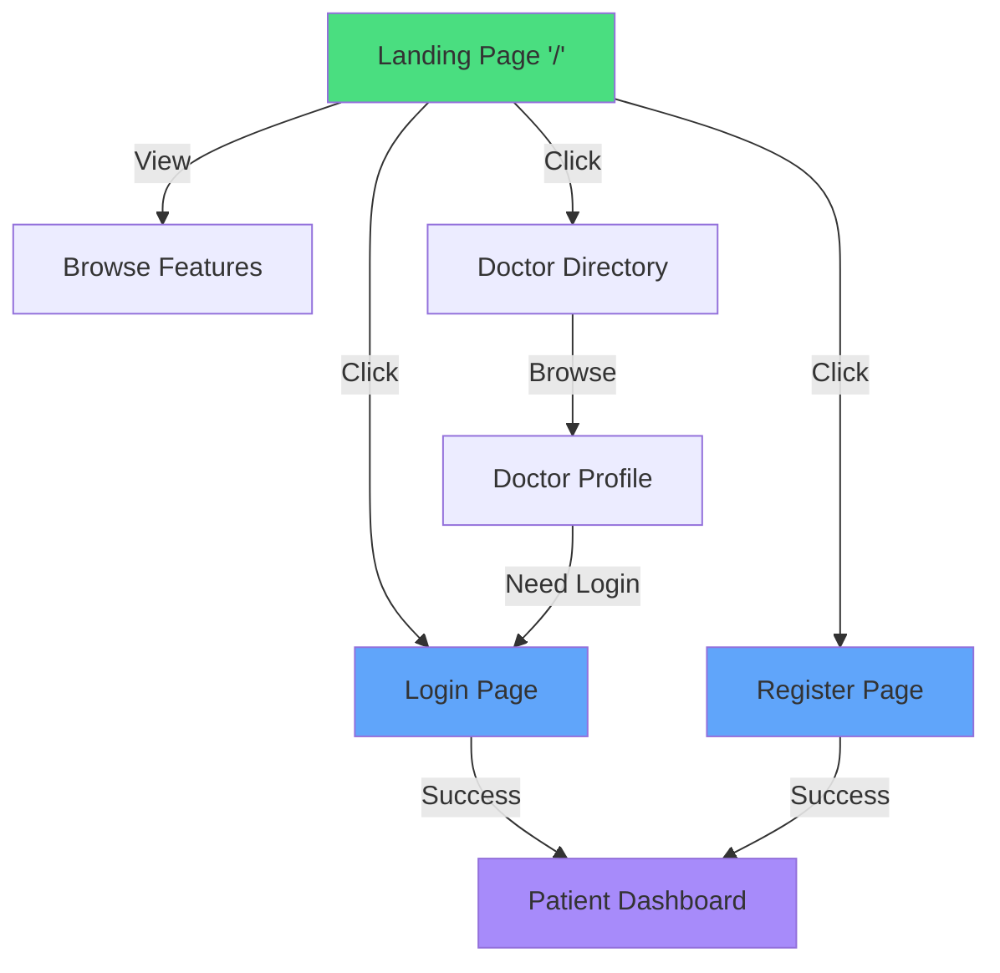
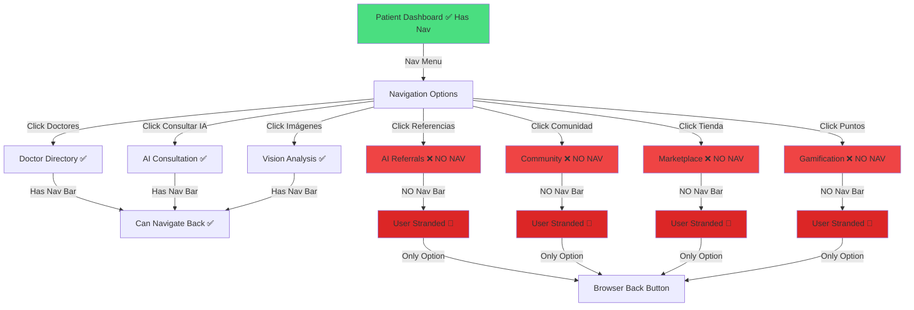
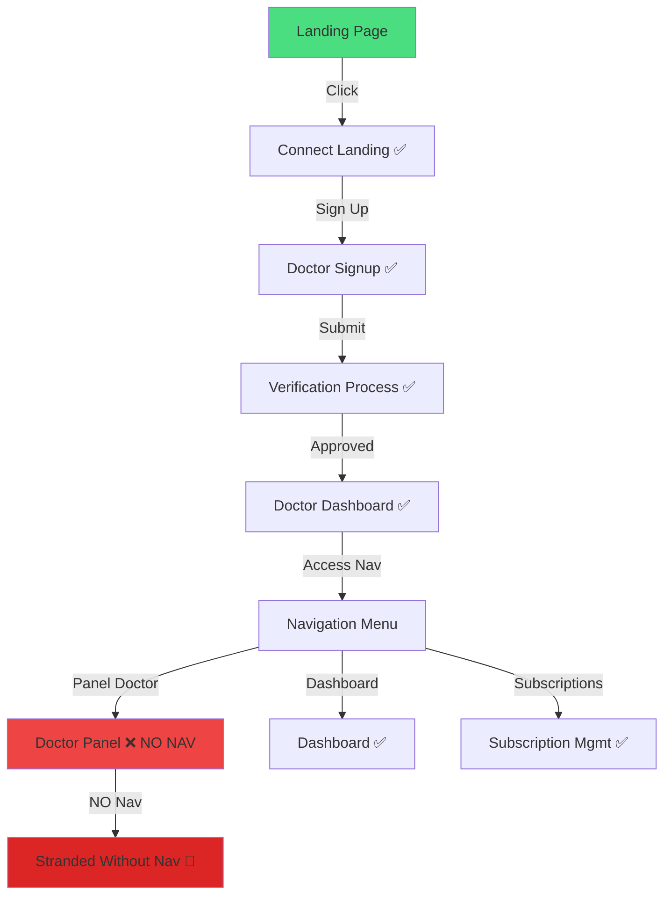
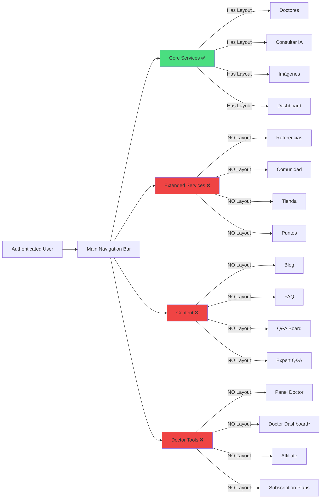
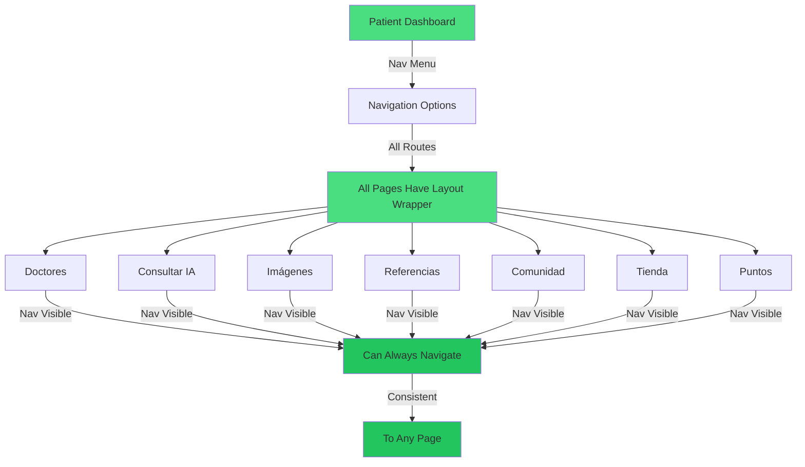
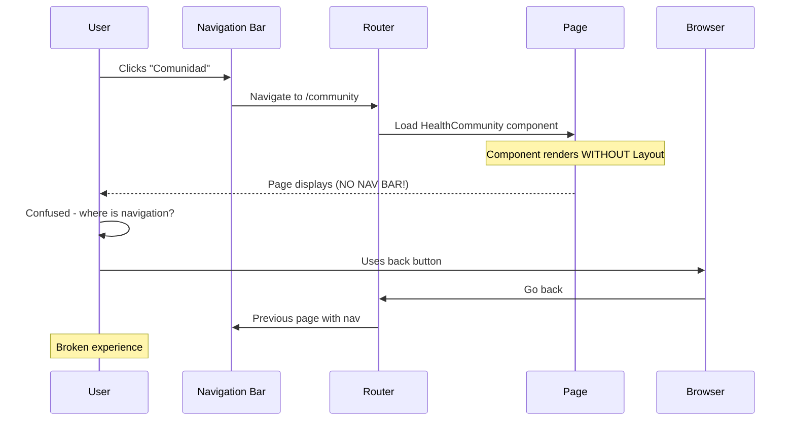
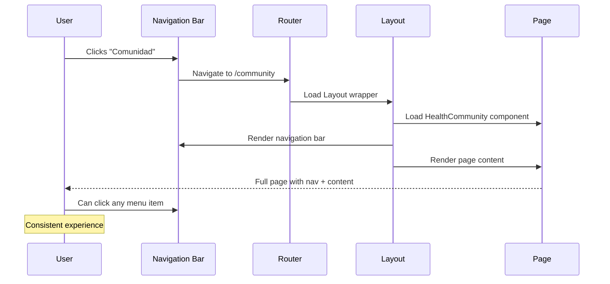

# Doctor.mx User Journeys

## Journey Mermaid Diagrams

### 1. Guest User Journey

### 2. Patient User Journey (Current - WITH ISSUES)

### 3. Doctor User Journey (Current - WITH ISSUES)

### 4. Complete Feature Access Map

### 5. Ideal Patient Journey (FIXED)

### 6. Current Routing Flow

### 7. Desired Routing Flow (FIXED)

## Journey Issues Summary

### Current State Issues

| Journey Step | Issue | Severity | User Impact |
|-------------|-------|----------|-------------|
| Patient → Comunidad | No navigation bar | 🔴 High | User stranded |
| Patient → Tienda | No navigation bar | 🔴 High | User stranded |
| Patient → Puntos | No navigation bar | 🔴 High | User stranded |
| Patient → Referencias | No navigation bar | 🔴 High | User stranded |
| Doctor → Panel Doctor | No navigation bar | 🔴 High | User stranded |
| Any → Blog | No navigation bar | 🟡 Medium | Content isolated |
| Any → FAQ | No navigation bar | 🟡 Medium | Support isolated |
| Any → Q&A Board | No navigation bar | 🟡 Medium | Content isolated |

### User Pain Points

1. **Navigation Disappearance**: User clicks menu item → nav vanishes
2. **Context Loss**: User doesn't know where they are
3. **No Way Back**: Must use browser back button
4. **Inconsistent UI**: Some pages have nav, others don't
5. **Professional Concern**: Looks like broken website
6. **Trust Issues**: Users may think site is malfunctioning

## Required Journey Fixes

See `/json/recommendations.md` for implementation details.

---

**Generated**: October 30, 2025  
**Purpose**: Identify and document user journey issues in Doctor.mx application
