# Doctor.mx - Visual Architecture Summary

## 🎯 The Problem in One Diagram

```mermaid
graph TB
    User[User on Dashboard<br/>with Navigation Bar]
    
    User -->|Clicks Nav Item| Choice{Which Link?}
    
    Choice -->|Working Routes| Good[Page with Nav Bar ✅]
    Choice -->|Broken Routes| Bad[Page WITHOUT Nav Bar ❌]
    
    Good --> Navigate[Can Navigate Anywhere]
    Bad --> Stranded[User Stranded 🔴<br/>Must Use Browser Back]
    
    subgraph "Working Routes ✅ (16 routes)"
        W1[/doctor]
        W2[/doctors]
        W3[/dashboard]
        W4[/vision]
        W5[/connect/*]
    end
    
    subgraph "Broken Routes ❌ (12 routes)"
        B1[/community]
        B2[/marketplace]
        B3[/gamification]
        B4[/ai-referrals]
        B5[/doctor-panel]
        B6[/blog]
        B7[/faq]
        B8[/expert-qa]
    end
    
    Good --> W1
    Good --> W2
    Good --> W3
    Good --> W4
    Good --> W5
    
    Bad --> B1
    Bad --> B2
    Bad --> B3
    Bad --> B4
    Bad --> B5
    Bad --> B6
    Bad --> B7
    Bad --> B8
    
    style User fill:#60a5fa
    style Good fill:#4ade80
    style Bad fill:#ef4444
    style Stranded fill:#dc2626
    style Navigate fill:#22c55e
    style Choice fill:#fbbf24
```

---

## 📊 Architecture Overview

```mermaid
graph TD
    subgraph "Current File Structure"
        Pages[/src/pages/<br/>16 files ✅] 
        Components[/src/components/<br/>12 page-like files ❌]
        
        Pages -->|Has Layout| Router1[Routes with Nav]
        Components -->|NO Layout| Router2[Routes without Nav]
    end
    
    subgraph "User Navigation"
        NavMenu[Navigation Menu<br/>15 items]
        NavMenu -->|8 links| Router2
        NavMenu -->|7 links| Router1
    end
    
    Router2 -.Broken.-> UserLost[User Lost ❌]
    Router1 -.Works.-> UserHappy[User Happy ✅]
    
    style Pages fill:#4ade80
    style Components fill:#ef4444
    style Router1 fill:#4ade80
    style Router2 fill:#ef4444
    style UserLost fill:#dc2626
    style UserHappy fill:#22c55e
    style NavMenu fill:#fbbf24
```

---

## 🔥 Critical Path Impact

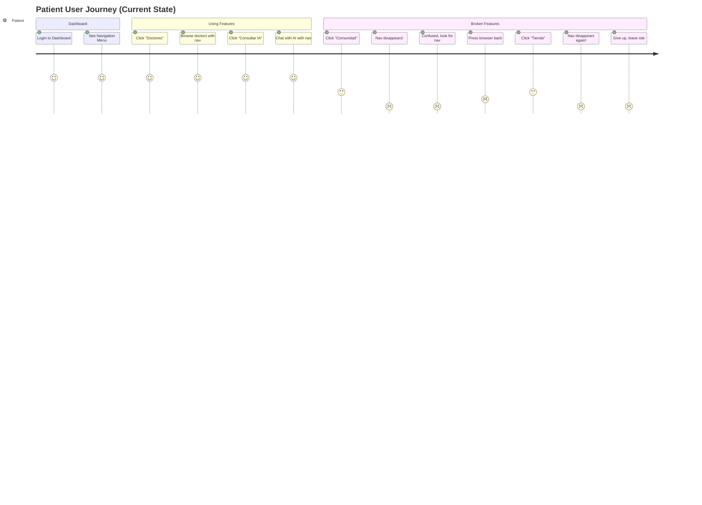

---

## 📈 Severity Distribution

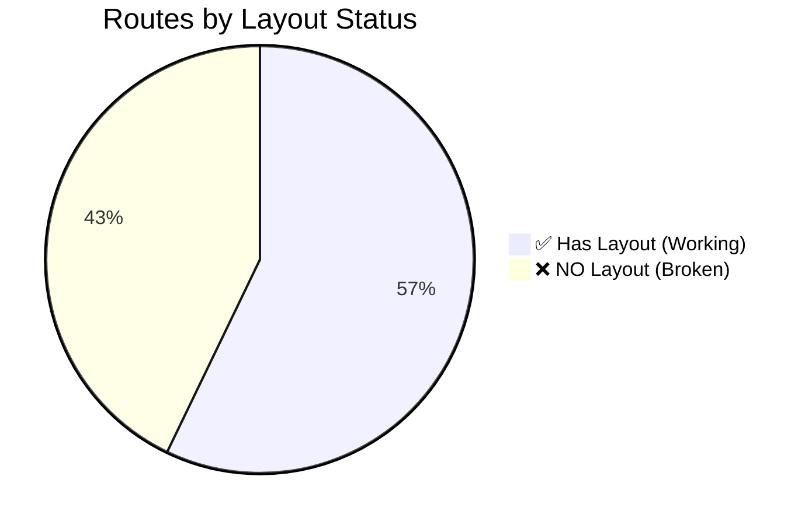

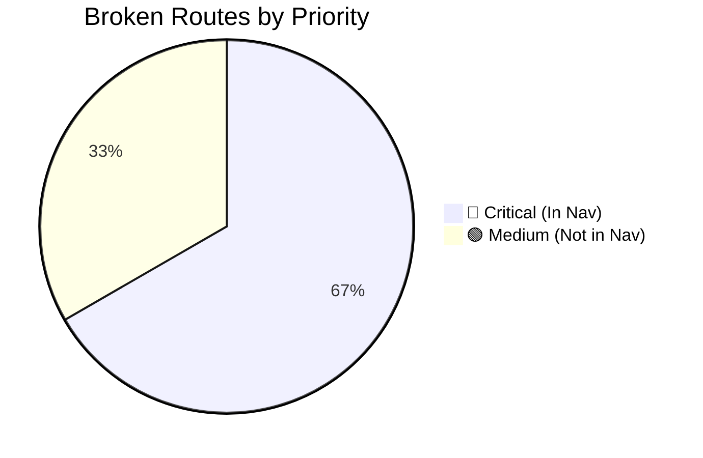

---

## 🎭 Component Location Problem

```mermaid
graph LR
    subgraph "Where Components Are"
        CP[/components/<br/>12 page components]
        CC[/components/<br/>50+ UI components]
    end
    
    subgraph "Where They Should Be"
        PP[/pages/<br/>28 page components]
        PC[/components/<br/>50+ UI components]
    end
    
    CP -.Should Move.-> PP
    CC -.Stay.-> PC
    
    style CP fill:#ef4444
    style PP fill:#4ade80
    style CC fill:#60a5fa
    style PC fill:#4ade80
```

---

## 🔄 Fix Flow Diagram

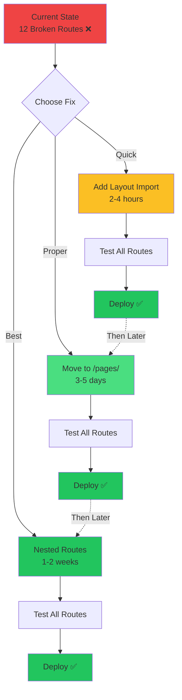

---

## 🎯 Navigation Menu Reality Check

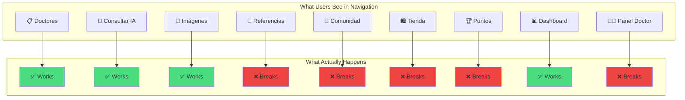

---

## 📱 User Experience Flow (Current)

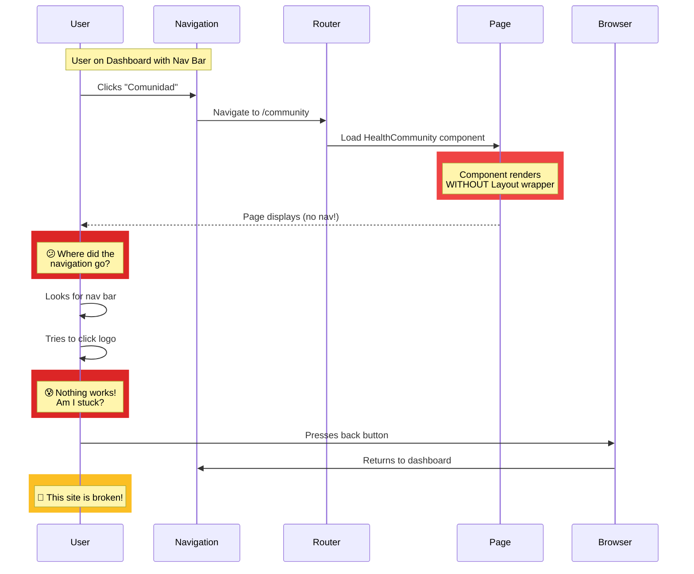

---

## 📱 User Experience Flow (Fixed)

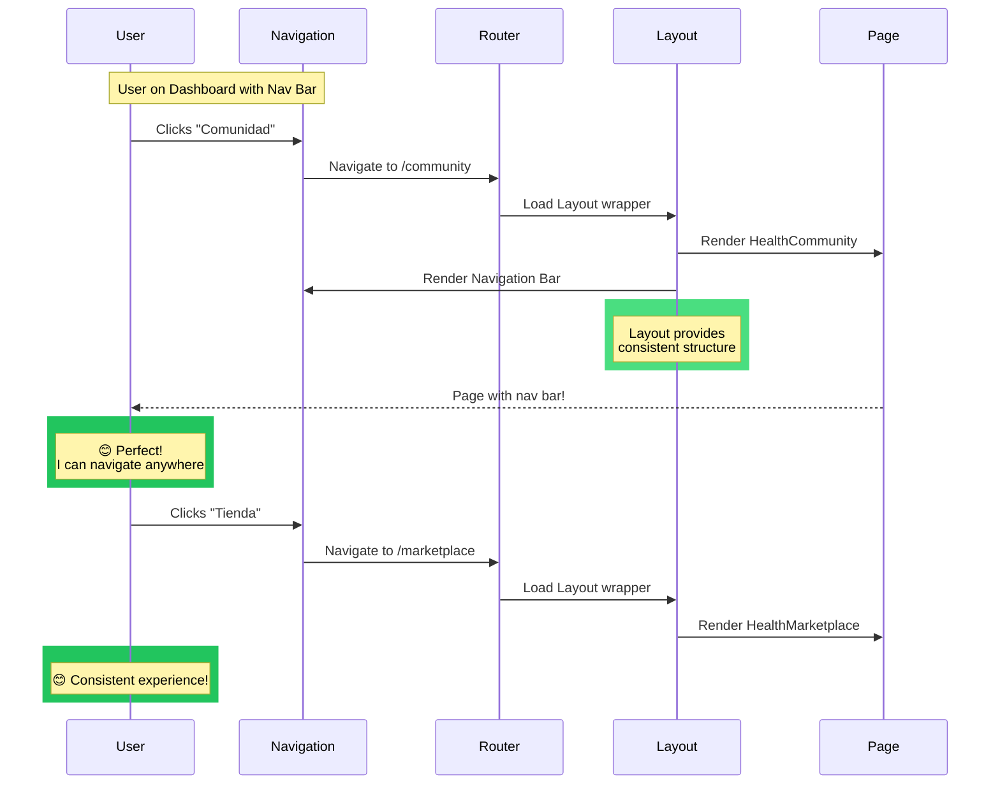

---

## 🏗️ Component Architecture (Current vs Ideal)

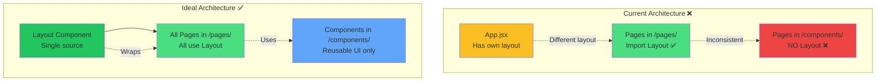

---

## 📊 Impact Matrix

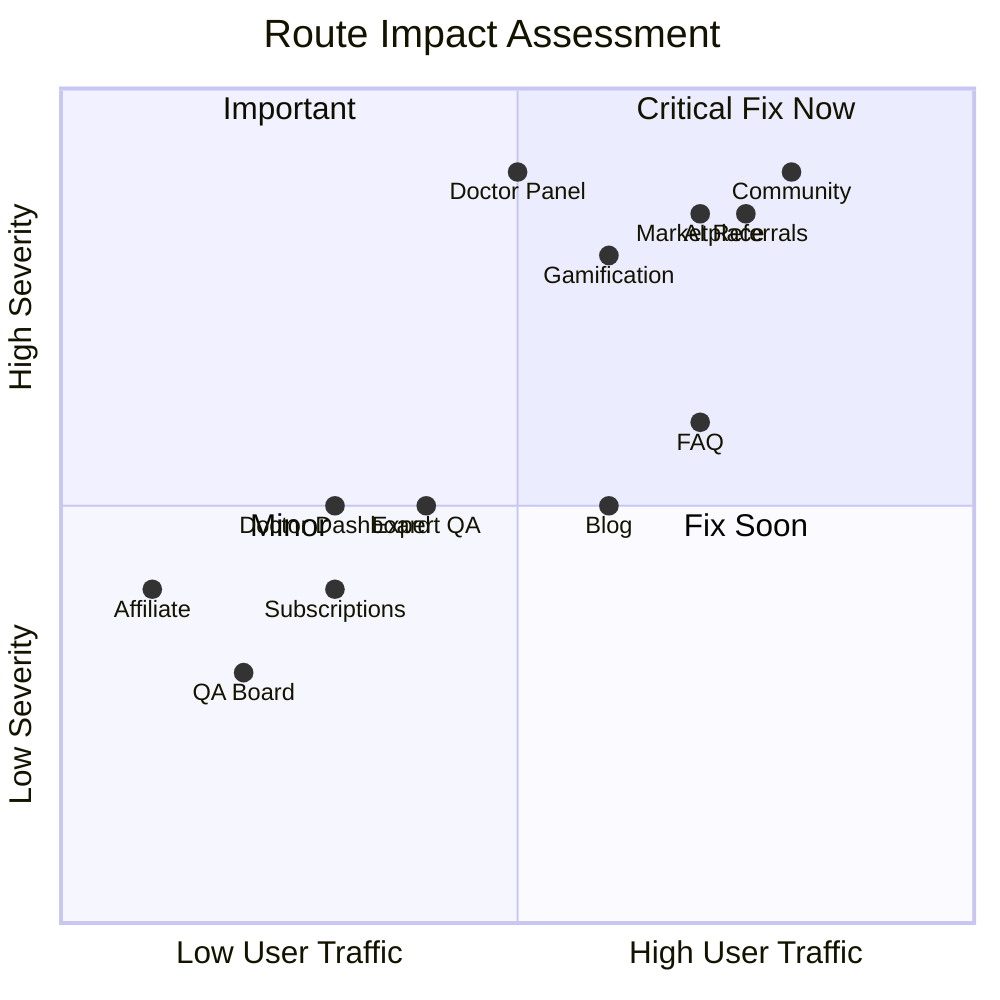

---

## 🎯 Success Metrics Dashboard

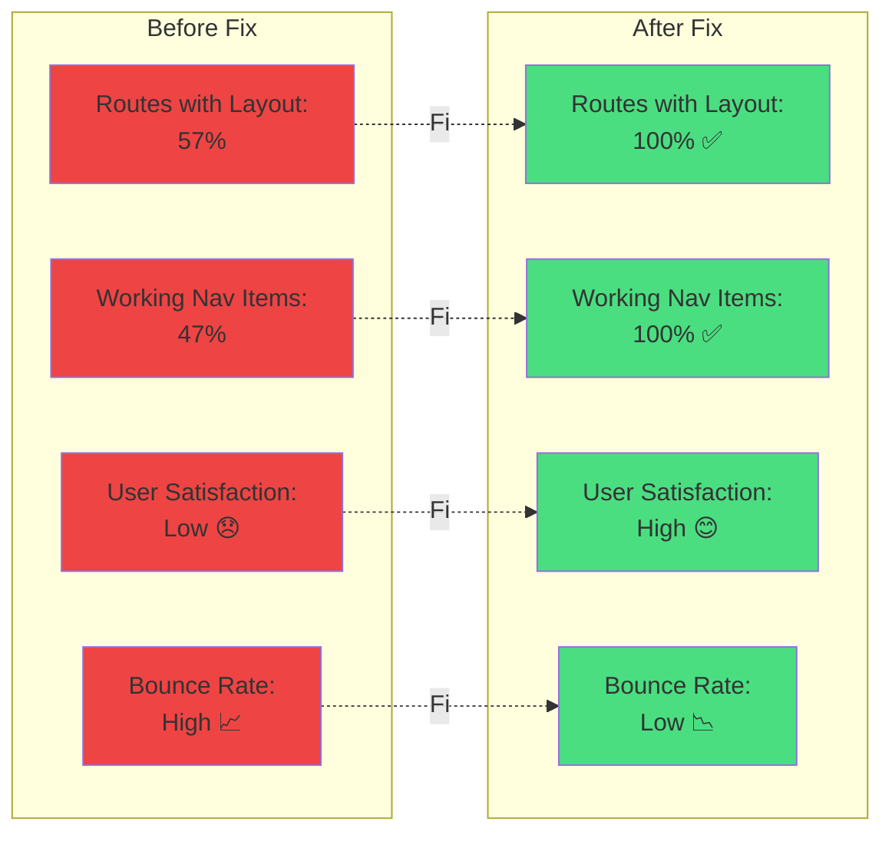

---

## 🔧 Implementation Timeline

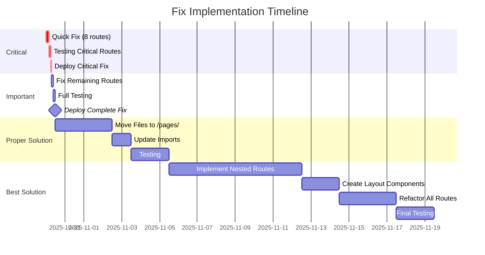

---

## 🎬 Quick Reference

### Files Needing Immediate Fix

| File | Route | Priority | In Nav? |
|------|-------|----------|---------|
| HealthCommunity.jsx | /community | 🔴 Critical | ✅ YES |
| HealthMarketplace.jsx | /marketplace | 🔴 Critical | ✅ YES |
| GamificationDashboard.jsx | /gamification | 🔴 Critical | ✅ YES |
| AIReferralSystem.jsx | /ai-referrals | 🔴 Critical | ✅ YES |
| EnhancedDoctorPanel.jsx | /doctor-panel | 🔴 Critical | ✅ YES |
| HealthBlog.jsx | /blog | 🟡 High | ✅ YES |
| FAQ.jsx | /faq | 🟡 High | ✅ YES |
| ExpertQA.jsx | /expert-qa | 🟡 High | ✅ YES |

### The Fix (For Each File)

```jsx
// 1. Add import
import Layout from './Layout';

// 2. Wrap return
export default function ComponentName() {
  return (
    <Layout>
      {/* existing content */}
    </Layout>
  );
}
```

---

**Document Type**: Visual Summary  
**Created**: October 30, 2025  
**Purpose**: Quick visual reference for architecture issues and fixes  
**View With**: Mermaid-compatible Markdown viewer
